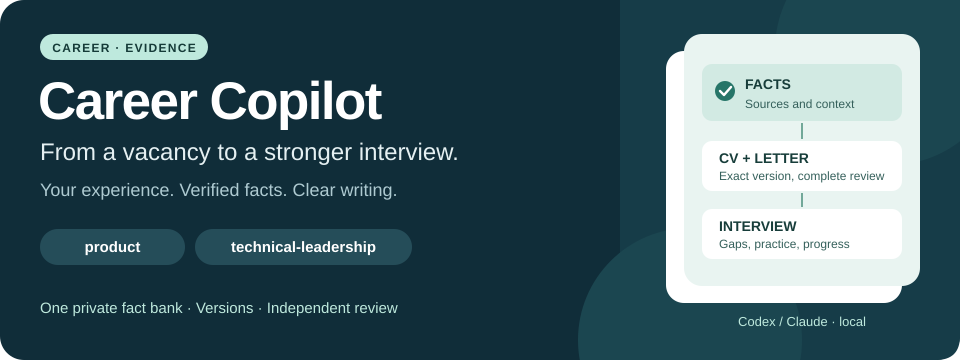
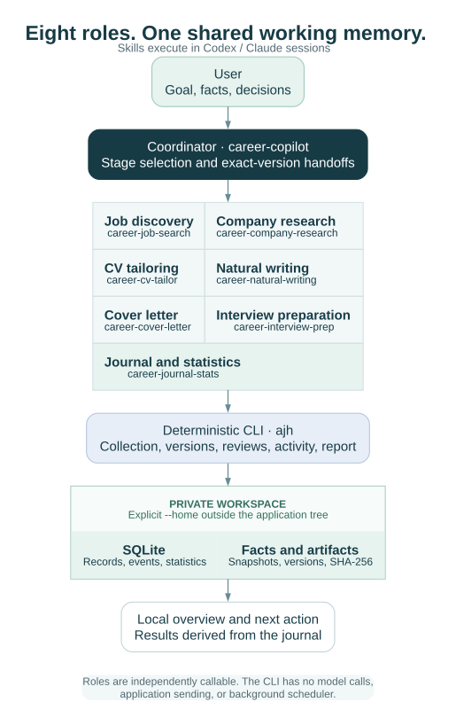

# Career Copilot

[English](README.md) · [Русский](README.ru.md)



**Turn a private career history into a focused job search, credible CVs and better-prepared interviews.** Career Copilot gives Codex and Claude eight independent skills backed by a local evidence journal, versioned documents and a readable browser overview.

The main path is **collect vacancies → keep the ones that fit your profile → read clear cards → decide the fit with an explanation → fix or tailor the CV → prepare**, for a specific employer or for general gaps. You can also start with any single result: research an employer, find roles, tailor a CV, improve a paragraph, write a letter, practice an interview or understand what is stalled. A coordinator connects stages when your request needs several of them.

| You want to… | Skill | Concrete result |
| --- | --- | --- |
| Move a search through several stages | `career-copilot` | Linked work, dependencies and next actions |
| Find and assess roles | `career-job-search` | Collection runs, a profile screen with a 0–100 thermometer and an agent review by meaning, keyword queries with fields such as `company:acme + title:director + location:remote + ai`, original conditions and an explained fit result |
| Understand an employer | `career-company-research` | Business, products, markets, scale and hiring dossier |
| Build or tailor a CV | `career-cv-tailor` | Before → after edit proposals, versioned source/PDF/text, requirement coverage and review handoff |
| Make existing writing sound natural | `career-natural-writing` | Original/revised text with factual meaning preserved |
| Write a targeted letter | `career-cover-letter` | Draft bound to an exact CV version |
| Prepare and practice for interviews | `career-interview-prep` | Sourced vacancy brief, plan for general gaps, real STAR stories and reviewed text practice |
| See progress and record outcomes | `career-journal-stats` | Deterministic counts and evidence-backed application history |

## Two directions, one factual history

`product` covers product management and leadership: discovery, strategy, customer outcomes, commercialization and P&L. `technical-leadership` covers engineering management and senior technical leadership: architecture, platforms, reliability, delivery and teams.

There are exactly two master CVs. AI, payments, enterprise/API and other domains are overlays within them. Both draw from the same private fact set. Official roles, chronology, clients, publications and properly attributed awards remain traceable; there is no automatic two-page cutoff.

## Try it in a few commands

Requires macOS/Linux, Python 3.12+, [uv](https://docs.astral.sh/uv/getting-started/installation/) and a Unicode TTF font such as DejaVu Sans or Arial.

```sh
git clone https://github.com/eiler2005/career-copilot.git
cd career-copilot
uv sync --all-groups
uv run python scripts/demo_workflow.py --home /tmp/career-copilot-demo-EXAMPLE
uv run ajh --home /tmp/career-copilot-demo-EXAMPLE report --open
uv run ajh --home /tmp/career-copilot-demo-EXAMPLE stats
uv run ajh --home /tmp/career-copilot-demo-EXAMPLE verify
```

Use a new destination, with unused `-backup` and `-restored` siblings. The complete offline walkthrough imports synthetic evidence, evaluates both tracks, builds masters and an application package, records agent work, replays a saved response and verifies backup/restore. Its PDFs intentionally stay **pending review**; it never fabricates model authorship or an approval.

The local export is `report/index.html` inside that workspace. Source, PDF, text, coverage and author tasks are under `packages/`; `demo-results.json` records the actual run. Follow [getting started](docs/GETTING_STARTED.md) for the private setup and real authorship/review flow.

## Explore your workspace in a browser

The [private dashboard](docs/DASHBOARD.md) reads the existing SQLite journal and brings vacancies, CVs, preparation, companies, documents, sources and history into one searchable interface. Vacancy cards show the original pay, conditions and an explainable fit result (no score); the CV section handles master and vacancy versions with edit decisions and PDF preview; Preparation covers vacancy briefs, general gaps and text practice. Interface actions become requests that `ajh inbox apply` applies to the local journal with version checks. Open a record to inspect its evidence and nested fields. Vacancies show country, city and remote scope separately; ambiguous geography remains unknown and the original location stays visible. Filters and open records live in the address, so a view can be bookmarked or shared. Reach a server copy through an SSH tunnel or the optional [authenticating HTTPS gateway](docs/DASHBOARD.md#public-https-address-with-authentication).

The interface supports Russian and English, desktop and mobile, and needs no frontend build or external CDN. Dashboard design v3 is the default only when there is no valid saved design preference; saved v1 and v2 choices remain in force. The footer **Design** selector offers v1, v2 and v3, while `?design=v1`, `?design=v2` or `?design=v3` overrides the current view and persists that choice without changing hash routes or journal data. It never edits the journal directly: a decision, a vacancy link, a campaign or a practice answer is saved as a request, and authored or researched work becomes a task for an agent session that is marked done only after a finished activity. Run it locally or use the included Docker configuration with a private SSH tunnel or the authenticating gateway. Keep candidate data outside the image and public repository.

## How the pieces fit



The **public checkout** contains reusable Python, documentation, synthetic fixtures and repository-local skills. The **private workspace** contains candidate facts, companies, vacancies, source bytes, SQLite history, activity records and document versions. Select it explicitly with `--home` before the command; real data belongs in persistent external storage.

An existing **Codex or Claude session** does research, writing and judgment. Repository-local skill discovery is enabled normally, and each specialist can work independently. Employer-facing authorship and complex judgments use Astra (`gpt-6-astra`) in Codex or Opus (`claude-opus-5`) in Claude; independent content review uses a separate flagship session. Simple collection can use Luna. Missing required models produce a blocked handoff.

The **CLI** hashes and preserves inputs, collects supported sources, applies explicit evidence rules, renders documents, applies interface requests and computes journal statistics. It has no embedded model API, automatic application sender or background scheduler.

## Sources and trustworthy progress

Fifteen read-only adapters cover employer ATS boards (Greenhouse, Lever, Ashby, SmartRecruiters, Workable, Recruitee), corporate pages with static JSON-LD, HH by employer or text search, remote-job boards (Remotive, Remote OK, Jobicy), regional boards (Arbeitnow, Get on Board), Russian open data (Работа России) and the public LinkedIn Salaries JSON dataset. The salary index adds leads with original pay wording and the provider's monthly USD figures; LinkedIn pages are never requested by that adapter, and discovered availability stays unknown. Original snapshots support offline replay. Collection records empty results, partial coverage, cooldowns and errors separately; a blocked page does not become “no vacancies.” Each run reports new and changed vacancies, possible duplicates and source errors. Vacancies keep the original salary range, currency, period and tax basis (no invented monthly figure), format, employment, language, where the work is allowed (remote without a country list stays unknown) and separate publication, discovery and verification dates. A single posting can be added by public link or pasted text. Search campaigns compare vacancies with your preferences without changing the qualification assessment.

The fit result is one of *insufficient data*, *has questions*, *does not meet a mandatory condition* or *fits verified requirements* — never a percentage or a hiring probability. Each requirement shows its evidence and a route: edit the CV, prepare, clarify or use as a decision basis. A missing word in the CV is not treated as missing experience, and an assessment is marked for update when the vacancy, facts or constraints change.

Availability, suitability, document readiness, demonstrated learning and actual submission are separate states. A technically valid PDF is not a reviewed CV. A ready package is not a sent application. Company size includes its metric, date, organizational scope and source; missing evidence remains unknown.

See the [system overview](docs/SYSTEM_OVERVIEW.md) for every module, container and data flow on one page, [source behavior and official API references](docs/SOURCES.md), [how sources are built and extended](docs/SOURCE_ARCHITECTURE.md), [data contracts](docs/DATA_MODEL.md) and [the complete workflow](docs/WORKFLOW.md).

## Documentation

| Guide | What it answers |
| --- | --- |
| [Getting started](docs/GETTING_STARTED.md) | Install, run the offline demo and connect private work |
| [Workflow](docs/WORKFLOW.md) | Inputs, results, ownership, stops and restart for every stage |
| [Agent workflows](docs/AGENT_WORKFLOWS.md) | Eight independent roles, activity JSON and typed handoffs |
| [CLI](docs/CLI.md) | Commands, output, identities, contributors and exit behavior |
| [Changelog](CHANGELOG.md) | What changed in each release and why |
| [Dashboard and deployment](docs/DASHBOARD.md) | Browser interface, request queue, Docker, tunnel or authenticated HTTPS access and updates |
| [Configuration](docs/CONFIGURATION.md) | Environment, sources, search campaigns, candidate constraints and policy |
| [Data model](docs/DATA_MODEL.md) | Facts, records, vacancy conditions, fit results, requests and versions |
| [CV profiles](docs/CV_PROFILES.md) | Two master tracks, vacancy versions, edit decisions, coverage and acceptance |
| [Sources](docs/SOURCES.md) | Providers, access, replay, limits and failure interpretation |
| [Profile relevance](docs/RELEVANCE.md) | Which vacancies fit the profile and why: the 0–100 thermometer, the agent's review by meaning, keyword queries with fields, tiers and tuning |
| [Source architecture](docs/SOURCE_ARCHITECTURE.md) | Collection pipeline, source families, direct/proxy/reserve routes, adapter contract and how to add a provider |
| [Interview preparation](docs/PREPARATION.md) | Vacancy briefs, general gaps, STAR and the text practice cycle |
| [System overview](docs/SYSTEM_OVERVIEW.md) | All modules with their code and records, request lifecycle, runtime topology, containers, release and rollback |
| [Architecture](docs/ARCHITECTURE.md) | Public/private boundary and ownership of state |
| [Operations](docs/OPERATIONS.md) | Review, diagnostics, migration, backup and restoration |
| [Privacy](docs/PRIVACY.md) | Worktree, staged/history and release checks |
| [CRM module (specification)](docs/CRM_MODULE.md) | Optional contacts, interactions, agreements and reminders; off by default, not implemented |
| [Product research 2026-09-15](docs/PRODUCT_RESEARCH_2026-09-15.md) | User jobs, gaps, priorities and the collection → matching → CV → preparation roadmap |
| [Contributing](CONTRIBUTING.md) | Development workflow and documentation parity |

Every guide has a full Russian counterpart in [docs/ru](docs/ru/GETTING_STARTED.md). Shared policy lives in these guides; Claude adapters refer to the canonical skills instead of maintaining another policy copy.

## Current limits

Semantic evidence matching, company-level interpretation, authorship, page inspection and progress assessment require real agent/user work. The initial CLI rules are intentionally conservative and do not replace that judgment. Browser/search fallback is manual; arbitrary JavaScript career sites are not automatically scraped.

Interface requests take effect only after `ajh inbox apply` on the machine that owns the journal. Practice is text-only (no voice or video), the CRM module is only specified. Some boards refuse automated requests from certain networks; such sources are recorded as blocked and never bypassed.

The PDF renderer supports simple single-column Markdown. Model provenance is recorded and structurally checked, not independently proven by a model provider. Source configuration is trusted private input; network restrictions are not a complete sandbox. Local storage does not automatically encrypt backups or authorize sending personal data to hosted services.

## Contribute

Use only synthetic examples, preserve both languages and add meaningful checks for behavior changes:

```sh
uv run ruff check .
uv run ruff format --check .
uv run pytest
uv run python scripts/check_docs.py
```

Follow [CONTRIBUTING](CONTRIBUTING.md) and run the applicable local dictionary/Gitleaks checks from [PRIVACY](docs/PRIVACY.md) before publication. Real candidate material never belongs in public files or history.

[MIT license](LICENSE). The distribution `job-search-agent`, module `job_search_agent` and command `ajh` are retained for compatibility.
