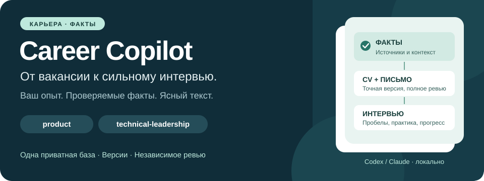
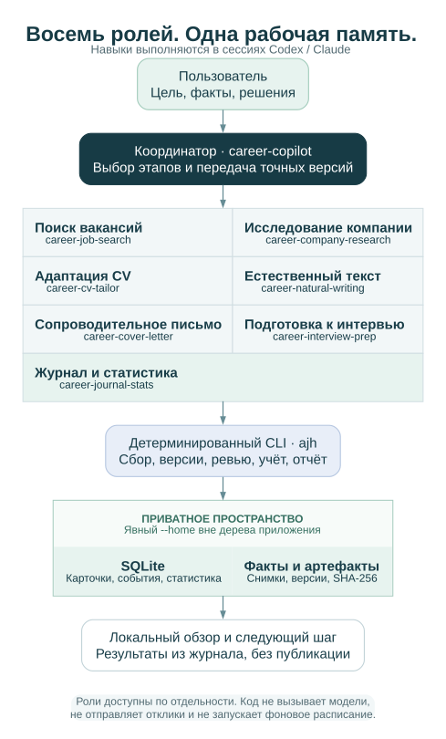

# Career Copilot

[English](README.md) · [Русский](README.ru.md)



**Превратите приватную историю опыта в целевой поиск работы, доказательные CV и подготовленные интервью.** Career Copilot даёт Codex и Claude восемь самостоятельных навыков, локальный журнал доказательств, версии документов и удобный обзор в браузере.

Основной путь — **собрать вакансии → оставить подходящие профилю → понять карточки → объяснимо решить, подходим ли → исправить или адаптировать резюме → подготовиться** к конкретному работодателю или по общим пробелам. Можно начать и с отдельного результата: изучить работодателя, найти роли, адаптировать CV, улучшить абзац, написать письмо, потренировать интервью или понять, где работа остановилась. Координатор связывает этапы, когда запрос требует нескольких.

| Задача | Навык | Результат |
| --- | --- | --- |
| Провести поиск через несколько этапов | `career-copilot` | Связанные задания, зависимости и следующие шаги |
| Найти и оценить роли | `career-job-search` | Итоги сбора, отбор по профилю с термометром 0–100 и оценкой агента по смыслу, запросы с полями вида `компания:сбер + должность:директор + где:москва + ai`, исходные условия и объяснённый результат соответствия |
| Понять работодателя | `career-company-research` | Досье о бизнесе, продуктах, рынках, масштабе и найме |
| Создать или адаптировать CV | `career-cv-tailor` | Правки «было → стало», исходник/PDF/текст с версиями, покрытие требований и передача на ревью |
| Сделать текст естественным | `career-natural-writing` | «До/после» с сохранением фактов и голоса |
| Написать письмо под вакансию | `career-cover-letter` | Черновик, связанный с точной версией CV |
| Подготовиться к интервью | `career-interview-prep` | Памятка к вакансии с источниками, план по общим пробелам, реальные STAR и текстовая практика с разбором |
| Посмотреть прогресс и записать исход | `career-journal-stats` | Детерминированные счётчики и подтверждённая история откликов |

## Два направления, одна история фактов

`product` — продуктовое управление и руководство: discovery, стратегия, клиентские результаты, коммерциализация и P&L. `technical-leadership` — инженерное управление и техническое лидерство: архитектура, платформы, надёжность, delivery и команды.

Мастер-CV ровно два. AI, payments, enterprise/API и другие области — модули внутри них. Оба используют одну приватную базу фактов. Официальные роли, хронология, клиенты, публикации и корректно приписанные награды остаются проверяемыми; автоматического ограничения в две страницы нет.

## Попробовать за несколько команд

Нужны macOS/Linux, Python 3.12+, [uv](https://docs.astral.sh/uv/getting-started/installation/) и Unicode TTF, например DejaVu Sans или Arial.

```sh
git clone https://github.com/eiler2005/career-copilot.git
cd career-copilot
uv sync --all-groups
uv run python scripts/demo_workflow.py --home /tmp/career-copilot-demo-EXAMPLE
uv run ajh --home /tmp/career-copilot-demo-EXAMPLE report --open
uv run ajh --home /tmp/career-copilot-demo-EXAMPLE stats
uv run ajh --home /tmp/career-copilot-demo-EXAMPLE verify
```

Назначение и соседние пути `-backup`, `-restored` должны быть новыми. Полный офлайн-цикл импортирует синтетические доказательства, оценивает оба трека, создаёт мастера и пакет вакансии, фиксирует работу агентов, повторяет разбор снимка и проверяет backup/restore. PDF намеренно остаются **в ожидании ревью**: модельное авторство и положительные проверки не придумываются.

Локальный экспорт — `report/index.html` пространства. Исходники, PDF, текст, покрытие и задания автору находятся в `packages/`, результаты запуска — в `demo-results.json`. [Начало работы](docs/ru/GETTING_STARTED.md) описывает приватную настройку и реальное авторство/ревью.

## Работа с пространством в браузере

[Приватный веб-интерфейс](docs/ru/DASHBOARD.md) читает существующий журнал SQLite и объединяет вакансии, резюме, подготовку, компании, документы, источники и историю. Карточки вакансий показывают исходную вилку, условия и объяснимый результат соответствия (без процента); раздел «Резюме» ведёт master и версии под вакансии с решениями по правкам и предпросмотром PDF; «Подготовка» — памятки к вакансиям, общие пробелы и текстовую практику. Действия в интерфейсе становятся заявками, которые `ajh inbox apply` применяет к локальному журналу с проверкой версий. Поиск помогает найти нужную запись; подробная карточка раскрывает доказательства и вложенные поля. У вакансий отдельно показаны страна, город и удалённый формат. Неоднозначная география остаётся неизвестной, исходное описание местоположения сохраняется. Фильтры и открытая запись хранятся в адресе, поэтому вид можно добавить в закладки или отправить ссылкой. Копия на сервере доступна через SSH-туннель или необязательный [HTTPS-шлюз с авторизацией](docs/ru/DASHBOARD.md#публичный-https-адрес-с-авторизацией).

Интерфейс работает на русском и английском, на компьютере и телефоне, без frontend-сборки и внешнего CDN. Он не редактирует журнал напрямую: решение, ссылка на вакансию, кампания или ответ на практике сохраняются как заявка, а работа, требующая авторства или исследования, становится задачей для агентской сессии и считается выполненной только после завершённой активности. Можно запустить его локально или в Docker с доступом через SSH-туннель или шлюз с авторизацией. Данные кандидата остаются вне образа и публичного репозитория.

## Как устроена работа



**Публичный checkout** содержит Python, документацию, синтетические примеры и репозиторные навыки. **Приватное пространство** хранит факты кандидата, компании, вакансии, снимки, SQLite, activity и документы. Оно явно задаётся через `--home` перед командой; реальные данные требуют постоянного внешнего хранилища.

**Существующая сессия Codex или Claude** исследует, пишет и оценивает. Навыки обнаруживаются обычным способом и применимы по отдельности. Внешние тексты и сложные суждения выполняет Astra (`gpt-6-astra`) в Codex либо Opus (`claude-opus-5`) в Claude; независимое содержательное ревью — отдельная сессия флагмана. Простой сбор может выполнять Luna. Нет нужной модели — задание blocked.

**CLI** сохраняет входы и хеши, собирает поддержанные источники, применяет явные правила доказательств, строит документы, применяет заявки интерфейса и считает статистику. В нём нет модельного API, автоматической отправки откликов или фонового планировщика.

## Источники и честный прогресс

Пятнадцать read-only адаптеров охватывают ATS-доски работодателей (Greenhouse, Lever, Ashby, SmartRecruiters, Workable, Recruitee), корпоративные страницы со статическим JSON-LD, HH по работодателю или поиску по тексту, доски удалённой работы (Remotive, Remote OK, Jobicy), региональные доски (Arbeitnow, Get on Board), открытые данные «Работа России» и публичный JSON-набор LinkedIn Salaries. Зарплатный индекс добавляет находки с исходным описанием оплаты и месячным USD-значением провайдера; адаптер не загружает LinkedIn, а доступность новых вакансий остаётся неизвестной. Исходные снимки поддерживают офлайн-разбор. Пустой результат, частичный охват, cooldown и ошибка учитываются отдельно: заблокированная страница не превращается в «вакансий нет». Каждый прогон показывает новые и изменившиеся вакансии, возможные дубли и ошибки источников. У вакансии хранятся исходная вилка, валюта, период и налоги (без придуманной месячной суммы), формат, занятость, язык, где разрешено работать (удалённо без списка стран — «нужно уточнить») и раздельные даты публикации, обнаружения и проверки. Отдельную вакансию можно добавить по публичной ссылке или вставленному тексту. Кампании поиска сравнивают вакансии с предпочтениями и не меняют оценку квалификации.

Результат соответствия — *недостаточно данных*, *есть вопросы*, *не подходит по обязательному условию* или *подходит по проверенным требованиям*, без процента и вероятности найма. У каждого требования видны доказательство и маршрут: правка резюме, подготовка, уточнение или основание для решения. Отсутствие слова в резюме не считается отсутствием опыта, а оценка помечается как требующая обновления при изменении вакансии, фактов или ограничений.

Доступность, соответствие кандидата, готовность документов, продемонстрированное обучение и реальная отправка независимы. Технически корректный PDF ещё не прошёл ревью, готовый пакет ещё не отправлен. Размер компании сопровождается метрикой, датой, охватом и источником; неизвестное остаётся неизвестным.

Подробнее: [обзор системы](docs/ru/SYSTEM_OVERVIEW.md) — все модули, контейнеры и потоки данных на одной странице, [источники и официальные API](docs/ru/SOURCES.md), [архитектура источников и подключение новых](docs/ru/SOURCE_ARCHITECTURE.md), [данные](docs/ru/DATA_MODEL.md), [полный рабочий цикл](docs/ru/WORKFLOW.md).

## Документация

| Руководство | Содержание |
| --- | --- |
| [Начало работы](docs/ru/GETTING_STARTED.md) | Установка, офлайн-пример, приватное пространство |
| [Рабочий цикл](docs/ru/WORKFLOW.md) | Входы, выходы, ответственность, остановка и возобновление |
| [Работа агентов](docs/ru/AGENT_WORKFLOWS.md) | Восемь ролей, activity JSON и типизированные результаты |
| [Журнал изменений](CHANGELOG.md) | Что изменилось в каждом релизе и зачем (на английском) |
| [CLI](docs/ru/CLI.md) | Команды, авторы/редакторы, вывод и коды завершения |
| [Веб-интерфейс и размещение](docs/ru/DASHBOARD.md) | Интерфейс, очередь заявок, Docker, доступ через туннель или HTTPS с авторизацией и обновления |
| [Настройки](docs/ru/CONFIGURATION.md) | Окружение, источники, кампании поиска, ограничения кандидата и политика |
| [Модель данных](docs/ru/DATA_MODEL.md) | Факты, сущности, условия вакансий, результаты соответствия, заявки и версии |
| [CV-профили](docs/ru/CV_PROFILES.md) | Два master-трека, версии под вакансии, решения по правкам, покрытие и приёмка |
| [Источники](docs/ru/SOURCES.md) | Провайдеры, доступ, replay, лимиты и ошибки |
| [Релевантность профилю](docs/ru/RELEVANCE.md) | Какие вакансии подходят профилю и почему: термометр 0–100, оценка агента по смыслу, запросы с полями, ступени и настройка |
| [Архитектура источников](docs/ru/SOURCE_ARCHITECTURE.md) | Конвейер сбора, семейства источников, маршруты напрямую/через прокси/резервный, контракт адаптера и подключение провайдера |
| [Подготовка к интервью](docs/ru/PREPARATION.md) | Памятки к вакансиям, общие пробелы, STAR и цикл текстовой практики |
| [Обзор системы](docs/ru/SYSTEM_OVERVIEW.md) | Все модули с кодом и записями, жизненный цикл заявки, схема запуска, контейнеры, релиз и откат |
| [Архитектура](docs/ru/ARCHITECTURE.md) | Публичная/приватная граница и источник истины |
| [Эксплуатация](docs/ru/OPERATIONS.md) | Ревью, диагностика, миграция, backup/restore |
| [Приватность](docs/ru/PRIVACY.md) | Дерево, staging, история и релиз |
| [Модуль CRM (спецификация)](docs/ru/CRM_MODULE.md) | Необязательные контакты, взаимодействия, договорённости и напоминания; выключен по умолчанию, не реализован |
| [Продуктовое исследование 2026-09-15](docs/ru/PRODUCT_RESEARCH_2026-09-15.md) | Задачи пользователя, пробелы, приоритеты и путь сбор → мэтчинг → CV → подготовка |
| [Участие в разработке](CONTRIBUTING.ru.md) | Изменения кода и паритет документации |

Каждому разделу соответствует полная английская версия в [docs](docs/GETTING_STARTED.md). Общие правила хранятся в руководствах; Claude-адаптеры ссылаются на канонические навыки.

## Ограничения текущей версии

Семантическое сопоставление доказательств, проверка уровня компании, авторство, осмотр страниц и оценка прогресса требуют реальной работы агента/пользователя. Консервативные CLI-правила не заменяют это суждение. Браузерный/поисковый fallback выполняется вручную; произвольные JavaScript-сайты автоматически не обходятся.

Заявки интерфейса вступают в силу только после `ajh inbox apply` на машине, где хранится журнал. Практика только текстовая (без голоса и видео), модуль CRM пока только описан. Некоторые доски отказывают автоматическим запросам из отдельных сетей; такие источники записываются как заблокированные и не обходятся.

PDF-рендерер поддерживает простой одноколоночный Markdown. Происхождение модельного вклада записывается и проверяется структурно, но не удостоверяется провайдером модели. Конфигурация источников — доверенный приватный ввод; сетевые ограничения не являются полной изоляцией. Локальное хранение не шифрует backup автоматически и не разрешает передачу персональных данных hosted-сервисам.

## Участие в разработке

Используйте синтетические примеры, сохраняйте обе языковые версии и проверяйте существенные изменения поведения:

```sh
uv run ruff check .
uv run ruff format --check .
uv run pytest
uv run python scripts/check_docs.py
```

Следуйте [CONTRIBUTING.ru](CONTRIBUTING.ru.md) и локальным проверкам словаря/Gitleaks из [PRIVACY](docs/ru/PRIVACY.md). Реальные данные кандидата не входят в публичные файлы и историю.

[Лицензия MIT](LICENSE). Имена дистрибутива `job-search-agent`, модуля `job_search_agent` и команды `ajh` сохранены для совместимости.
