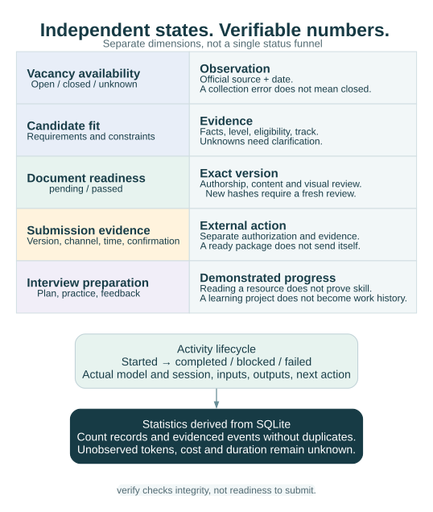

# Architecture and ownership of state

[English](ARCHITECTURE.md) · [Русский](ru/ARCHITECTURE.md) · [Documentation](../README.md#documentation)

The public repository contains reusable code and instructions. The private workspace contains the candidate's evidence and job-search history. An existing Codex or Claude session performs model work; a local Python CLI performs deterministic operations.


For a single map of modules, code, request lifecycle and containers, see the [system overview](SYSTEM_OVERVIEW.md).

## Storage boundary

```text
Public checkout                    Explicit private workspace
src/job_search_agent/               workspace.json, settings.json, facts.json
.agents/skills/, .claude/skills/     journal.sqlite
docs/, examples/, tests/            snapshots/, evidence/, facts-history/
scripts/, pyproject.toml            packages/, reviews/, learning/
                                   imports/, legacy/, report/
```

Pass an absolute `--home` outside the source checkout or set `AI_JOB_HUNTER_HOME`. It cannot be the filesystem root, the entire user home, the public repository or an ancestor/descendant of that repository. For real data, choose persistent private storage and backups.

A personal research repository may hold private additions. The public package neither imports its modules nor knows its location. Candidate settings, real company targets, dictionaries and CVs never belong in a public distribution. Local storage is not a guarantee that a hosted model sees no personal data: agents must honor authorization for sending material to external model services.

## Hosted skills and deterministic runtime

The canonical skill instructions live under `.agents/skills/`; ordinary Markdown adapters under `.claude/skills/` refer to the same contracts. Discovery belongs to the host environment. There is no global skill installation, embedded LLM API client, daemon or automatic sending service.

The coordinator selects only necessary specialists. Each specialist can run independently and logs an activity with input hashes, actual actor metadata, output artifacts/records and next action. Activity records explain model work; CLI events explain concrete local operations. Model labels never prove that a model performed work.

## SQLite and immutable artifacts

`records` stores JSON entities keyed by `(kind, id)`; `artifacts` stores relative paths, SHA-256 and byte counts; `meta` holds schema/runtime metadata. SQLite runs in WAL mode. Use the SQLite backup API for a consistent database snapshot instead of copying one file from an open WAL database.

Artifacts and retained versions are immutable by path. Different content at an occupied immutable path causes a conflict. A snapshot holds source bytes; an observation links those bytes to a source and vacancy. This supports offline replay and audit of normalized cards.

Deduplication uses provider IDs within company/provider scope, canonical URLs and saved aliases. A matching title is insufficient. Resolve ambiguous identities explicitly; retain previous annotations, decisions and document versions.

The source design adopts useful operational principles—preserved observations, offline replay, bounded retries, separate error state and last success—also seen in reddit-compass. It has no runtime dependency on that project and copies no private history or data.

## Versioned evidence and independent states

`facts import PATH` saves previous and new fact sets in `facts-history/` and materializes local references in `evidence/`. Package context snapshots preserve the exact facts used. Import is preferable to editing the current JSON directly; the CLI does not promise a history of arbitrary out-of-band edits.

An assessment hashes vacancy, company, facts and policy inputs. Changed inputs require a new assessment. A package is linked to `master` or a vacancy and a track; each version records authorship, files, hashes, page counts and reviews.



| State | What it answers | What it does not prove |
| --- | --- | --- |
| Source health | Did a collection route succeed, and how completely? | That all company vacancies were found |
| Availability | What evidence says about a posting being live | Candidate suitability |
| Evaluation | How requirements and policy match evidence | Document readiness |
| Document readiness | Whether this exact version passed required checks | Actual submission |
| Learning progress | Which output has demonstrated improvement | Commercial experience |
| Application outcome | What was actually sent and what happened | Automatic progression from a ready CV |

Reviews bind to an exact version and complete artifact hash dictionary. `pending` is an accurate incomplete state. Integrity verification, content approval, visual approval and external submission are distinct operations.

## Reports, compatibility and extension

HTML and exported JSON/Markdown/CSV are derived views. Editing them does not update SQLite. `report --open` generates `report/index.html` and opens a local file; no frontend build or web server is required. The report contains private data and should not be publicly hosted.

The optional [dashboard server](DASHBOARD.md) serves local HTML/CSS/JavaScript and reads the same journal through read-only SQLite connections. Browser requests do not initialize a workspace, migrate the schema or write records. Interface actions follow an explicit write contract: the dashboard stores validated requests in its state directory, and only `ajh inbox apply` on the machine that owns the journal changes records, with a record-version check against lost updates and a `record_updated` event holding the fields before and after. Work that needs authorship or research becomes a task for an existing agent session and is marked done only by a finished activity. The hosted copy therefore never becomes an independently edited journal. It preserves the original record payload and adds display fields for geography; those fields do not replace source evidence. Registered document downloads remain inside the selected private workspace.

Docker packages public application code and browser assets only. Mount a separate, verified private workspace read-only. The provided Compose configuration publishes its HTTP port on host loopback; remote access uses an SSH tunnel. A copied remote snapshot is a read-only replica, with the local workspace remaining authoritative. Updating that replica is an explicit deployment operation, not two-way synchronization.

Entry points are [cli.py](../src/job_search_agent/cli.py), persistence is [core.py](../src/job_search_agent/core.py), collection is [sources.py](../src/job_search_agent/sources.py), document/evaluation work is [workflow.py](../src/job_search_agent/workflow.py), and the local UI is [report.py](../src/job_search_agent/report.py). The distribution `job-search-agent`, import module `job_search_agent` and command `ajh` remain for compatibility with earlier versions.

Adapters follow [source policy](SOURCES.md) and the [source architecture](SOURCE_ARCHITECTURE.md) contract; migrations and recovery follow [operations](OPERATIONS.md); public artifacts follow [privacy](PRIVACY.md). See [data model](DATA_MODEL.md) before extending record kinds or contracts.
