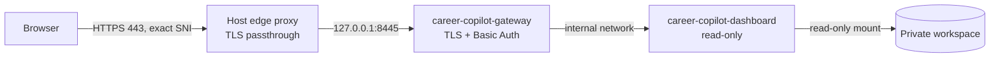

# Private dashboard and deployment

[English](DASHBOARD.md) · [Русский](ru/DASHBOARD.md) · [Documentation](../README.md#documentation)

The dashboard reads the existing SQLite journal. It shows vacancies with conditions and explainable fit, the CV module, preparation, companies, documents, activities, sources with collection and campaigns, and history, with search, filters and detailed records. Actions in the interface create requests that are applied to the journal locally. Russian and English are available in the interface. The browser assets ship with the Python package; there is no JavaScript build, external font request or CDN dependency.

## Run locally

Install the project as described in [getting started](GETTING_STARTED.md), then select an initialized external workspace:

```sh
uv run ajh-dashboard --home /absolute/private/career-workspace --port 8100
```

Open `http://127.0.0.1:8100`. The default host is loopback; the default port without `--port` is 8080. The process runs in the foreground. `ajh report --open` remains available as an independent local HTML export.

The server never edits the journal. Interface actions create [requests](#requests-from-the-interface) that `ajh inbox apply` applies locally; research, authorship and reviews still run through `ajh` and the [agent workflows](AGENT_WORKFLOWS.md). Refresh the dashboard after local changes. A remote copy must be updated separately; it does not synchronize changes back to the local workspace.

## Using the interface

- **Overview** answers "what needs attention": recent vacancies that are still open, the number of vacancies whose availability needs a source check (one click opens exactly that list), and the next recorded steps from unfinished activities, active vacancies and followed companies.
- **Lists** combine search with faceted filters. A filter offers only values that still match the other active filters, so a choice never leads to an empty page. The vacancy list separates hiring availability from review status. On a phone the filters fold behind a **Filters** button that shows how many are active. Press `/` to focus search and `Esc` to clear it.
- **Links are shareable.** The address keeps the section, search, filters, sort, page and an open record (`#vacancies?availability=needs_check&record=vacancies/<id>`). Reload, the browser back button and a copied link reopen the same view; **Copy link** in a record does this for you.
- **Freshness is explicit.** The footer shows when the journal itself last changed and when the page loaded the data. A remote snapshot therefore shows its age instead of looking current.
- **Documents** lists packages by the date of their current version and titles them by vacancy and company. **Journal files** at the end of the section lists every downloadable registered file, including files that no record references.
- **Vacancy cards follow one reading order:** the title with the original pay range on the right (currency, period, before/after tax, or "salary not stated"; a provider recalculation is labelled as such), the company and place, chips for track, level, format and employment (unknown values shown as unknown), where the work is allowed and the language, a short quoted description, the fit result with its reason and the campaign summary, the next step, availability with check age, and publication, discovery and verification dates with the source. Actions: **Details**, **Tailor CV**, **Preparation** and **Original ↗**. A market switcher above the list filters **All / Russia / International / Market unknown**. On a phone the salary moves under the title.
- **Vacancy details have tabs** — **Vacancy** (description and full text, conditions with their source, personal decision and collapsed technical details), **Fit** (the outcome with its first blocking reason, a "needs update" notice naming the changed inputs, the requirement matrix with evidence, basis and a route — to the CV tab, to preparation, an inline clarification answer or the decision basis — mandatory constraints, data completeness, requests to re-assess or annotate requirements and the comparison with each search campaign), **Company** (profile, dossiers, other vacancies), **CV** (versions for this vacancy and a request to tailor one) and **Preparation** (plans, a request for a vacancy brief and the coding flag with its basis). The tab is kept in the address (`&tab=fit`) and works with arrow keys.
- **CV** shows both master CVs with state, next step, versions, source and extracted text, an inline PDF preview, requirement coverage and review findings, and a request to fix the master; proposed edits as before → after → reason → facts with accept, reject and edit (history kept, reviews still required); vacancy versions grouped by vacancy with `based_on`; and CV import by pasted text with extracted sections, periods and claims to check. `GET /api/preview/<path>` serves a registered PDF under `packages/` inline with `X-Frame-Options: SAMEORIGIN`; the page allows frames only from itself.
- **Documents open in the browser.** Markdown and text files — full postings, research, plans — render in a reader with a download button instead of downloading immediately. Shared research files scroll to and highlight the row or paragraph for the selected vacancy.
- **Vacancies are linked everywhere they appear** — overview, company and document cards, next steps, plans, history and record details show the title, company, found date and availability together with a direct link to the original posting.
- **Preparation** has two entries: **For a vacancy** opens the vacancy's Preparation tab (briefs with company and interview claims labelled confirmed / participant report / assumption and dated sources, questions with type, what they test and provenance, STAR stories, plan, brief and employer questions; the coding flag with its basis; practice for that vacancy) and **General gaps** builds a plan from track, goal, hours and experience. Plan topics show why, where found, weight, exercise, criterion and a status that only practice changes. Practice shows the question, what it tests and its provenance, an answer box with a browser draft, "awaiting review" until an agent reviews, the review with highlighted fragments, follow-up and retry. Complete learning and interview plans follow with PDF downloads; older versions stay behind a toggle.
- **Sources** starts with collection: **Run collection** queues a task for an agent session, the last run lists new and changed vacancies, possible duplicates and source errors with the last success, and a form adds a vacancy by link or pasted text. **Search campaigns** shows each campaign with the number of fitting vacancies and an editor. Every configured source follows with schedule, last and next check, last success, problem (status, HTTP code, configuration error) and links; **Requests and tasks** shows what is waiting for sync, what was applied or rejected and each agent task's real status. **All data sources** lists every website referenced by vacancies, companies, documents and history, with the number of records and each individual link.
- **Pipeline** places every active vacancy in the furthest stage it has reached — found, assessed, documents, reviewed, applied, response, interview — with the stage date and days in stage. **Reminders** list what is due: an interview within 7 days, reviewed documents not sent for over 3 days, documents awaiting review for over 5 days, no response for over 14 days, and availability never checked or older than 15 days (grouped, with one button to check them all). The overview shows the top reminders.
- **Availability and data age.** Every vacancy shows when its availability was last checked ("checked 3 days ago") with green (≤7 days), amber (8–14) and red (15+ or never) highlighting and a matching filter. **Check** buttons on cards, in record details, reminders and the overview run the read-only check described in the [CLI reference](CLI.md#availability-translations-and-maintenance) and show the reason, confidence and evidence. Results made on a server are stored in its state directory, marked as pending, and imported into the local journal at the next publish.
- **Languages.** The interface is Russian or English. **Texts: translated / original** switches journal text — next steps, decisions, company descriptions, plans and history notes — between stored translations in the interface language and the original. Official vacancy titles and company names are never translated. Plan PDFs use the same translations.
- **History** is a timeline grouped by day with the time of each event, a readable summary and links to the affected records.

## Records and geography

Open a record to inspect its fields, sources, linked records and retained document versions. Nested objects and arrays remain available; source evidence is not reduced to a summary. Availability, evaluation, document readiness and submission are separate states.

Geography is a display projection. It preserves the raw location and shows country, city and remote scope separately. Explicit structured fields take precedence. A small set of supported city/country and city/state combinations supplies a conservative fallback; an arbitrary token before a country is not assumed to be a city. Narrow market context also supports the known Russian capital when the record explicitly uses the Russian market. Ambiguous city names, multiple countries, broad regions and remote-only descriptions remain unresolved where the source does not establish the answer. Unknown values remain visible; the server does not geocode through an external service or write inferred locations back to SQLite.

The API uses `GET /api/workspace` for the overview and `GET /api/records/<kind>/<id>` for an individual record. Workspace arrays include `companies`, `vacancies`, `documents`, `activities`, `preparations`, `sources` and `history`; `legacy_files` maps retained source references. Records preserve their original `payload` and provide separate `display` fields. `meta.journal_updated_at` is the last write time of `journal.sqlite` or its WAL. Older assessments of the same vacancy and track carry `display.current: false`; the newest is current. `history` includes `imports`. Older learning plans of the same vacancy and track also carry `display.current: false`. Vacancies also expose `display.description` (`kind` `posting`, `research` or `record`, verbatim `excerpt` up to 360 characters, source `path`, research `heading`, posting `meta` such as location and salary), or `null` when no description is retained. `translations` maps each exact journal text to its stored `ru`/`en` renderings. `capabilities.availability_check` tells the interface whether checks can run. `POST /api/availability/check` with `{"vacancy_ids": [...]}` (at most 10) runs checks for stored posting URLs only when the server was started with `--state-dir`; it requires `Content-Type: application/json`, the header `X-Career-Copilot: availability-check` and a same-host `Origin`, refuses parallel runs (409) and returns cached results younger than 10 minutes. Vacancies expose `display.availability`, `display.availability_check` and `display.checked_at` that merge the journal with newer state-directory checks. `GET /api/text/<path>` returns a registered Markdown or text artifact (up to 1 MB) as `text/plain` for in-page reading, with absolute local paths redacted. `GET /api/plans/<learning|interview_plans>/<id>.pdf` renders a plan as a PDF in memory (`?lang=en` for English labels); interview plans include their registered detailed plan. PDF rendering needs a Unicode TrueType font — the container installs DejaVu; locally DejaVu or Arial is used. `sources` combines `source_settings` from `settings.json` — limited to identifiers, provider, board, market, schedule, title filter and verified URL, never credentials or proxy settings — with the stored `health`; health records without a configured source remain listed separately. String values that are absolute local filesystem paths (for example an agent session file) are shown as `[local]/<file name>` so the operator's directory layout does not leave the machine; relative workspace paths and URLs are unchanged. The download registry includes eligible registered artifacts with paths, sizes and hashes. `GET /api/artifacts/<path>` checks directory, file type, path and integrity before download. Eligible roots are `activities`, `activity-artifacts`, `evidence`, `learning`, `legacy`, `packages`, `reviews` and `snapshots`; LaTeX sources (`.tex`) are downloadable alongside PDF, Markdown and the other document types. Top-level workspace control/configuration files, raw imports, maintenance, symlinks and unregistered files are refused, including registered paths outside those eligible roots and types. This is a path policy, not a scanner for credentials embedded in document content. HTML and other documents download as attachments instead of executing in the application's origin.

## Requests from the interface

The dashboard does not edit the journal. When it is started with `--state-dir`, `capabilities.requests` is true and actions in the interface create requests. `POST /api/requests` accepts `{"type", "base": {"kind", "id", "version"}, "payload"}` with `Content-Type: application/json`, the header `X-Career-Copilot: request` and a same-host `Origin`; the body is limited to 40 KB. The server validates the type and payload, assigns the ID and time, returns 409 with `current_version` when the record already changed, 404 when it does not exist, 422 for an invalid request and 429 when 500 requests are waiting. An accepted request is stored as `requests/<id>.json` and answered with 202 and `status: pending`. `GET /api/requests` and `pending_requests` in `/api/workspace` list requests that the journal has not imported yet. Every record carries `version`, the digest used for the check.

Requests take effect only after `ajh inbox import` and `ajh inbox apply` on the machine that owns the journal; the result (`applied`, `queued_for_agent`, `conflict`, `failed`, `rejected`) and agent `tasks` are then published with the next snapshot. The interface shows a request as waiting until then and never presents work as finished before the journal says so.

## Docker with private access

The image contains public source code and browser assets. The dashboard container also mounts a small named volume at `/data/state` (started with `--state-dir /data/state`) that holds only on-demand availability results and pending interface requests (`requests/`); the workspace mount stays read-only. Runtime dependencies are exported from `uv.lock` with `--frozen`; the application is installed without resolving additional dependencies. The workspace is an external read-only bind mount at `/data/workspace`. The process runs as UID/GID 10001; the selected directory and files must be readable by that identity. The Docker context allowlist admits only package metadata and source, excluding generated bytecode. Keep credentials, candidate material and host-specific settings out of the build context and Git.

```sh
export AJH_WORKSPACE=/absolute/private/career-workspace
docker compose config --quiet
docker compose up -d --build
docker compose ps
curl --fail http://127.0.0.1:8100/healthz
```

The supplied [Compose file](../compose.yaml) publishes port 8100 on host loopback. It defines a health check, restart policy, resource and log limits, a read-only container filesystem and reduced privileges. Docker must preserve that loopback mapping: an unqualified port publication exposes the service beyond the host. See [Docker's port publishing documentation](https://docs.docker.com/engine/network/port-publishing/).

There is no built-in public login service. Access a remote deployment through an authenticated SSH tunnel:

```sh
ssh -N -L 18100:127.0.0.1:8100 YOUR_SSH_HOST_ALIAS
```

Then open `http://127.0.0.1:18100` on the local computer. `YOUR_SSH_HOST_ALIAS` represents a privately configured SSH destination. No public firewall port is required. Simply changing the bind address is never a way to publish the dashboard.

## Public HTTPS address with authentication

Use this when the dashboard should open from a phone or another computer without a tunnel. [compose.public.yaml](../compose.public.yaml) adds an authenticating [Caddy gateway](../deploy/public-gateway/Caddyfile) in front of the unchanged dashboard container:



- The gateway terminates TLS for one hostname and obtains its certificate through TLS-ALPN-01, so no port 80 listener is needed. The host's edge proxy must forward TLS for that exact server name, unchanged, to the gateway's loopback port. That route belongs to whoever owns the host's port 443; this project does not change it.
- Every path except `GET /healthz` and `/robots.txt` requires HTTP Basic authentication over TLS. The dashboard accepts the public `Host` only because `AJH_DASHBOARD_ALLOWED_HOSTS` names it; every other name is still rejected, preserving DNS-rebinding protection. The `Authorization` header is not forwarded to the dashboard.
- Responses carry `X-Robots-Tag: noindex` and HSTS; neither Caddy nor the dashboard writes request URIs, record identifiers or credentials to logs. Both containers run with a read-only filesystem, dropped capabilities and memory, CPU and PID limits. The host publishes only loopback ports.

Keep these values in the deployment `.env` next to `AJH_WORKSPACE` (mode `0600`, never in Git):

| Variable | Meaning |
| --- | --- |
| `CC_PUBLIC_HOST` | Public hostname, for example `career.example.org` |
| `CC_BASIC_USER` | Login name |
| `CC_BASIC_HASH` | bcrypt hash from `docker run --rm caddy:2.11.4-alpine caddy hash-password` |
| `ACME_EMAIL` | Certificate expiry and incident notices |
| `CC_GATEWAY_PORT` | Optional loopback port, default `8445` |

```sh
docker compose -f compose.yaml -f compose.public.yaml config --quiet
docker compose -f compose.yaml -f compose.public.yaml up -d --build --wait
curl --fail https://career.example.org/healthz
curl -s -o /dev/null -w '%{http_code}\n' https://career.example.org/   # 401 without credentials
```

Keep the password in a password manager. To rotate it, generate a new hash, update `.env` and recreate only the gateway (`up -d --no-deps gateway`). To withdraw public access, remove the edge route and stop the gateway; the SSH tunnel keeps working. Basic authentication is a single shared credential: it has no per-user accounts, second factor or session revocation, so place a stronger identity-aware proxy in front if more people need access.

## Copy, update and recover

1. Pause workspace writers and make an [application backup](OPERATIONS.md#backup-and-restore). Restore it into a new local directory and run `ajh verify` against that copy.
2. Prepare a closed SQLite snapshot for the read-only mount. A live WAL database cannot be copied safely as just `journal.sqlite`; use the SQLite backup API. For a deployment copy with no concurrent writer, close connections and switch that copy to rollback journal mode before transfer. Keep the active local database unchanged.
3. Transfer the verified workspace over SSH into a new private release directory on the server. Restrict filesystem access and make it readable by the container UID. Keep the previous workspace and image until the new release passes its checks.
4. Before building the snapshot, download pending request files from the server, run `ajh inbox import` and `ajh inbox apply` locally, and after a successful swap delete the request files the journal now holds. Point `AJH_WORKSPACE` at the new snapshot and recreate the dashboard container. A change to the gateway Caddyfile needs `caddy validate` and a separate `up -d --no-deps --force-recreate gateway`, because the file is bind-mounted at container start. Verify health, record counts, document downloads and the private tunnel. Updating the image alone does not update the workspace snapshot.
5. Include durable workspace storage in the host's encrypted backup plan and test restoration. The container filesystem is disposable; the external workspace is not. A successful application-local backup is not evidence that the server's backup includes the new directory.

For rollback, select the previous application image and workspace snapshot, recreate the service and repeat the health/content checks. Do not delete volumes or overwrite retained document versions during an update. The dashboard does not alter the existing journal schema or require a reimport of legacy data.

## Verification and limits

Run the repository checks in [Privacy](PRIVACY.md) before publishing code or an image. Backend tests cover HTTP behavior, SQLite reads, geography and artifact boundaries. Browser verification should exercise navigation, search, filters, record details, downloads and Russian/English layouts on desktop and mobile.

`/healthz` checks application readiness; it does not prove vacancy freshness, review approval or backup coverage. The service is a private browser view using Python's standard HTTP server, intended for loopback, tunnel or authenticated gateway access. It reads the journal and writes only requests and availability results to its state directory. It does not provide multi-user accounts, direct editing, automatic applications, background collection, model API calls or two-way synchronization; requests take effect only after a local `inbox apply`. Errors and access logs must not disclose candidate records or credentials.
