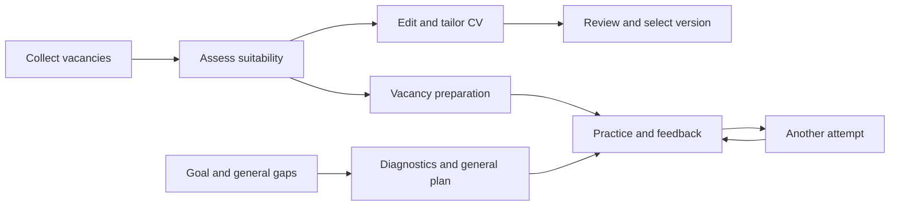

# Career Copilot: product research and development opportunities

[English](PRODUCT_RESEARCH_2026-09-15.md) · [Русский](ru/PRODUCT_RESEARCH_2026-09-15.md) · [Project overview](../README.md)

**Research date:** 15 September 2026.  
**Status:** research and a refined product focus; the proposed improvements are not yet implemented.  
**Scope:** Career Copilot's public code and documentation and fourteen external products and open-source projects. The original ten-product sample is extended with Treparo, Koru, Exponent / Aced and Interview Query to examine information gathering and interview preparation.

## 1. Main conclusion

Develop Career Copilot as **a personal workspace for a deliberate job search**, where the user understands:

1. Which opportunities deserve attention now, and why.
2. Which real facts support their suitability for a role.
3. Which document version to use and what still prevents it from being ready.
4. What to do today to move towards the next employer conversation.
5. What actual applications and interviews revealed, and how to adjust the search.

The foundation already exists: versioned facts, requirement assessments, document versions, independent review, preparation and a journal. The main product gap is **making those capabilities accessible in everyday work**. Many actions require the CLI, files and an agent session; the browser mainly presents results.

**Priority after scope clarification:** vacancy collection and clear cards with market separation → explained matching → CV editing and tailoring. Next comes a [separate preparation module](#preparation-module) for vacancies and general gaps. [CRM](#optional-crm) is specified separately, disabled by default and deferred. Trustworthy states and UI actions support this workflow; initial CV import supports independent onboarding.

**Proposed initial audience:** experienced professionals and leaders in product and technical leadership who value accurate positioning, confidentiality and individual opportunities. This is a hypothesis based on the project's design, not validated segment demand.

## 2. Method and limits

- Reviewed the README, workflow, data, sources, dashboard and preparation guides, plus relevant CLI, statistics and interface implementation.
- Local baseline: `ead5398` plus the working tree available during research. The interface had uncommitted changes; the observed state should not automatically be treated as a published release.
- External evidence consists of official product pages, help centers and author repositories. All external sources were accessed on 15 September 2026.
- Competitors were not tested through paid accounts. “Advertised” means described by the vendor, not independently verified for quality.
- “Not found” means no supporting evidence appeared in the reviewed material. It does not establish that a feature is absent from the entire product.
- No user interviews, willingness-to-pay validation or effectiveness measurements were conducted. Priorities below reflect the user's clarified request; effort, expected effects and pilot criteria remain hypotheses.
- Only public product materials were used. Candidate information and the private journal are unnecessary for this analysis.

## 3. Career Copilot's existing capabilities

Labels: **implemented** means found in the code and/or documented as available; **agent workflow** means the outcome requires agent or human work; **gap** means a complete user workflow was not found.

| Area | Current state | Product value and limitation |
| --- | --- | --- |
| Career profile | Versioned facts, two master tracks and structured import are implemented | A strong basis for consistent positioning. No UI wizard for “upload CV → review extracted facts” was found |
| Discovery | Six adapters: Greenhouse, Lever, Ashby, HH, corporate JSON-LD and LinkedIn Salaries | Collection, original snapshots, failures and freshness exist. Most sources need company/board configuration; this is not a market-wide search engine |
| Suitability | Requirements/evidence matrix, role, language and eligibility gates, conservative rules | Decisions can be explained. Semantic interpretation requires an agent; personal preference ranking is not a complete product workflow |
| Companies | Records and a standalone employer research workflow | Business context exists. A personal, weighted comparison of company attractiveness was not found |
| CVs and letters | Source/PDF/text versions, coverage, authorship, letters linked to CV versions and review | Strong traceability. Preparation is more involved than a visual editor; the built-in PDF renderer supports simple single-column Markdown |
| Search overview | RU/EN dashboard, filters, stateful links, detailed records, documents and history | A browser product already exists. Proposing a dashboard from scratch would misstate the baseline |
| Pipeline and reminders | Stages, time in stage, reminders and next actions already exist | Improve their meaning and usability rather than treat the pipeline as a new feature |
| Vacancy checks | The interface can check availability and display data age | An interactive operation already exists. It does not make the whole dashboard a journal editor |
| Interviews | Agent workflow: plans, STAR stories, practice, feedback and demonstrated progress; plan viewing and PDF downloads | “Add interview preparation” is too broad. Convenient practice launch and completion within a vacancy context are missing |
| Outcomes | Submission and response records, version links and deterministic statistics | An analytics foundation exists. Comparable-cohort analysis and a managed strategy improvement cycle were not found |
| Operations | Local data, backup/restore, separate private workspace, Docker and restricted access | Useful data control. Setup requires technical skills; a hosted copy does not provide two-way synchronization |

Evidence: [README](../README.md), [workflow](WORKFLOW.md), [sources](SOURCES.md), [data model](DATA_MODEL.md), [dashboard](DASHBOARD.md), [preparation](PREPARATION.md), [CLI](../src/job_search_agent/cli.py), [statistics](../src/job_search_agent/stats.py).

### 3.1. Product debt: pipeline accuracy

Static inspection of `vacancyStage()` in [app.js](../src/job_search_agent/web_assets/app.js) identified reasons for targeted verification:

- `interview_practices` and `interview_feedback` contribute to the `interview` stage. Practice can appear as actual employer progress.
- Legacy `application_status: submitted` also affects the stage, while [stats.py](../src/job_search_agent/stats.py) separately excludes submissions without confirmation and evidence.
- The UI considers `at/date/submitted_at` for submission dates, while statistics checks `sent_at`. Stage age needs verification against the current record format.

These are implementation observations, not reproduced errors in a particular private journal. Before developing conversion analytics, align stages and dates with confirmed events. Practice, scheduled interviews, completed interviews, offers and search completion should be distinct.

## 4. Comparable products

The sample covers application automation, search management, CV work, preparation and self-hosting. The first table covers the original ten products; the [extended comparison](#interview-research) examines information gathering and interview preparation. Tables describe selected capabilities from provider materials rather than an exhaustive feature audit.

| Product | What its materials support | Implication for Career Copilot |
| --- | --- | --- |
| **Sofi** | Search and application automation; examined below. [Landing page](https://sofi-assistant.com/landing/) | Learn from the simple entry point and visible daily result; separately test demand for automatic submission |
| **Teal** | Resume building/tailoring, extension-based vacancy capture and a tracker. [Product](https://www.tealhq.com/). Records include stage guidance, notes and CV attachments. [Help](https://help.tealhq.com/en/articles/9525013-leveraging-your-job-tracker-tools) | Make a vacancy record the place to work on documents and next steps |
| **Huntr** | Tracking, CV/letter tailoring, autofill, vacancy capture and contacts. [Product](https://huntr.co/) | Easy daily operations; place relationships between people, companies and opportunities in optional CRM |
| **Simplify Copilot** | An extension fills forms, assists with answers and CV tailoring, and tracks applications submitted through it. [Copilot](https://simplify.jobs/copilot) | Reduce repeated entry during submission; first test a prepared answer kit |
| **Jobscan** | CV/job comparison, missing keywords and formatting checks. Match Rate is described as the tool's own indicator. [Scanner](https://www.jobscan.co/resume-scanner) | Separate document readability from evidence coverage; do not present a proprietary score as hiring probability |
| **LoopCV** | Recurring search, auto-apply, manual match review, company exclusions and CV variant analytics. [Product](https://www.loopcv.pro/) | Adopt understandable search campaigns with settings, results and a pause control |
| **Careerflow** | Role-specific interview practice, feedback and progress history. [Mock interview](https://www.careerflow.ai/ai-mock-interview) | Turn the existing preparation method into convenient recurring practice |
| **JobSync** | A self-hosted tracker with CV import, an AI assistant, contacts, questions, scheduled ATS discovery and MCP integration. [Repository](https://github.com/Gsync/jobsync) | A close open-source comparison: local ownership and agent connectivity alone are insufficient differentiation |
| **Reactive Resume** | Self-hosting, visual editing with preview, PDF/JSON/DOCX export and AI integrations. [Repository](https://github.com/reactive-resume/reactive-resume) | A reference for editing and portability; investigate export/integration before building a large proprietary editor |
| **OpenResume** | Browser-based operation, PDF import, live preview and resume parsing. [Repository](https://github.com/xitanggg/open-resume) | A reference for simple onboarding and showing what the document parser actually extracted |

**Interpretation:** text generation, tracking, local storage and AI chat individually provide limited differentiation within this sample. Career Copilot's promising distinction is the connected chain: **fact → requirement → decision → CV version → preparation → confirmed outcome**. Architectural support for that chain still needs to become tangible user value.

<a id="interview-research"></a>

### 4.1. Information gathering and interview preparation in comparable products

This section records specific external product capabilities and outputs. Career Copilot proposals remain in section 7. Sources were checked on 15 September 2026; no personal product sessions were run.

**Evidence levels:**

- **Published example / catalog:** an output or collection page was opened. This establishes the example's existence, not every claim's accuracy or the quality of all outputs.
- **Documented feature:** a help center describes user actions and results. This establishes the documented workflow, not an independent test.
- **Vendor claim:** the product page describes a capability whose execution was not tested.

### 4.2. Workflow comparison

Details, sources and limitations follow below. Evidence levels apply to the specific materials rather than the entire product.

| Product | Inputs | Information gathering | Preparation | Output and evidence |
| --- | --- | --- | --- | --- |
| Treparo | Experience and vacancy | Company and sector | Talking points, questions, answer plans | Brief and reference sheet; published examples |
| Koru | Journal or CV, company, vacancy | Refreshable public brief | Relevant experience selection | Editable STAR stories; vendor claims |
| Exponent / Aced | Company and role | Guides and participant accounts | Questions, courses, practice | Preparation catalog; public pages and product description |
| Interview Query | Goals and exercise responses | Questions and hiring-process information | Diagnosis and recommendations | Exercises and learning materials; vendor claim |
| Careerflow | CV and vacancy or custom questions | Uses supplied context | Recorded practice session | Video, text and feedback; instructions |
| Teal | Saved vacancy or scenario | Role description; research checklist | Simulation and coaching modes | Feedback and meeting history; instructions |

### 4.3. Treparo: research becomes a preparation package

Using candidate experience and a vacancy, the service advertises seven separate outputs:

- A company briefing covering business, competitors, culture and news.
- Sector context and role expectations.
- A personalized interview brief.
- Situational questions.
- Experience-based answer outlines.
- A short reference sheet.
- A plan for the first 30/60/90 days.

The page also describes recorded practice with adaptive follow-ups. [Treparo product](https://treparo.com/)

**Inspectable outputs:** the [company research example](https://treparo.com/examples/sarah-chen-tide/company-research) contains topic sections and employer questions; the [interview brief example](https://treparo.com/examples/sarah-chen-tide/interview-brief) contains strengths, gaps and talking points tied to experience. Both pages open without registration and include PDF links. The examples' structure was inspected; facts about their subjects and employers are neither reproduced here nor independently verified.

### 4.4. Koru: public context and a career journal

The vendor describes gathering public information from multiple sources and summarizing business model, culture, risks and strategy. Research is retained, refreshable and reused in preparation and application materials. [Company research](https://koru.careers/en/features/company-research)

Work entries become STAR stories: situation, task, action and result. Users can start with a CV, add a vacancy, find relevant stories and edit the output. Short company briefs and employer questions are also advertised. [Interview preparation](https://koru.careers/en/features/interview-prep)

**Evidence:** product pages. An output example and authenticated feature execution were not tested.

### 4.5. Exponent / Aced: information about actual interview processes

The public [guide catalog](https://www.tryexponent.com/guides) supports company and role selection. [Participant accounts](https://www.tryexponent.com/experiences) show role, company, interview date, round count and questions. Some carry the service's verified label; its verification method was not examined. Full access to some content is restricted.

Courses, question banks, expert video answers and mock interviews complement these resources, including Product Management and Engineering Management tracks. The site uses Aced branding and mentions the transition from Exponent. [Product overview](https://www.tryexponent.com/)

**Evidence:** public catalogs and product description. Accounts describe individual experiences and do not guarantee a future interview format.

### 4.6. Interview Query: diagnosis guides learning

The product page describes questions organized by company and topic, participant accounts, hiring-process guides, exercises with solutions and a browser code editor. It advertises practice and study recommendations based on user goals and diagnostic responses. Its focus is data science and analytics. [Interview Query](https://www.interviewquery.com/)

**Evidence:** product description; personal diagnosis was not tested. This does not establish automatic collection of arbitrary external articles for each vacancy.

### 4.7. Careerflow: personalized recorded practice

The instructions describe uploading a CV and vacancy, selecting technical, behavioral or mixed interviews and an interviewer role. Custom questions are supported. Recorded sessions provide video, transcripts, criterion scores, question feedback, sample answers and next steps. [Careerflow instructions](https://help.careerflow.ai/en/articles/12631590-using-the-ai-mock-interview-tool)

**Evidence:** a step-by-step help article. It documents supplied-context preparation; it does not establish automatic company research.

### 4.8. Teal: practice linked to vacancies and meetings

Practice launched from a saved vacancy uses its description. **Mock** provides feedback at the end; **Coach** provides it during answers. Follow-up questions and transcripts are available; the tracker retains rounds, participants and notes. [Teal instructions](https://help.tealhq.com/en/articles/14435728-how-to-prepare-for-interviews-using-teal)

**Evidence:** help-center documentation. Company research is described as a user checklist task; this source does not establish automatic dossier collection.

### 4.9. Sofi: limits of confirmed capabilities

Separate company-research and mock-interview modules were not established from [Sofi's reviewed landing page](https://sofi-assistant.com/landing/). This is a research limit, not proof of absence.

### 4.10. Established findings and remaining unknowns

The comparison documents distinct capabilities: research artifacts, interview-experience collections, journal-based story selection, learning recommendations after diagnosis and practice with feedback. Their presence in other products does not establish effectiveness for every user.

**Qualification of the initial interpretation:** linking experience, research and preparation is already described by Koru and shown in Treparo's examples. The idea's uniqueness is therefore unestablished; Career Copilot's differentiation needs validation through concrete user outcomes. [Koru](https://koru.careers/en/features/interview-prep), [Treparo example](https://treparo.com/examples/sarah-chen-tide/interview-brief)

Unverified areas include source completeness and freshness, generated-question and scoring accuracy, Russian-language quality, paid-account results and integration availability. A public example does not establish a primary-source link for every claim. A blog's advice to research a company also does not establish an automatic collection feature.

## 5. Sofi: lessons and adaptations

### Established from the reviewed page

The landing page advertises HH profile import, preference-based matching, personalized letters, automatic submission and a semi-automatic mode. Its FAQ names HH, Habr Career, company sites, Telegram and direct recruiter contact. Matching quality, channel completeness and the no-blocking promise were not independently tested. [Sofi](https://sofi-assistant.com/landing/)

### Product interpretation

Sofi's useful positioning pattern is to explain value through a completed user outcome. A corresponding message for Career Copilot could be:

> “Review your best opportunities, prepare accurate documents and know the next step for every vacancy.”

This is proposed positioning. Time savings and interview gains still need measurement.

| Transferable idea | Career Copilot adaptation |
| --- | --- |
| A short route to the first result | CV + one vacancy → a draft assessment with sources and factual questions |
| Understandable preferences | Target role, market, compensation, working arrangement, excluded companies and weekly time budget |
| Regular progress | A few priority opportunities and specific actions for today |
| Influence over matching | “Relevant”, “wrong level”, “wrong arrangement”, “later”, with editable reasons |
| Less repetitive work | A CV/letter/answer package and easy recording of an actual submission |

**Automation decision:** defer fully automatic submission. It changes the current boundary of a product that reads sources and prepares materials, and requires separate validation of channels, submission errors and user control. The nearest useful step is a prepared queue of quality packages handed to the user for submission.

**Possible coexistence:** users who already employ a submission service could use Career Copilot to prepare materials and import outcomes. This is an idea to validate; Sofi's public API or compatible export was not established, so an integration is not promised.

## 6. Product strategy choice

| Direction | Potential value | Development cost | Recommendation |
| --- | --- | --- | --- |
| Personal workspace for an experienced candidate | Better decisions, documents and preparation; control of history | Simplify the existing system and measure usefulness | **Initial focus:** fits the two current tracks and existing core |
| Mass-market automatic application service | Major reduction in repetitive operations | Broad form coverage, channel operations, support and submission on the user's behalf | A separate strategic branch after demand validation |
| Career consultant workspace | Multiple clients, collaboration and quality control | Client isolation, access roles, approval processes and support | Later: first test a consulting pilot without a shared client database |

For the initial audience, distinguish **hard constraints** from **preferences**. An eligibility failure should not be offset by attractive compensation. Unknown conditions should generate questions. Keep two master tracks; campaigns, markets and domains are search settings within them.

## 7. Product modules and priorities

**Refined focus:** vacancy collection → an explained suitability decision → CV tailoring. Preparation develops as a separate module with two entry points: a vacancy and general gaps. CRM is an optional module, disabled by default. This describes future behavior; the report does not implement new screens, settings or operations.

Priorities: **P0** is the core workflow for the next version; **P1** is the next delivery after that workflow; **P2** is an optional extension. Relative sizes: **S** is a contained change; **M** is a new workflow on the existing core; **L** spans subsystems or integrations. These are not day estimates. Priorities reflect the selected focus; usefulness and effort still require validation.

### 7.1. Module boundaries

| Module | User task | Independent entry | Connections |
| --- | --- | --- | --- |
| Vacancies and matching | Find opportunities and understand suitability | Configure discovery or add a URL/text | Supplies requirements to CV work and preparation |
| CVs | Improve a master CV or tailor a version | Open a CV independently or from a vacancy | Uses shared verified facts and the selected track |
| Preparation | Prepare for a meeting or address general gaps | Choose a vacancy or a track and topic | Uses requirements, experience, diagnostics and practice results |
| CRM, optional | Remember people and commitments | Enable the module in settings | Enriches companies/vacancies; other modules do not depend on it |

Main navigation: **Vacancies · CVs · Preparation**. Source settings are accessible from vacancies. CRM appears after activation. Keep two master tracks, `product` and `technical-leadership`; markets, domains and preparation topics do not create additional master CVs.

| ID | Capability and outcome | Existing foundation → addition | Priority / size | Dependency |
| --- | --- | --- | --- | --- |
| F00 | Trustworthy states | Pipeline/statistics → align events, dates and separation of practice from employer interviews | P0, supporting work / M | Verify current record semantics |
| F01 | Understandable CV import | Fact import → extraction, review and master-track selection | P0 for onboarding / M | F04 for UI persistence |
| F02 | Vacancy intake | Adapters/records → URL/text, original content, completeness and duplicates | P0 / M | Permitted access; F04 for persistence |
| F03 | Next useful action | Overview → a short explained queue | P1 / M | F00, F04; core workflow results |
| F04 | Interface actions | Viewing → saving changes and handing tasks to an existing agent | P0, incremental / L | Explicit write and execution contract |
| F05 | CV editing and tailoring | Versions/reviews → comparison, reasons, preview and version selection | P0 / M | Facts, F04; authorship/review contracts |
| F06 | Vacancy preparation | Research/plans → connected workspace, questions, practice and feedback | P1 / M | Requirements and available experience; F04, no mandatory F05 completion |
| F07 | CRM: people and commitments | Companies/vacancies → a separately enabled module | P2, disabled by default / M | F04; separate activation decision |
| F08 | Outcome analytics | Counts → comparable cohorts and reason analysis | P2 / M | F00; enough confirmed data |
| F09 | Discovery by market | Six adapters → campaigns, coverage, freshness and controlled refresh | P0 for existing sources; P1 for new ones / M→L | F02, F04; new channels address observed coverage gaps |
| F10 | CV readability and coverage | Extracted text → understandable sections and missing evidence | P0, minimum within F05 / M | F05 |
| F11 | Application-form answers | Materials → verified answer bank, then autofill | P2 / M→L | F05; supported-site validation |
| F12 | Terms comparison | Dossiers/pay → personal criteria and employer questions | P2 / M | Provenance of terms; no CRM requirement |
| F13 | Message/calendar import | Events → selected imports, then connections | P2 / L | F00, F04; separate integration decision |
| F14 | Understandable vacancy cards | Title, description, status → conditions, explained suitability and next action | P0 / M | F02, F09; F15 result when available |
| F15 | Explained matching | Requirement matrix → decision, evidence, unknowns and reasons | P0 / M | Vacancy completeness, facts and search constraints |
| F16 | General-gap preparation | Track-level plans → diagnostics, consolidated topics, exercises and reassessment | P1 / M | Track and available experience; no vacancy or CRM requirement |

### 7.2. Vacancies: collection, markets and clear cards — F02, F09, F14

**User outcome:** receive fresh opportunities and quickly decide what to open, clarify or dismiss.

**Search settings.** List switch: “All / Russia / International / Market unknown”. Each campaign stores a track, role titles, level, work countries, arrangement, language, employment type, pay preferences and exclusions. Market classification follows the position's conditions and campaign settings; headquarters country alone does not determine it. One vacancy can match several campaigns while remaining one record.

Show work eligibility separately: “can work from the selected country / cannot / needs clarification”, with its basis. Remote does not establish eligibility from Russia or any other country. International does not automatically mean suitable for the user.

**Source expansion plan:**

| Area | Existing foundation | Next improvement |
| --- | --- | --- |
| Russia | HH for configured employers, corporate JSON-LD | Coverage of relevant employers; assess separate market-wide HH search; initially add selected Habr Career and Telegram posts through permitted manual intake |
| International | Greenhouse, Lever, Ashby, corporate JSON-LD, LinkedIn Salaries | Company/board and region settings, full descriptions from permitted sources, duplicate handling |
| Both markets | URL, text and original snapshots | Consistent fields, change history, visible completeness and refresh results |

These are coverage proposals, not claims of implemented new adapters. The existing HH adapter collects a specified employer's vacancies; the corporate adapter reads static JSON-LD. LinkedIn Salaries provides aggregated cards that may lack full descriptions and requirements. See the current [source implementation](SOURCES.md).

After collection, show new records, changes, possible duplicates, failed/unverified sources and last successful retrieval time. Closing a vacancy requires a separate basis; a source error or absence from incomplete results does not prove closure. Keep publication, discovery and verification as distinct dates.

**List card.** Adopt the hierarchy of the supplied example: prominent title and terms, employer, short labels, dates and source link. This proposed layout contains placeholder fields only:

```text
Role title                                     Original pay range
Employer · workplace                           Currency · period · gross/net

[Track] [Level] [Arrangement] [Employment]
Permitted work locations: … · Language: …

Suitability: … — main reason
Matches: … · Clarify: …
Next action: …

Published: … · Checked: … · Source: …
[Details] [Tailor CV] [Preparation] [Original ↗]
```

- Highlight the original range and period. Use “not stated” when pay is missing; show a single amount only when the source supplies one. Currency conversion is an additional, clearly approximate value with provenance; hourly pay requires an hours assumption.
- An aggregator's monthly USD estimate is the publisher's conversion, not a verified employer offer. Preserve the original currency/wording. A decorative pay bar needs a meaningful comparison basis.
- Limit labels to decision-relevant conditions; expand requirements within the record. Mark unknown conditions explicitly.
- Keep vacancy availability, suitability, CV readiness and application stage separate. Before assessment, display “not assessed”.
- On mobile, place pay below the title; actions and constraints remain accessible without horizontal scrolling.
- Expanded record: **Vacancy · Suitability · Company · CV · Preparation**. “Contacts” appears only with CRM enabled. The preparation link opens the same object in the separate module.

**Validation criterion:** within a target ten seconds per card, a user identifies the role, conditions, unknowns and next action. This is a pilot target, not measured performance. An incomplete card remains viewable but does not claim a full match without sufficient requirements.

### 7.3. Matching: an explained suitability decision — F15

**Inputs:** vacancy version, selected track, verified candidate facts and search constraints. Current CV wording can help locate evidence, but rewritten text does not create a qualification.

| Interface decision | When to show it | Next action |
| --- | --- | --- |
| Not assessed | Assessment has not run | Obtain the description and assess |
| Insufficient data | Full description or sufficient experience evidence is missing | Gather missing inputs; show preliminary observations only |
| Meets assessed requirements | Assessed mandatory conditions are satisfied and evidence is sufficient | Check personal attractiveness and proceed to CV work |
| Questions remain | A mandatory condition or supporting evidence is unclear | Show the exact question and where/to whom to ask it |
| Fails a mandatory condition | A material mismatch is supported by evidence | Show the basis; reassess when inputs change |

Below the decision, show **requirement → mandatory status → fact/source → match, gap or unknown → action**. A personally undesirable arrangement is separate from qualification. An overall percentage must not hide a mandatory constraint or resemble offer probability.

Separate three outcomes: existing experience is poorly presented, which creates CV work; a skill needs development, which creates preparation work; a structural constraint needs clarification or vacancy exclusion. A missing word does not prove missing experience. A course cannot supply required commercial tenure, a license or work authorization.

Changed vacancy content, facts or constraints mark the affected assessment for refresh. A manual “not interested” stores a personal decision and reason without rewriting evidence. Campaign settings change explicitly.

**Validation criterion:** every decision opens its requirements and supporting basis; unknowns do not become failures or matches. Synthetic cases should check both missed constraints and wrongful exclusion of suitable roles.

### 7.4. CVs: improve the baseline and tailor for a vacancy — F01, F05, F10

The module has two modes: **master CV by track** and **vacancy-specific version**. Retain exactly two master CVs; vacancies receive derived versions. Tailoring must not silently rewrite a master.

1. Import a document or open an existing version. Show extracted sections, dates, facts and points needing review.
2. For a vacancy, compare requirements with verified experience and select relevant emphasis.
3. Propose edits as **before → after → reason → supporting fact**. Identify where candidate clarification is needed.
4. Allow accepting, rejecting or editing a change. Substantive editing creates a new version linked to its source.
5. Show PDF preview, extracted text and requirement coverage. Separate readability problems from missing evidence.
6. Display findings, remaining checks and the exact version available for use.

States: draft, awaiting facts, authored, awaiting content review, awaiting visual review and ready. Accepting an edit does not replace required checks; review binds to exact files and versions. Existing authorship and independent review contracts remain applicable.

Preserve official role titles, dates, personal contribution and outcomes. New keywords need verified experience. Create a cover letter when requested and bind it to the selected CV version.

**Validation criterion:** users can improve a master or move from a vacancy to a reviewed version, explain each substantial change and choose the correct file without browsing directories. Better wording does not change the assessment of actual experience without new evidence.

<a id="preparation-module"></a>

### 7.5. Separate Preparation module — F06, F16

**Purpose:** turn requirements, general gaps and answer results into executable practice. The section works independently; a ready CV, submitted application, scheduled interview and enabled CRM are not entry prerequisites.

This extends existing plans and agent workflows, including general track preparation. The new product layer adds clear navigation, diagnostics and completion of the practice loop. [Current preparation](PREPARATION.md).

**Mode A — a specific vacancy.**

Inputs: vacancy, selected track and available experience; when available, the CV version used, interview date, format and time budget.

Output is a connected package:

- **Company:** product, customers, business model, market, competitors and recent events; sources and dates, separating analysis and unknowns.
- **Role and interview:** key responsibilities, confirmed stages/format and interviewers when known. Participant accounts and assumptions are not presented as the employer's promised process.
- **Questions:** behavioral, role-specific and follow-up; each states its purpose, requirement/gap and origin. Distinguish published questions from generated exercises.
- **Experience:** relevant real stories, introduction, answer outlines and evidence gaps.
- **Plan:** what to study, solve and rehearse within available time; deferred topics separately.
- **Cheatsheet:** a brief and employer questions before the meeting. A 30/60/90-day plan is optional where relevant, not mandatory for every preparation.

Research references: Treparo's package, Teal's vacancy-linked practice and Careerflow's recording review are documented in the [competitor comparison](#interview-research).

**Mode B — general gaps.**

Inputs: track, goal, available hours, experience and a diagnostic attempt. Starting without vacancies is supported. Optionally use requirements from several relevant vacancies, exposing their count and sources. Without that sample, label the plan as baseline preparation for the track.

1. Build a topic map: knowledge, application, experience framing and interview answers.
2. Run a short diagnostic: explanation, case, exercise or answer. Self-assessment supplies a hypothesis; demonstrated work indicates current ability.
3. Consolidate recurring gaps; duplicate vacancies must not increase their weight. Prioritize by goal, topic importance, diagnostics and available time. Frequency in a limited sample is not presented as market-wide frequency.
4. Provide a checked resource, exercise, expected output and assessment criterion. Links include topic, language, level and check date; an agent verifies sources.
5. Review the completed work and give another exercise. Reuse demonstrated progress across plans while preserving its context and limits.

**Shared gap card:** topic → importance → where observed → attempts → next exercise → criterion → reviewed result. Show structural constraints separately from learning tasks. Reading or a “done” marker cannot close a gap without demonstrated output; a learning project remains learning experience.

**Preparation types and the LeetCode question:**

| Type | Content |
| --- | --- |
| Behavioral / leadership | Real stories about decisions, conflict, mistakes, influence and team development; short and detailed versions |
| Product / business case | Product decisions, prioritization, metrics, economics and assumptions |
| System design / architecture | Constraints, alternatives, tradeoffs, reliability and operations |
| Coding / algorithms | Relevant task types and difficulty when the interview need is confirmed or the user explicitly selects that learning goal |
| Introduction and motivation | A coherent account of experience, transitions and interest in the role |

Behavioral preparation belongs in the initial preparation delivery. STAR stories—situation, task, personal action and result—use real experience only. If no story exists, record the gap.

For each vacancy, store **coding required / not required / unknown**, with basis, source and date. A technical role title does not establish an algorithm round. Unknown format prompts clarification; an independent algorithm-learning goal remains valid without that confirmation. LeetCode is a possible external resource, not a mandatory separate subsystem.

**Practice loop:** context and goal → question → answer → follow-up → feedback → another attempt. “Coaching” gives hints during practice; “Mock interview” provides feedback after the session. The first iteration can use text; add voice recording/transcription next, and video after validating demand.

Feedback includes an answer excerpt, criterion, what was demonstrated, what remains unclear and how to improve the next attempt. Link to the recording position when available. Compare attempts under the same rubric, retaining topic and difficulty. Scores are not interview-pass probabilities. Correcting a transcript requires refreshing the affected feedback.

After an actual interview, record questions, notes and feedback within preparation. Meeting participants can be recorded without CRM; a contact database and relationship history belong to the optional module. Keep observations separate from inferred rejection causes.

**Validation criteria:** both entry points work independently; vacancy preparation exposes sources and a concrete plan, while general preparation provides diagnostics and the next exercise. Another attempt uses prior feedback. Demonstrated learning does not create an employer interview, commercial experience or an automatically approved CV claim.

<a id="optional-crm"></a>

### 7.6. Separate optional CRM module — F07

**Status:** deferred, P2. CRM manages contacts and relationships. Validate its value separately after the core search, CV and preparation workflows.

**Proposed switch:** “Settings → Modules → CRM: disabled / enabled”, **disabled** by default per workspace. This is a proposed setting, not a claim that a configuration parameter or switch already exists.

| State | Expected behavior |
| --- | --- |
| Disabled, initial state | No CRM section, contact panel or CRM reminders. Vacancies, matching, CVs and both preparation modes work fully |
| Enabled | Contacts, company/vacancy relationships, interaction history and commitments appear |
| Disabled again | CRM interface and its reminders stop; entered data is retained and becomes accessible when enabled again |

**Minimum scope after activation:**

- Contact: name, role, company and a user-supplied communication channel.
- Relationships: recruiter, hiring manager, interviewer or referrer; one person can relate to multiple vacancies.
- Interaction: date, discussion, commitment, who owns the next action and its deadline.
- Views: company contacts, people linked to a vacancy, personal commitments and expected replies.
- Actions: add, edit, link a vacancy, record a conversation, create or complete a reminder.

Standalone CRM is not a preparation dependency: meeting details and notes remain in Preparation. A contact relationship is added only when CRM is enabled. Manual entry is sufficient initially; email, calendar and automatic correspondence are outside the minimum scope.

**Condition for returning to development:** actual use reveals repeated lost commitments or difficulty managing several contacts per opportunity. Until then, CRM stays outside the next release.

**Future validation criterion:** CRM can be enabled and disabled without losing entered data or disrupting the core workflow and preparation.

### 7.7. Supporting capabilities — F00, F03, F04, F08

Minimum UI operations support vacancy persistence, input clarification, CV work and agent task handoff. A full task-management system is not a prerequisite for first value. Preserve fact provenance, versions and change history.

Trustworthy states remain a quality requirement: viewing a vacancy, preparing a document, submitting it, practicing and attending an actual interview are distinct. A clear next action per card is sufficient initially. Develop an explained daily queue after validating the core workflow.

Cohort analytics is a later extension requiring enough confirmed outcomes. Compare track, level, market, channel, period and version; response differences cannot automatically be attributed to CV edits. Basic search statistics work without CRM.

## 8. Fit with the current architecture

The project has no embedded model invocation, background scheduler or automatic submission. Ordinary changes go through the CLI and agent workflows. The proposals do not remove those constraints. [Architecture](ARCHITECTURE.md), [workflow](WORKFLOW.md), [privacy](PRIVACY.md).

1. **Initial step:** the interface prepares a task with its selected vacancy, version and expected output; an existing agent session executes it, and the journal exposes completion. This reduces context preparation without promising a fully autonomous button.
2. **UI writes:** F04 requires an explicit extension to the current contract. Use validated field operations, history, protection against lost concurrent updates and appropriate undo. Whole-record replacement must not become an invisible single-field editor.
3. **Local and hosted copies:** begin with one source of truth. Do not turn the hosted snapshot into a second independently editable journal. Choose a command queue or a single write server before implementation.
4. **Refresh automation:** start with user-triggered runs. Scheduling needs a separate runner, machine availability and request-budget decision; a schedule field is not an operating scheduler.
5. **External actions:** package export and submission recording cover the initial workflow. Email connectivity, autofill, sending and document publishing are separate extensions with their own access control.

6. **Independent modules:** preparation accepts either vacancy context or a general goal. CV readiness and contacts are not required inputs. Modules share facts; reassessing qualifications after learning requires a separate substantive decision.
7. **Optional CRM:** the future switch applies to the workspace, interface and CRM reminders. Disabling it preserves data and access to vacancies, CVs, plans and meeting notes. Recording an interviewer name in preparation does not require a CRM contact.

Target user loop:



Preparation can use CV materials when available; a ready package is not a mandatory step. Actual submissions and meetings are recorded as separate real events. CRM connects optionally and is outside the required path.

## 9. Validation and delivery sequence

Stages express dependencies, not calendar commitments. The next complete release combines collection, cards, matching and CV work. Preparation follows as a separate delivery; CRM is outside those stages.

| Stage | Scope | Completion condition |
| --- | --- | --- |
| A. Collect and select | F02, F09 on existing sources, F14, F15; minimal F04 and F00 verification | Refresh the chosen market, add a vacancy, inspect completeness and receive an explained decision |
| B. CVs | F05 and minimum F10; F01 for initial import | Improve a master or tailor a CV, review changes and select the exact ready version |
| C. Separate preparation | F06 and F16: both entry points, brief/diagnostics, questions, text practice and retry | Plans and exercises work with and without a vacancy; attempt results change the next action |
| D. Deepen where needed | New F09 sources, voice recording/transcription, F03 queue | Missing suitable opportunities or repeated practice use is observed; the addition addresses that problem |
| E. Optional extensions | F07 CRM separately; F08 and F11–F13 on their own merits | The core workflow is validated; each extension serves a demonstrated user need |

When an interview is already scheduled, use the existing preparation agent workflow before developing the new interface. That does not require changing the general product delivery sequence.

### Checks during initial use

| Hypothesis | Check | Evidence of usefulness |
| --- | --- | --- |
| Cards support quick vacancy selection | Review the same set in the current and proposed layouts | Conditions, reasons and unknowns are clear; fewer detail openings just to see basic facts |
| Discovery covers the selected market | Compare collection with a manually checked sample of relevant sources | Missing results, duplicates and incomplete data are visible; the next useful source is clear |
| Matching explains its decision | Review synthetic matches, unknown conditions and disqualifying constraints | Users locate the basis; unknowns do not become arbitrary yes/no decisions |
| CV changes are reviewable | Compare a draft and “before → after → fact”, including an unsupported claim | The error is noticed and the correct version found; active time and review waiting are measured separately |
| Preparation supports both modes | Complete a vacancy task and a separate diagnostic without a vacancy | Both produce an attempt, useful feedback and a concrete retry |
| CRM is truly optional | Complete the core workflow and preparation with CRM disabled | No required contacts, hidden dependencies or CRM reminders |

This is a validation plan, not pilot results. Measure the baseline and test usefulness on recurring tasks first; expand the sample after resolving obvious issues.

## 10. Usefulness metrics

**Near-term result:** time from a saved vacancy to a reviewable decision and, for a selected role, the correct CV version. Measure active work, agent/review waiting, matching errors and document errors separately. A faster incorrect result is not an improvement.

**Later outcome metric:** confirmed interview invitations for suitable roles per active search week. Define suitability through stored campaign constraints; include weeks with no invitations. Always show application volume, user time and sample size alongside it. The metric does not establish a causal product effect.

| Level | Measures |
| --- | --- |
| First result | Share of new users receiving a useful assessment; median and p90 time; extracted facts needing correction |
| Ease of use | Active minutes per saved vacancy, prepared package and recorded outcome; agent waiting separately |
| Collection | Coverage of selected sources/markets, freshness, duplicates, full-description share and reasons for incomplete data |
| Matching | Share worth another step, dismissal reasons, unknown mandatory conditions, wrongful inclusion/exclusion in a reviewed sample |
| Documents | Material corrections after review; unsupported claims; wrong-version selections |
| Actual outcomes | For submission cohorts: reply/invitation within 14 and 30 days, response time and unobserved outcomes |
| Vacancy preparation | Brief/source/question readiness; repeat practice under the same rubric; practice separate from employer interviews |
| General gaps | Diagnostics, completed exercises and demonstrated improvement; consumed materials separate from demonstrated skill |
| Continued use | Weekly use among people still searching; finding a job is successful completion rather than ordinary churn |
| Reliability and cost | Source freshness, duplicates, write errors, model work cost and share of unknown costs |

Do not treat more generations, saved vacancies or submissions as independent proof of value. Measure time savings against an observed baseline; candidate outcomes also depend on the market, role and candidate.

## 11. Commercial model to test

This section remains research context and is outside the immediate product priorities.

Pricing references at the research date: Teal+ lists $13 per seven days, $29 per 30 days or $79 per 90 days; Huntr Pro lists $40 with monthly billing. Periods and feature bundles differ. [Teal pricing](https://www.tealhq.com/pricing), [Huntr pricing](https://huntr.co/pricing).

Sofi displays ₽4,410 for one month and a three-day trial, alongside a current-pricing loading error; treat the price as an unconfirmed reference. [Sofi](https://sofi-assistant.com/landing/).

**Career Copilot hypothesis:** retain a useful open core and test paid value in setup, time-bounded search support and convenient managed hosting. Separately validate willingness to place data in a hosted service. A month of search support or a service package may make more sense than an indefinite subscription; the pilot should answer that.

Do not copy a competitor's price directly. First measure authorship, separate review, document processing, support and rework costs. A user's existing agent subscription does not make their time free. Local storage also does not mean processing by the chosen model is always local.

## 12. Defer these investments

- CRM as a separate module disabled by default, until contact/commitment needs are demonstrated.
- Fully autonomous mass applications and recruiter conversations.
- Universal job-board coverage before measuring the actual share of missing opportunities.
- A large visual template library before reliable version selection and readability checks.
- A general-purpose AI chat disconnected from a vacancy, document or action.
- Voice until the basic practice loop is validated; video and complex recording processing until their separate value is established.
- A proprietary algorithm-exercise platform before demonstrated need; exercises and checked external resources are sufficient initially.
- Elaborate CV A/B testing with small, incomparable samples.
- Multi-user SaaS and consultant accounts before validating the core workflow.
- Expansion beyond the two master tracks without a separate audience decision.

## 13. Settled focus and open decisions

**Settled for further specification:**

1. The core workflow is **vacancy collection → explained matching → CV editing and tailoring**.
2. Clear cards and Russia/international market separation belong to that core workflow.
3. **Preparation is a separate module** for a specific vacancy and general gaps, including diagnostics, questions, exercises and attempt review.
4. **CRM is a separate optional module, disabled by default**; the next release does not depend on its development.
5. Preserve two master tracks, verified facts, versions and existing review contracts.

**Open before implementation:** minimum required card fields, specific source coverage for initial campaigns, the UI write/task-handoff contract, initial diagnostic rubrics and the first voice scenario. Resolve these during the relevant delivery's design; they do not change the selected focus.

**Final recommendation:** first complete the path from a collected vacancy to an explained decision and reviewed CV; then provide an independent preparation loop of **“diagnostics/requirements → plan → attempt → feedback → retry”**. Enable CRM only when a separate contact-management need emerges.
