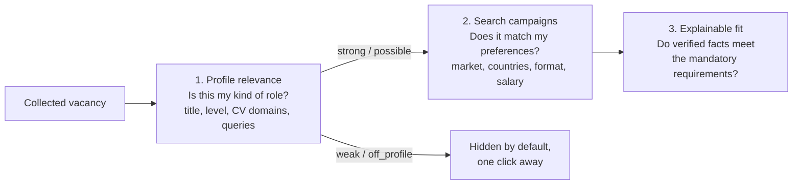

# Profile relevance: which vacancies are yours at all

[English](RELEVANCE.md) · [Русский](ru/RELEVANCE.md) · [Documentation](../README.md#documentation)

Collection brings in everything a source returns: an aggregator search for "director" also returns a store director, a sales VP and an office manager. Profile relevance is the first, cheap screen that separates the vacancies that belong to the candidate's search from the rest — and says why, with the words that decided it. It runs on every stored vacancy without model calls, so the list, the overview and the pipeline open on the vacancies worth reading.

It is implemented in [relevance.py](../src/job_search_agent/relevance.py) and configured in private `settings.json → relevance`.

## Three separate questions



| Layer | Question | Input | Changes records? |
| --- | --- | --- | --- |
| Profile relevance (this page) | Is this the candidate's kind of role at all? | Title, stored text, candidate facts and interests, saved queries | No — computed on the fly |
| [Search campaigns](CONFIGURATION.md#search-campaigns) | Does it match stated preferences? | Conditions: market, countries, format, language, salary | No |
| [Explainable fit](DATA_MODEL.md#explainable-fit-evidence-rules-v2) | Do verified facts meet the mandatory requirements? | Annotated requirements and reviewed evidence | Writes an assessment |

Relevance never rejects a vacancy, edits facts or replaces a fit assessment. A vacancy that is `weak` or `off_profile` stays in the journal and is shown under **All**.

## How a vacancy is screened

Four checks, each recorded as a reason with the words found:

1. **Function (title).** Does the title name a function of one of the candidate's tracks? Product: `product`, `cpo`, `продукт`… Technical leadership: `engineering`, `technology`, `cto`, `platform`, `AI`, `data`, `разработ`, `технолог`, `ИИ`… A title naming an excluded function — sales, marketing, design, recruiting, office management, accounting, a store — is `off_profile` regardless of other words.
2. **Level (title).** `top` words (director, head, VP, chief, CPO/CTO/CAIO, директор) meet the target. A `below` word (senior, manager, specialist, project manager, owner) or an individual-contributor word (engineer, developer, staff, scientist — matched as whole words, so "Director of Engineering" is not an engineer) makes the level below target. `lead` words (руководитель, lead, principal) meet a `lead` target. Two policy rules apply: `russia_director_only` requires a `top` word for Russian vacancies, and for `bigtech_company_ids` senior/staff/principal titles are left to employer-specific level mapping instead of being downgraded.
3. **Domains (title and text).** The candidate's domains come from fact tags and `policy.interests`: AI, payments and fintech, platforms, APIs and developer tools, commercialisation, engineering management, industrial technology. A domain in the title counts more than one in the text. A title without a track word but with a candidate domain at leadership level ("Head of Payments") is kept as `possible`.
4. **Saved queries.** Keyword queries (grammar below) are evaluated on every vacancy. A query marked `include` stands in for the function and domain checks — useful for roles the track words miss — but never for the level.

Policy exclusions (`policy.exclude`, such as gambling) found in the text also make a vacancy `off_profile`.

| Tier | Rule | Shown by default |
| --- | --- | --- |
| `strong` | Track function (or an including query), level at target, and a domain in the title or at least two domains in the text | Yes |
| `possible` | Function present, level at target or not stated, domains not yet confirmed (for example no description stored) | Yes |
| `weak` | Level below target, or the full text shows none of the candidate's domains | Under **Weak** / **All** |
| `off_profile` | Excluded function, policy exclusion, or no track function and no including query | Under **Off profile** / **All** |

A missing description is not a missing domain: a card without text is `possible` with the reason "no description — domains checked in the title only". The numeric `score` only orders vacancies within the list; the tier and the reasons are the decision.

## Keyword queries

The same grammar works in the dashboard search box, in `ajh relevance search` and in saved queries:

| Syntax | Meaning | Example |
| --- | --- | --- |
| `a + b` | Every group must match | `engineer + ai` |
| `a \| b` or `a, b` | Any alternative in a group | `(ai \| ml \| ии)` |
| `-a` (after a space) | Exclude vacancies that contain it | `product + payments - crypto` |
| `title:(…)` | Look for this group in the title only | `title:(engineer \| инженер) + (ai \| ии)` |

Terms of up to three letters match whole words (`ai` does not match "air"); longer terms also match word endings (`инженер` matches "инженера", `platform` matches "platforms"). Text is compared case-insensitively with separators removed, so "AI/ML" reads as "ai ml". In the dashboard, a search containing `+`, `|`, ` -` or `title:` is treated as a query; any other search is a plain substring search.

## Configuration

`settings.json → relevance` is optional. Without it the screen uses built-in words, the tracks from `policy.tracks` and domains derived from facts and interests.

```json
{
  "relevance": {
    "target_level": "lead",
    "queries": [
      {"name": "AI product", "query": "title:(product | cpo) + (ai | genai | llm | agent)", "include": true},
      {"name": "Engineering + AI", "query": "title:(engineering | engineer | cto) + (ai | ml | llm)"}
    ],
    "exclude_title": ["customer success"],
    "vocabulary": {"payments": ["open banking"]}
  }
}
```

| Field | Default | Meaning |
| --- | --- | --- |
| `target_level` | `lead` | `top` needs director-level words; `lead` also accepts lead/principal/руководитель; `any` ignores level |
| `roles` | built-in per track | Extra title words per track, e.g. `{"product": ["pm lead"]}` |
| `levels` | built-in | Extra words for `top`, `lead`, `below` and `individual` |
| `exclude_title` | built-in list | Extra excluded functions, matched in the title |
| `domains` | derived | Explicit list of domain ids; replaces derivation from facts and interests |
| `vocabulary` | built-in | Extra terms per domain id; a new id defines a new domain |
| `queries` | none | `{name, query, include}`; `include: true` lets a query stand in for the function and domain checks |
| `extend_defaults` | `true` | `false` replaces built-in words instead of extending them |

A synthetic starting point is in [examples/relevance.json](../examples/relevance.json). An invalid section is reported in the dashboard and by `ajh relevance profile`; the screen is then skipped rather than guessed, and collection continues. Replace the section with `ajh relevance set PATH` (validated, recorded as a `relevance_updated` event with before and after).

## Where it is used

- **Dashboard.** Vacancies and the pipeline open on **Relevant** (strong + possible); a switch shows each tier and **All** with counts. Saved queries appear as buttons under the search box. Each card has a "Profile" line with the tier and the short reason; the vacancy's **Fit** tab starts with a "Profile relevance" block listing every reason, the domains with where they were found, and each saved query as matched or not. The overview's fresh vacancies, its availability count and the vacancy statistic count only relevant vacancies.
- **Collection.** Every card is screened as it is collected; each `collection_runs` record counts new vacancies per tier (`relevance`). A source with `"skip_off_profile": true` does not add `off_profile` cards to the journal (the snapshot still holds them, and `source_health.screened_out` counts them); leave it off while tuning the rules.
- **Agents.** `career-job-search` lists relevant vacancies before evaluating, and annotates requirements for relevant ones first.

## Commands

| Command | Result |
| --- | --- |
| `ajh relevance list [--relevant] [--tier T] [--limit N]` | Vacancies with tier, score, domains and a one-line reason, best first |
| `ajh relevance explain VACANCY_ID` | Every reason, domain and query result for one vacancy |
| `ajh relevance search "QUERY" [--limit N]` | Vacancies matching a keyword query, with the terms that matched |
| `ajh relevance profile` | The resolved roles, levels, exclusions, domains and queries |
| `ajh relevance set PATH` | Replace `settings.json → relevance` from a JSON object |

## Tuning and limits

Tune with evidence: run `ajh relevance list --tier weak` and `--tier off_profile`, look for vacancies you would read, and add a role word, a domain term or an including query; look at `strong` for noise and add an exclusion. The screen is lexical — it recognises words, not meaning: a banking "product" (a loan, a card) looks like a product role, and a role described only in images or on a page that was not stored has no text to check. Treat `possible` as "read the posting", and use the fit assessment for any decision to apply.
