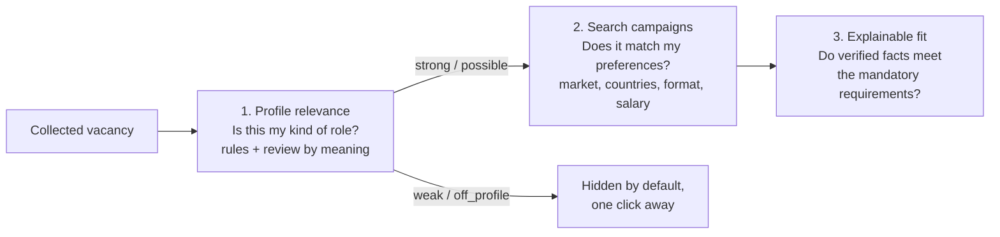

# Profile relevance: which vacancies are yours at all

[English](RELEVANCE.md) · [Русский](ru/RELEVANCE.md) · [Documentation](../README.md#documentation)

Collection brings in everything a source returns: an aggregator search for "director" also returns a store director, a sales VP and an office manager. Profile relevance separates the vacancies that belong to the candidate's search from the rest, shows how well each one fits on a 0–100 **thermometer**, and says why. It works in two layers:

1. **Rules** — a fast screen of every vacancy without model calls: the function and level in the title, the candidate's domains in the title and text, how many CV facts back those domains, and saved keyword queries.
2. **Review by meaning** — a flagship agent session reads the posting against the candidate's profile and records a verdict, a score and reasons. A current review takes precedence over the rules.

It is implemented in [relevance.py](../src/job_search_agent/relevance.py) and configured in private `settings.json → relevance`.

## Three separate questions



| Layer | Question | Input | Changes records? |
| --- | --- | --- | --- |
| Profile relevance (this page) | Is this the candidate's kind of role at all, and how close? | Title, stored text, company, location, candidate facts and interests, saved queries; optionally an agent's review | Rules: no, computed on the fly. Review: a `relevance_reviews` record |
| [Search campaigns](CONFIGURATION.md#search-campaigns) | Does it match stated preferences? | Conditions: market, countries, format, language, salary | No |
| [Explainable fit](DATA_MODEL.md#explainable-fit-evidence-rules-v2) | Do verified facts meet the mandatory requirements? | Annotated requirements and reviewed evidence | Writes an assessment |

Relevance never rejects a vacancy, edits facts or replaces a fit assessment. A vacancy that is `weak` or `off_profile` stays in the journal and is shown under **All**.

## The thermometer

The rule score adds four parts:

| Part | Points | How it is earned |
| --- | --- | --- |
| Function | 30 | The title names a function of the candidate's tracks (product: `product`, `cpo`, `продукт`…; technical leadership: `engineering`, `technology`, `cto`, `platform`, `AI`, `разработ`, `технолог`, `ИИ`…). 24 when a saved query with `include` stands in; 18 when there is no track word but a candidate domain sits in a leadership title ("Head of Payments") |
| Level | 25 | 25 for `top` words (director, head, VP, chief, CPO/CTO/CAIO, директор, and Russian titles that head a whole function: «руководитель разработки / департамента / управления / центра / блока / практики»); 22 when the level is mapped per employer; 20 for `lead` words at a `lead` target; 12 when no level is stated; 10 for a lead title under the Russian director-only rule; 5 below target |
| Domains | 25 | The candidate's domains (from fact tags and `policy.interests`: AI, payments and fintech, platforms, APIs and developer tools, commercialisation, engineering management, industrial) — 12 for the first in the title plus 3 for each further title domain, 4 for each domain found only in the text |
| CV support | 20 | How many facts back the matched domains: a verified fact counts 1, a self-reported one 0.5; conflicting facts and targets do not count |

| Tier | Score | Hard rules |
| --- | --- | --- |
| `strong` | 70–100 | — |
| `possible` | 50–69 | — |
| `weak` | 0–49 | A level below target or under the Russian director-only rule, or a full text with none of the candidate's domains, caps the score at 49 |
| `off_profile` | 0–20 | An excluded function in the title (sales, marketing, design, recruiting, office, accounting, a store …), a policy exclusion in the text (`policy.exclude`) or no function at all caps the score at 20 |

Level details: a `below` word (senior, manager, specialist, project manager, owner) or an individual-contributor word (engineer, developer, staff, scientist — whole words, so "Director of Engineering" is not an engineer) is below target. For employers in `policy.bigtech_company_ids`, lead and senior/staff/principal titles are mapped per employer (`company_specific`) instead of being downgraded, and the Russian director-only rule does not override that mapping. **One level below director by market.** `relevance.market_levels` sets a target level per market, for example `{"intl": "near"}`. The `near` target accepts director-level titles plus one level below — Engineering Manager, Senior Engineering Manager, Staff, Principal, Group or Lead Product Manager, Product Lead (`levels.near`). Near words are read before `below` words only where the market's target is `near` (or `any`), so "Engineering Manager" counts abroad while the same title elsewhere, a Senior Product Manager, or a Russian role under `policy.russia_director_only` stays below target.

**Program roles at top companies.** Top companies are `policy.bigtech_company_ids` plus `relevance.top_companies`. Their titles use the employer's own ladder (`company_specific`), and outside Russia program and project leadership titles — Technical Program Manager, Program/Programme Manager, Project Manager, Program/Project Lead, TPM (`relevance.program_roles`) — count as a technical-leadership function (reason `program_role_top_company`). A top company is matched by its stable ID or, when an aggregator stored the card under another ID, by the employer name and aliases as whole words ("amazon" matches "Amazon"). Elsewhere a program title names no function. A level reference such as "Meta E5" is a judgment for the review by meaning and `policy.company_levels`, not a title word.

A banking "product" — «продукты банка», «кредитные продукты», "lending products" — is removed from the title before the function check (`ignore_in_title`), so a pricing or lending role is not read as product management.

A missing description is not a missing domain: a card without text keeps the reason "no description — domains checked in the title only".

## Review by meaning

Rules read words; an agent reads meaning. A flagship agent session (`claude-opus-5` or the Codex flagship) reads each posting against the candidate's profile and records a `relevance_review` activity result:

```json
{
  "type": "relevance_review",
  "data": {
    "reviews": [
      {
        "vacancy_id": "…",
        "verdict": "strong",
        "score": 82,
        "track": "technical-leadership",
        "summary": "Heads AI/ML development at a large integrator: the engineering-leadership track.",
        "reasons": [
          {"kind": "fit", "text": "Leads an engineering function"},
          {"kind": "gap", "text": "Hands-on model training is not in the CV"}
        ],
        "fact_ids": ["…"]
      }
    ]
  }
}
```

Validation: every vacancy must exist and appear once; `verdict` is a tier and `score` must sit in that tier's band (strong 70–100, possible 50–69, weak 0–49, off profile 0–20); `summary` up to 400 characters; 1–6 reasons of kind `fit`, `gap` or `risk`; `fact_ids` must name existing facts; the actor must be a flagship model with a session. The CLI stores a digest of what the reviewer read — title, employer, text and requirements — and a digest of the candidate's facts.

A **current** review decides the tier and the score; the rule result stays visible as "Rules: weak · 49/100". When the vacancy text or the candidate's facts change, the review becomes **stale**: the rule result is shown again with a warning until a new review. Request a review from a vacancy's **Fit** tab ("Review by meaning"), which queues a `review_relevance` task for `career-job-search`; an agent session takes it with `ajh tasks next`, reads `ajh relevance pending` and finishes the activity with the typed result.

## Keyword queries

The same grammar works in the dashboard search box, in `ajh relevance search` and in saved queries:

| Syntax | Meaning | Example |
| --- | --- | --- |
| `a + b` | Every group must match | `engineer + ai` |
| `a \| b` or `a, b` | Any alternative in a group | `(ai \| ml \| ии)` |
| `-a` (after a space) | Exclude vacancies that contain it | `product + payments - crypto` |
| `field:(…)` | Look for the group in one field only | `company:(sber \| сбер) + title:(director \| head)` |

| Field | Russian aliases | Looks in |
| --- | --- | --- |
| `title:` (`role:`) | `должность:`, `название:` | Vacancy title |
| `company:` | `компания:` | Employer name and aliases from the company record |
| `location:` | `локация:`, `где:` | Stated location, country and city, work mode (remote, hybrid, office) and allowed countries |
| `text:` (`tech:`) | `текст:`, `стек:` | Description and requirements — technologies, stack |

A group without a field looks in all four. Terms of up to three letters match whole words (`ai` does not match "air"); longer terms also match word endings (`инженер` matches "инженера"); a term with spaces is a phrase. Text is compared case-insensitively with separators removed, so "AI/ML" reads as "ai ml". Russian and English place names are different words: write `location:(москва | moscow)`.

Example: `компания:(сбер | т-банк) + должность:(директор | руководитель) + где:(москва | remote) + стек:(llm | ml)`.

In the dashboard, a search containing `+`, `|`, ` -` or a field is a query; several plain words must all appear, in any order, anywhere in the card (`сбер ai директор`); one plain word is a substring search.

## Configuration

`settings.json → relevance` is optional. Without it the screen uses built-in words, the tracks from `policy.tracks` and domains derived from facts and interests.

```json
{
  "relevance": {
    "target_level": "lead",
    "queries": [
      {"name": "AI product", "query": "title:(product | cpo) + (ai | genai | llm | agent)", "include": true},
      {"name": "Engineering + AI", "query": "title:(engineering | engineer | cto) + (ai | ml | llm)"}
    ],
    "exclude_title": ["customer success"],
    "vocabulary": {"payments": ["open banking"]}
  }
}
```

| Field | Default | Meaning |
| --- | --- | --- |
| `target_level` | `lead` | `top` needs director-level words; `near` also accepts one level below (EM, Staff, Principal, Group PM) and lead words; `lead` also accepts lead/principal/руководитель; `any` ignores level |
| `market_levels` | none | Target level per market, e.g. `{"intl": "near"}`; the Russian director-only policy still wins for `ru` |
| `top_companies` | none | Company IDs or names added to `policy.bigtech_company_ids` for employer-specific levels and program roles abroad |
| `program_roles` | built-in | Extra program/project leadership title words counted at top companies outside Russia |
| `roles` | built-in per track | Extra title words per track, e.g. `{"product": ["pm lead"]}` |
| `levels` | built-in | Extra words for `top`, `near`, `lead`, `below` and `individual` |
| `exclude_title` | built-in list | Extra excluded functions, matched in the title |
| `ignore_in_title` | banking products | Regular expressions removed from the title before the function check |
| `domains` | derived | Explicit list of domain ids; replaces derivation from facts and interests |
| `vocabulary` | built-in | Extra terms per domain id; a new id defines a new domain |
| `queries` | none | `{name, query, include}`; `include: true` lets a query stand in for the function and domain checks, never for the level |
| `extend_defaults` | `true` | `false` replaces built-in words instead of extending them |

A synthetic starting point is in [examples/relevance.json](../examples/relevance.json). An invalid section is reported in the dashboard and by `ajh relevance profile`; the screen is then skipped rather than guessed, and collection continues. Replace the section with `ajh relevance set PATH` (validated, recorded as a `relevance_updated` event with before and after).

## Where it is used

- **Dashboard.** Vacancies and the pipeline open on **Relevant** (strong + possible); a switch shows each tier and **All** with counts, and a sort orders by relevance. Saved queries appear as buttons under the search box. Each card has a "Profile" line with the tier, the thermometer (marked "by rules" or "by meaning") and a short reason; the vacancy's **Fit** tab starts with the agent's review, the four score parts, every reason and each saved query as matched or not. The overview's fresh vacancies, its availability count and the vacancy statistic count only relevant vacancies.
- **Collection.** Every card is screened as it is collected; each `collection_runs` record counts new vacancies per tier (`relevance`). A source with `"skip_off_profile": true` does not add `off_profile` cards to the journal (the snapshot still holds them, and `source_health.screened_out` counts them); leave it off while tuning the rules.
- **Agents.** `career-job-search` lists relevant vacancies before evaluating, reviews pending ones by meaning, and annotates requirements for relevant ones first.

## Commands

| Command | Result |
| --- | --- |
| `ajh relevance list [--relevant] [--tier T] [--limit N]` | Vacancies with tier, score, method, domains and a one-line reason, best first |
| `ajh relevance explain VACANCY_ID` | Every reason, score part, domain, query result and the agent's review for one vacancy |
| `ajh relevance search "QUERY" [--limit N]` | Vacancies matching a keyword query, with the terms that matched |
| `ajh relevance pending [--limit N] [--all]` | Vacancies without a current review by meaning, most promising first, with the text the reviewer needs; `--all` includes off-profile ones |
| `ajh relevance profile` | The resolved roles, levels, exclusions, domains with CV support, and queries |
| `ajh relevance set PATH` | Replace `settings.json → relevance` from a JSON object |

## Tuning and limits

Tune with evidence: run `ajh relevance list --tier weak` and `--tier off_profile`, look for vacancies you would read, and add a role word, a domain term or an including query; look at `strong` for noise and add an exclusion or an `ignore_in_title` phrase. Where words cannot decide, ask for a review by meaning. The rules are lexical — a role described only in images or on a page that was not stored has no text to check — and the agent's review is a judgment, not a verified fact: treat `possible` as "read the posting", and use the fit assessment for any decision to apply.
