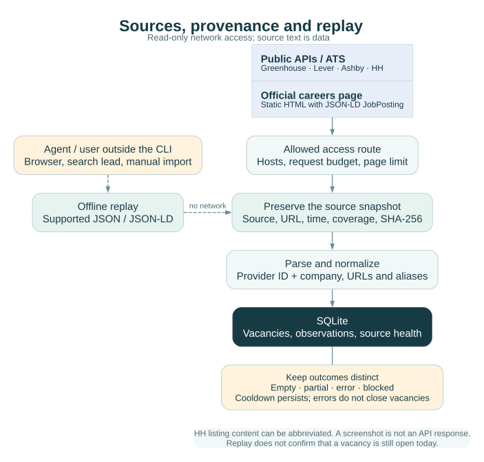

# Sources, collection and honest coverage

[English](SOURCES.md) · [Русский](ru/SOURCES.md) · [Documentation](../README.md#documentation)

Career Copilot collects published vacancies through fifteen adapters — employer ATS boards, remote-job boards, regional job boards, Russian open data and HH text search — and can replay compatible saved responses offline. Official employer boards support verification of hiring details; aggregator cards add leads and salary context. Neither route guarantees complete market coverage or that a previously observed vacancy is still open.



## Provider reference

| Provider | Private configuration | Implemented route | Primary reference |
| --- | --- | --- | --- |
| `greenhouse` | `board` | Public jobs list with `content=true` | [Greenhouse Job Board API](https://docs.greenhouse.io/job-board.html) |
| `lever` | `board` | Postings list, `limit=100`, bounded `skip` pagination | [Lever Postings API](https://github.com/lever/postings-api) |
| `ashby` | `board` | Public job-board endpoint with compensation requested | [Ashby Job Postings API](https://developers.ashbyhq.com/docs/public-job-posting-api) |
| `hh` | `employer_id` | Employer vacancies, `per_page=100`, bounded pages | [HH API documentation](https://api.hh.ru/openapi/redoc) |
| `corporate` | `url` | Static HTML containing JSON-LD `JobPosting` objects | [Schema.org JobPosting](https://schema.org/JobPosting) |
| `linkedinsalaries` | `url: https://linkedinsalaries.com/jobs.json` | Public salary-index JSON dataset; one response | [Dataset](https://linkedinsalaries.com/jobs.json) · [Publisher](https://linkedinsalaries.com/) |
| `hh` (text search) | `query`; optional `area`, `period`, `professional_role`, `experience`, `schedule` | Vacancy search, `per_page=100`, bounded pages; employers come from each item | [HH API documentation](https://api.hh.ru/openapi/redoc) |
| `smartrecruiters` | `board` (company identifier) | Public postings list, `limit=100`, bounded `offset` pagination; card without description | [SmartRecruiters Posting API](https://developers.smartrecruiters.com/docs/posting-api) |
| `workable` | `board` (account subdomain) | Public careers widget list; card without description | [Workable careers widget](https://help.workable.com/hc/en-us/articles/115012771647) |
| `recruitee` | `board` (company subdomain) | Public offers list with description, requirements and salary | [Recruitee Careers Site API](https://docs.recruitee.com/reference/intro-to-careers-site-api) |
| `remotive` | optional `category`, `query`, `limit` | Remote jobs list; at least six hours between runs | [Remotive API](https://github.com/remotive-com/remote-jobs-api) |
| `remoteok` | optional `tag` | Remote jobs feed; the first element is the provider's legal notice | [Remote OK API](https://remoteok.com/api) |
| `jobicy` | optional `query` (tag), `geo`, `category`, `limit` | Remote jobs with geography, level and annual salary | [Jobicy API](https://jobicy.com/jobs-rss-feed) |
| `arbeitnow` | none | Job board fed by employers' ATS (mostly Europe), bounded pages | [Arbeitnow API](https://www.arbeitnow.com/blog/job-board-api) |
| `getonbrd` | `query` | Public job search (mostly Latin America), bounded pages, company expanded | [Get on Board API](https://www.getonbrd.com/api-doc.html) |
| `trudvsem` | `query`; optional `region` code | Open data of the Russian federal job portal, `limit=100`, bounded pages; employer contacts are not copied | [Работа России open data](https://trudvsem.ru/opendata/api) |

Boards and aggregators added on 15 September 2026 are in [source_adapters.py](../src/job_search_agent/source_adapters.py). Aggregators (`remotive`, `remoteok`, `jobicy`, `arbeitnow`, `getonbrd`, `trudvsem`, HH text search) take the employer from each item; a company already in the journal with the same name or alias is reused, so the same employer found through several sources stays one company, and possible duplicates between sources are reported in the collection run. Providers' terms apply: link to the original posting and credit the source; Remotive asks for a few requests per day, so its minimum interval is six hours. A challenge page or HTTP 403 is recorded as `blocked` and never bypassed. From the network used on 15 September 2026, Trudvsem, Workable and Recruitee answered and were verified live; Jobicy, Remote OK and Get on Board answered intermittently; Remotive, Arbeitnow and SmartRecruiters returned bot challenges and HH refused requests, so those adapters follow the providers' documented formats and need a network the provider accepts. Paid aggregator APIs (for example LoopCV) are not integrated.

The adapter implementation is [sources.py](../src/job_search_agent/sources.py). Provider APIs offer more operations than this client implements. It performs read-only collection; application submission endpoints are not used. Current API behavior should be checked against the linked provider documentation when adding or changing a source.

The HH list can contain excerpts. Retrieve the full official posting through an allowed route before assessing mandatory requirements. Absence from an excerpt is not evidence that a requirement does not exist. Corporate HTML without usable JSON-LD needs browser/manual research; the adapter is not a general JavaScript browser.

## LinkedIn Salaries: salary context for new leads

[LinkedIn Salaries](https://linkedinsalaries.com/) publishes a [public JSON dataset](https://linkedinsalaries.com/jobs.json) with job cards and compensation context. The `linkedinsalaries` adapter reads that dataset directly. It is an aggregator source, separate from LinkedIn and the employer's official vacancy page.

| Dataset information | How Career Copilot uses it |
| --- | --- |
| `generatedAtMs`, `todayKey` | Retained in the original dataset snapshot as collection context |
| `jobs[]`: `id`, `url`, `title`, `company`, `companyLocation` | Posting identity, outbound link, title and employer/location context |
| `jobType`, `jobLevel`, `jobMode`, `jobPayments`, `jobTime`, `region`, `easyApply` | Source-provided classifications; these do not establish candidate fit or eligibility |
| `salaryCite` | Original compensation wording, retained as `compensation.raw` |
| `salaryUsdMo` | The provider's monthly USD figure, retained as `compensation.normalized_monthly_usd` |
| `publishedMs`, `dayKey` | Publication context retained in the snapshot; `dayKey` is also recorded as the source publication label |

Normalized listings use `content_scope: "salary_index_card"`, with empty vacancy text and requirements until separately researched. `companyLocation` is the provider's company-location label, not a verified work location or proof of remote eligibility.

Compensation metadata identifies `source: "linkedinsalaries.com"`, `currency: "USD"`, `period: "month"` and `reliability: "aggregated"`. Currency and period describe the normalized figure; the original wording may use a different currency, range or payment interval. Missing or unusable normalized values remain null.

The monthly USD figure is the provider's conversion, not an exchange-rate calculation performed by Career Copilot or a verified employer offer. Preserve the original salary text when comparing leads. Dataset classifications, including `jobLevel`, do not replace the employer-specific seniority and role-family checks.

**One request reads one dataset.** The adapter does not paginate, scrape landing-page HTML, traverse archives or follow outbound posting links. Increasing `max_pages` does not expand this route. Dataset coverage and freshness belong to the source; a recent generation timestamp does not establish completeness across LinkedIn or the job market.

Every newly discovered listing uses `availability: unknown`. Confirm that the role is still open and obtain its full requirements from an official employer/ATS source before treating it as application-ready. A source publication date alone does not establish current availability.

Each card creates or updates its own employer record, with a `linkedinsalaries-` ID derived from the dataset's company name. The configured `company_id: "linkedinsalaries-index"` identifies the source; it is not counted as the employer of every listing. Reconcile company-name aliases deliberately when connecting an aggregator lead to an existing researched company.

The request goes only to the public dataset endpoint. The adapter does not request LinkedIn pages, log in, automate a browser or use a proxy route. Normal request budgets, cooldown, size limits and error reporting apply. Inspect a changed JSON schema rather than treating a parsing failure as an empty search result.

Use the [private configuration example](CONFIGURATION.md#linkedin-salaries-source). The original JSON is saved with the source observation; its outbound LinkedIn URL identifies the advertised posting but is never fetched during collection or replay. Replaying the saved dataset works offline and does not refresh availability.

## Configure the source registry

Private `settings.json` contains `sources`. Each entry needs a stable `id`, `provider`, `company_id` and the provider's board/employer/URL value. Optional fields include `company_name`, `market`, `enabled`, `allowed_hosts`, `include_title`, `user_agent`, request interval, page budget and explicit proxy settings. [Configuration](CONFIGURATION.md) lists defaults and limits.

`include_title` is a case-insensitive regular expression applied after the full snapshot is stored. It is a search filter, not a level or fit judgment. `count` reports retained cards; `observed_total` reports observed items before filtering and must be interpreted with the source attempt/history rather than as a market total.

Company size research needs a named metric, value or range, date/period, organizational scope, source URL and confidence. An unknown headcount remains unknown. Marketing language and the candidate's impressions are not independent corroboration.

## Collection and replay

Prefer an official API/ATS, then the official website, an ordinary browser for dynamic content, a search lead, and manual import. Use only routes allowed for that source. A failed route does not authorize a bypass.

```sh
uv run ajh --home /absolute/private/career-workspace discover --source SOURCE_ID
uv run ajh --home /absolute/private/career-workspace discover --source SOURCE_ID --replay snapshots/SOURCE_ID/SNAPSHOT.txt
```

A replay path is relative to the private workspace. Save original response/page bytes with URL, retrieval time, access method, coverage and hash. Replay expects the adapter's JSON response, including the LinkedIn Salaries dataset, or corporate HTML with JSON-LD. Screenshots and arbitrary prose need explicit manual normalization; they are not API responses. A manual JSON envelope uses `{"vacancies": [...]}` and the `manual` parser for offline ingestion.

Replay does not make a network request, refresh live source health or establish current availability. Replayed observations are historical; vacancy availability is unknown until a current authorized check establishes otherwise. Existing research annotations and document history must survive recollection and replay.

## Results and failure states

| Source state | Interpretation | Next action |
| --- | --- | --- |
| `success_nonempty` | Successful collection retained vacancies | Review scope, titles and freshness |
| `success_empty` | This successful attempt retained no vacancies | Inspect filters and observed coverage; do not claim the company has no jobs |
| `partial` | Some results were saved but collection did not finish | Inspect `failure_status` and limits; retain saved records |
| `cooldown` | Next permitted attempt has not arrived | Wait until `next_attempt` |
| `rate_limited` | Provider returned HTTP 429 | Respect Retry-After and persisted cooldown |
| `blocked`, `auth_required` | Access is denied or requires authentication | Stop that route; use a permitted alternative |
| `timeout`, `network_error`, `http_error` | Retrieval failed | Preserve prior success and diagnose the specific failure |
| `parse_changed` | Response no longer matches the parser | Inspect saved bytes and update/test the adapter |
| `redirect_requires_review` | Redirect was not followed | Review destination and source configuration |
| `budget_exhausted`, `response_too_large` | A configured/runtime limit stopped collection | Adjust an appropriate budget after inspection |

Source failures often appear as entries in a JSON list with process exit code zero. Check each result's `status`, not only the exit code. The journal retains last attempt, last success, count, HTTP status and next permitted attempt. An error does not erase successful observations or prove a vacancy closed.

Each `discover` run also writes a `collection_runs` record: new vacancies, changed vacancies with the changed fields, the unchanged count, possible duplicates across sources (same normalised title with the same company, or with the same concrete location; never merged automatically) and per-source errors with the last success. A source whose configuration is invalid — a URL outside its host allowlist or a proxy without `proxy_allowed` — is marked `config_error` with the reason and sends no request; other sources continue.

Adapters extract [conditions](DATA_MODEL.md#vacancy-conditions-and-dates) from structured fields: HH `salary`/`work_format`/`schedule`/`employment`/`languages`/`published_at`, Lever `commitment`/`workplaceType`/`salaryRange`/`createdAt`, Ashby `employmentType`/`workplaceType`/`isRemote`/`compensation`/`publishedAt`, Greenhouse `first_published`/`updated_at`, JSON-LD `baseSalary`/`employmentType`/`jobLocationType`/`applicantLocationRequirements`/`datePosted`/`validThrough`, and LinkedIn Salaries `salaryCite`, `jobMode`, `jobTime`, `dayKey` with `salaryUsdMo` kept as a provider conversion. Salary lines, explicit remote country limits and language requirements in the text fill only what structured fields leave unknown.

A single vacancy can be added outside the registry with `ajh vacancy add --url` or `--text-file` (or the dashboard form). The link must resolve to public addresses; a blocked page is not retried through another route.

Availability states such as `open`, `archived`, `expired_copy` and `unknown` describe evidence about the posting. A fresh successful official list can support `open`; missing data, blocked access or stale copies do not support a confident live-status claim.

## Limits and access policy

The default run budget is 20 requests. Page count defaults to 3 and is clamped to 1–20; inter-request spacing is clamped to 4–30 seconds, including a host-level record across commands. The default source interval is 3,600 seconds. The HTTP client has a 25-second timeout, refuses automatic redirects and rejects responses larger than 5 MB after receiving them. These are runtime controls, not provider rate-limit guarantees.

HTTP 429 stores Retry-After/cooldown; repeated rate limits increase the wait, with at least an hour after the third recorded attempt. There is no automatic retry loop, daemon or scheduler. Earlier successful pages are retained on a later failure.

Use HTTPS and approved hosts. Embedded credentials and obvious local/private literal addresses are rejected, but this is not a complete DNS-rebinding defense. Treat source configuration as trusted private input. Do not claim comprehensive network sandboxing.

The client ignores ambient proxy configuration. Proxy use requires `proxy_allowed: true` and `proxy_env` naming an environment variable for that source. Keep credentials outside JSON and Git. Do not rotate proxies after blocks; no CAPTCHA bypass, login bypass or anti-bot evasion. LinkedIn proxy routes are forbidden. Browser and search fallback are agent/user work outside this CLI.

Never send a CV, contact a recruiter or submit an application because collection succeeded. Each external action requires its applicable user authorization.

## Adding an adapter

Check the provider's primary documentation and permitted read-only route. Define source fields and limits, then make the parser operate on saved bytes without a network dependency. Preserve stable external IDs, original URLs, provenance and content scope. The transport saves originals before normalization and reports partial coverage explicitly.

Use synthetic fixtures for empty lists, duplicates, schema changes, pagination, 429, authorization failures, malformed JSON, JSON-LD and ambiguous identity. Do not add application or messaging methods under the label of a collection adapter.
