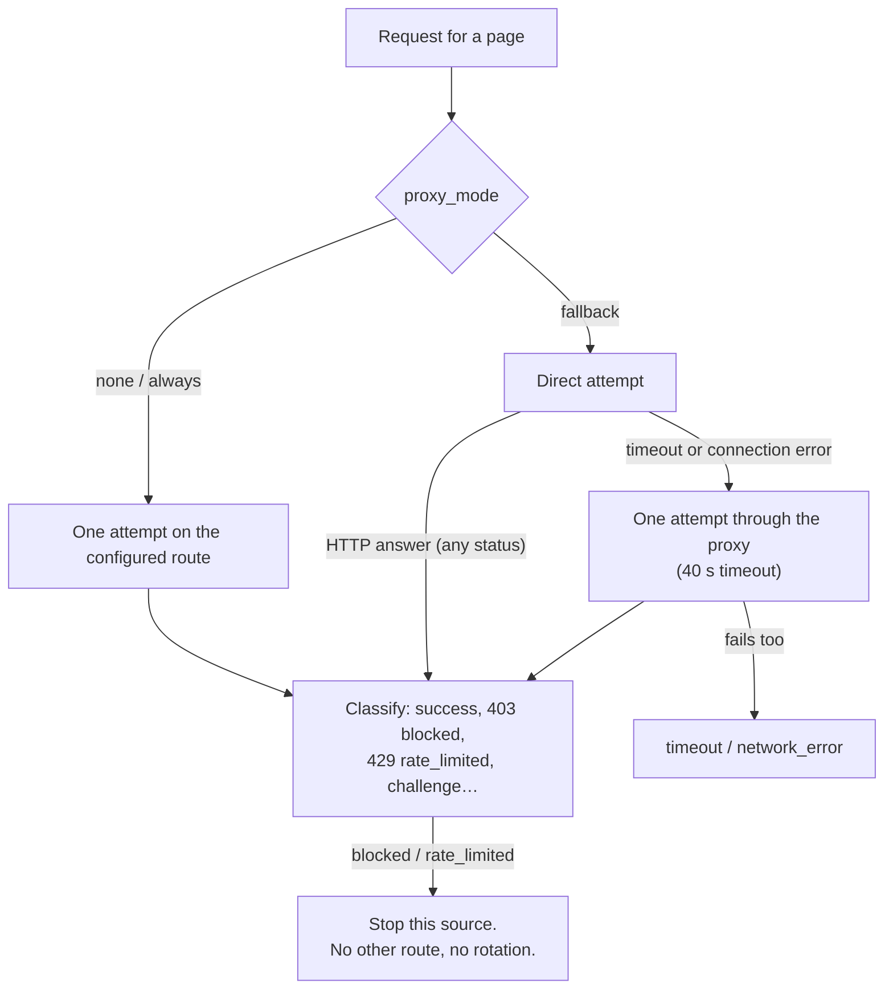

# Source architecture: collection pipeline, network routes and new adapters

[English](SOURCE_ARCHITECTURE.md) · [Русский](ru/SOURCE_ARCHITECTURE.md) · [Documentation](../README.md#documentation)

This page explains how vacancy sources work as one system: the families of sources, what happens during a collection run, how requests reach a provider (directly, through a proxy or through a reserve channel), the contract every adapter follows and the steps to connect a new provider. The per-provider reference, failure states and access policy stay in [Sources](SOURCES.md); field defaults stay in [Configuration](CONFIGURATION.md#source-fields).

## Design in one paragraph

A source is a line of private configuration, not code. The code has one collection loop (`discover` in [sources.py](../src/job_search_agent/sources.py)) that owns everything risky or stateful: budgets, cooldown, host allowlists, the network route, status classification, snapshots, company resolution and the run summary. A provider adapter owns only two pure functions — *which URL to request* and *how to turn saved bytes into cards* — registered in [source_adapters.py](../src/job_search_agent/source_adapters.py). Adapters never touch the network, the journal or credentials, so a new provider is a small, fully offline-testable change, and every provider automatically gets the same safety rules.

## Layers

```mermaid
flowchart LR
  subgraph Private["Private workspace"]
    S["settings.json<br/>sources[]"]
    E["Environment<br/>proxy variable"]
  end
  subgraph Loop["discover (sources.py)"]
    G["Guards<br/>enabled · cooldown · budget<br/>allowlist · proxy permission"]
    R["Route<br/>direct · proxy · reserve"]
    C["Classify<br/>200 · 403 · 429 · challenge<br/>timeout · size"]
    P["Snapshot<br/>original bytes"]
  end
  subgraph Adapters["Adapters (pure)"]
    A["ADAPTERS registry<br/>endpoint + parse"]
    N["card · conditions<br/>salary · geography"]
  end
  subgraph Journal["Journal (core.py)"]
    F["include_title filter<br/>profile relevance screen"]
    K["Company resolution<br/>by id, name, alias"]
    O["observe_vacancy_detailed<br/>new · changed · unchanged"]
    H["source_health"]
    U["collection_runs"]
  end
  S --> G --> R --> C --> P --> A --> N --> F --> K --> O
  E -. "only when allowed" .-> R
  C --> H
  O --> U
  H --> D["Dashboard: source cards,<br/>last run, errors, route"]
  U --> D
```



| Layer | Owns | Never does |
| --- | --- | --- |
| Configuration (`settings.json → sources[]`) | Which providers, boards, queries, filters, intervals and whether a proxy is permitted | Hold credentials (only the *name* of an environment variable) |
| Collection loop (`sources.discover`) | Budget, cooldown, allowlist, route, HTTP classification, snapshots, health, run summary | Interpret a provider's JSON |
| Adapter (`source_adapters.ADAPTERS`, core parsers in `sources.parse_jobs`) | Endpoint URL per page, parsing saved bytes into normalized cards | Network, journal writes, credentials, retries |
| Normalization helpers (`card`, `conditions`, `salary`, `geography`, [vacancy_fields.py](../src/job_search_agent/vacancy_fields.py)) | Stable ids, canonical URLs, salary with currency and period, work mode, employment, allowed geography, level and dates with their origin | Guess missing values — unknown stays `unknown` |
| Journal (`Store.observe_vacancy_detailed` in [core.py](../src/job_search_agent/core.py)) | Deduplication, completeness ranking of text, observations, change detection | Delete earlier observations or research |
| Views ([dashboard](DASHBOARD.md)) | Source cards with route and problems, last collection run, duplicates | Start network requests from the browser |

## Source families

| Family | Providers | Employer comes from | Text completeness | Best use |
| --- | --- | --- | --- | --- |
| Employer ATS board | `greenhouse`, `lever`, `ashby`, `smartrecruiters`, `workable`, `recruitee` | The configured `company_id` | Full description (SmartRecruiters and Workable: card only) | Verifying a target company's current openings |
| Employer list on a job board | `hh` with `employer_id` | The configured `company_id` | Often an excerpt | Russian employers without their own ATS |
| Corporate site | `corporate` | The configured `company_id` | JSON-LD `JobPosting` | Career pages with structured data |
| Aggregator / job board | `remotive`, `remoteok`, `jobicy`, `arbeitnow`, `getonbrd`, `hh` with `query` | Each item (`company_name`) | Full or partial description | Discovering leads across many employers |
| Open data | `trudvsem` | Each item (INN-based id) | Full description, contacts not copied | Russian regional and public-sector market |
| Dataset | `linkedinsalaries` | Each item | Card without description | Salary context for leads |
| Manual intake | `ajh vacancy add --url/--text-file`, dashboard form | Matched by name or alias, otherwise a draft company | Page text or pasted text | A single posting found elsewhere |

An adapter is marked `aggregate=True` when the employer comes from each item. For aggregates the loop does not create a company from the source entry; it creates or reuses one per employer name, so the same employer found on an ATS board and on two job boards remains one company.

## One collection run, step by step

1. **Select sources.** Enabled entries, or the one named by `--source`. The run budget is `max_requests_per_run` (default 20).
2. **Cooldown.** A source whose `next_attempt` is in the future returns `cooldown` and sends nothing.
3. **Build and check the URL.** `endpoint(source, page)` comes from the adapter. The host must be the endpoint host or listed in `allowed_hosts`; embedded credentials and local addresses are rejected. Proxy settings are validated here: `proxy_env` needs `proxy_allowed: true`, `proxy_mode` must be `always` or `fallback`, and a LinkedIn host never gets a proxy. Any problem marks this source `config_error` with the reason; other sources continue.
4. **Space requests.** A per-host timestamp in the journal keeps 4–30 seconds between requests to the same host, even across separate commands.
5. **Request through the chosen route** (next section). Redirects are not followed; ambient proxy variables are ignored.
6. **Classify the answer.** Over 5 MB → `response_too_large`. 429 → `rate_limited` with Retry-After and growing cooldown. 401/407 → `auth_required`. 403/999 or a challenge page → `blocked`. Other non-200 → `http_error` or `redirect_requires_review`. Timeout → `timeout`; other transport failure → `network_error`.
7. **Save the original bytes** as a snapshot before parsing, so the page can be replayed offline with `--replay`.
8. **Parse** with the adapter. A schema mismatch raises and becomes `parse_changed`; it is never treated as an empty result.
9. **Filter** by `include_title` (a search filter, not a fit judgment), then screen each card for [profile relevance](RELEVANCE.md); a source with `skip_off_profile` does not add `off_profile` cards. `observed_total` counts cards before the filter, `count` the cards added.
10. **Resolve the company.** Configured company for boards; for aggregates, an existing company with the same name or alias, otherwise a new one with unknown size and description.
11. **Observe.** `observe_vacancy_detailed` deduplicates by provider id and canonical URL, keeps the most complete text (`full > page_text > excerpt > card`), and reports `new`, `changed` (with fields) or `unchanged`.
12. **Paginate** while a full page came back and pages remain; stopping at the page limit marks `partial`.
13. **Record health** (`source_health`: status, failure status, HTTP status, count, route, screened-out count, last success, next attempt) and, at the end, one `collection_runs` record with new vacancies (and their relevance tiers), changed, possible duplicates across sources and errors.

## Network routes and the proxy

Every request takes exactly one of three routes, chosen per source:

| `proxy_env` set and variable present | `proxy_mode` | Route | Recorded `health.route` |
| --- | --- | --- | --- |
| No | — | Direct request | `direct` |
| Yes | `always` (default) | Every request through the proxy | `proxy` |
| Yes | `fallback` | Direct first; the proxy only after a failed connection or timeout | `direct` or `proxy_fallback` |



**What the reserve channel is for.** Some networks cannot reach a provider at all — for example, when the collecting machine sits behind a VPN exit that the provider's network drops. That is a connectivity failure, not a refusal. The reserve channel repeats the same request once through a permitted proxy and records that it did.

**What it is never for.** An HTTP answer is the provider's decision. A 403, a 429, an authentication wall or a challenge page is recorded as `blocked`, `rate_limited` or `auth_required` and is not retried through the proxy, another address or another tool. There is no proxy rotation, CAPTCHA solving or login bypass. LinkedIn hosts are rejected for any proxy route. These rules are enforced in code and covered by tests, not only described.

**Credentials.** Configuration stores only the variable name (`proxy_env`). The proxy URL is read from the environment for the request and is never written to health, snapshots, events or logs. The client ignores ambient `HTTP(S)_PROXY` variables, so a proxy is used only where a source explicitly permits it.

**Operator setup (private).** The run command reads the variable from its environment, so a small private wrapper can prepare it. When a proxy provider accepts only a whitelisted server address, the wrapper can forward a local port to the proxy through SSH to that server and export the variable pointing at `127.0.0.1`. Keep such wrappers and secrets in the private workspace; the public repository contains no proxy endpoint, account or host.

```json
{
  "id": "jobicy-product",
  "provider": "jobicy",
  "company_id": "jobicy-index",
  "query": "product",
  "proxy_env": "CAREER_COPILOT_SOURCE_PROXY",
  "proxy_allowed": true,
  "proxy_mode": "fallback"
}
```

## Adapter contract

```python
@dataclass(frozen=True)
class Adapter:
    parse: Callable[[object, dict], list[dict]]  # decoded JSON, source entry -> cards
    endpoint: Callable[[dict, int], str]  # source entry, page index -> HTTPS URL
    page_size: int | None = None  # full page size; None = one request
    aggregate: bool = False  # employer comes from each item
    min_interval_seconds: int = 3600  # provider-requested minimum spacing
```

- `parse` receives already-decoded JSON and the source entry. It raises `TypeError`/`ValueError`/`KeyError` on an unexpected schema (the loop records `parse_changed`) and skips only items that are clearly not jobs (such as a legal notice).
- Build every item with `card(...)`. It enforces a stable external id, a title, an `https://` URL and, for aggregates, a non-empty employer name. It produces the vacancy id (`provider-external` for aggregates, `provider-company-external` for boards), canonical URLs, `availability: "unknown"`, `content_scope` and `conditions`.
- Build conditions with `conditions(text, location, source_label, salary_value=..., work_mode=..., employment=..., allowed=..., published=..., level=...)`. Use `salary(...)` only when the provider states a currency, and `geography(...)` only for explicit allowed countries. Each value records its origin (for example `jobicy.annualSalaryMin`). What the provider does not state stays `unknown`.
- Clean text with `plain(...)`. Repair provider-specific encoding defects in the adapter (Remote OK's double-encoded UTF-8 goes through `repair_mojibake`).
- Do not copy personal contact data that is not needed for research (Trudvsem contact fields are dropped).
- Add a notice to `NOTICES` when the provider's terms ask for attribution or limits.

## Add a new source

**Only configuration.** If the provider already has an adapter (another Greenhouse board, another HH employer, another Jobicy query), add an entry to private `settings.json` and run `ajh discover --source ID`. No code changes.

**A new provider.**

1. **Check the route.** Read the provider's primary documentation and terms. It must be a public, read-only route that allows automated access. If it needs a paid key, login or browser automation, stop and record it as not integrated.
2. **Save a real response privately** and derive a synthetic fixture from it with fictional employers, ids and text. Real payloads never enter the repository.
3. **Write the adapter** in [source_adapters.py](../src/job_search_agent/source_adapters.py): a `parse` function built on `card` and `conditions`, and a registry entry.

   ```python
   def examplejobs(data: object, source: dict) -> list[dict]:
       result = []
       for item in _list(data, "jobs"):
           text = plain(item.get("description"))
           result.append(
               card(
                   "examplejobs",
                   source,
                   external=item.get("id"),
                   title=item.get("title"),
                   url=item.get("url"),
                   text=text,
                   location=item.get("location"),
                   company_name=str(item.get("company") or ""),
                   conditions_value=conditions(
                       text,
                       str(item.get("location") or ""),
                       "examplejobs",
                       salary_value=salary(
                           item.get("salary_min"),
                           item.get("salary_max"),
                           item.get("currency"),
                           "year",
                           "examplejobs.salary",
                       ),
                       published=item.get("published_at"),
                   ),
               )
           )
       return result


   ADAPTERS["examplejobs"] = Adapter(
       examplejobs,
       lambda s, page: f"https://api.example.com/jobs?{_query(s, q=s.get('query'), page=page + 1)}",
       page_size=100,
       aggregate=True,
   )
   ```

4. **Test offline** in [test_source_adapters.py](../tests/test_source_adapters.py): add the synthetic payload to `PAYLOADS` (the parametrized tests then cover normalization and schema rejection), plus provider-specific cases — pagination, salary without currency, explicit geography, missing employer, encoding defects.
5. **Check live once, privately.** `ajh --home PRIVATE discover --source ID` and read `health.status`, `http_status`, `route`, `count` and `observed_total`. Record a blocked or unreachable result honestly instead of working around it.
6. **Document in both languages.** A row in the provider table of [Sources](SOURCES.md#provider-reference) and [its Russian copy](ru/SOURCES.md), any new source fields in [Configuration](CONFIGURATION.md#source-fields) (EN+RU), a disabled sample in [examples/source-config.json](../examples/source-config.json), the provider label in the dashboard `app.js` translations and a [changelog](../CHANGELOG.md) entry.
7. **Run the checks** from `app/`: `uv run ruff check .`, `uv run ruff format --check .`, `uv run pytest`, `uv run python scripts/check_docs.py` and the privacy checks listed in [Privacy](PRIVACY.md).

## Coverage on 15 September 2026

Reachability depends on the network doing the collection, not only on the adapter:

| Provider | From the owner's machine (VPN exit) | Through the reserve channel | From the server network |
| --- | --- | --- | --- |
| Trudvsem, Workable, Recruitee | Answer directly | Not needed | Answer |
| Jobicy, Remote OK, Get on Board | Time out intermittently | Answer (`proxy_fallback`) | Answer |
| Remotive, Arbeitnow, SmartRecruiters | 403 bot challenge → `blocked` | Not used (refusal) | Answer |
| HH API | 403 → `blocked` | Not used (refusal) | 403 |
| LoopCV and other paid APIs | Not integrated | — | — |

Running collection from a network a provider accepts is an ordinary, permitted choice; it is a deployment decision and is not done automatically as a reaction to a block.
