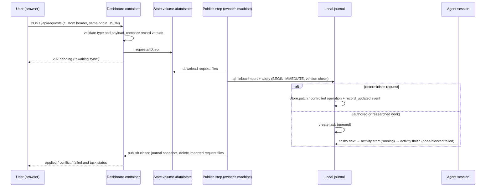
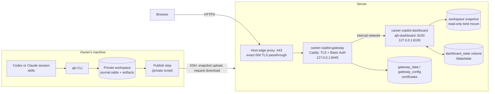

# System overview: modules, code, runtime and containers

[English](SYSTEM_OVERVIEW.md) · [Русский](ru/SYSTEM_OVERVIEW.md) · [Documentation](../README.md#documentation)

One page that shows how Career Copilot is put together: the product modules, where each lives in the code, how interface actions reach the journal, and how the dashboard runs in containers. Detailed contracts stay in the linked guides.

## Product modules

The main path is **collect → understand the card → decide the fit → fix or tailor the CV → prepare**. Every module can also be used on its own.

| Module | What the user gets | Interface | CLI | Code | Records |
| --- | --- | --- | --- | --- | --- |
| Collection and sources | New and changed vacancies, duplicates, source errors, vacancies added by link or text | Sources: collection, add form, source cards | `discover`, `collection runs`, `vacancy add` | `sources.py`, `intake.py`, `vacancy_fields.py`, `core.py` (`observe_vacancy_detailed`) | `vacancies`, `observations`, `source_health`, `collection_runs` |
| Profile relevance | Which vacancies fit the profile and why: function, level, CV domains, keyword queries; tiers strong/possible/weak/off profile | Relevance switch, saved queries, card line, Fit tab | `relevance list/explain/search/profile/set` | `relevance.py` | computed `display.relevance`; `collection_runs.relevance` |
| Search campaigns | What the user looks for, compared per criterion | Sources: campaigns; Fit tab | `campaigns list/set/match` | `campaigns.py` | `settings.json → campaigns` |
| Vacancy cards | Original pay, format, employment, language, allowed geography, dates, status | Vacancies list, market switcher, Vacancy tab | `maintenance reextract-conditions` | `vacancy_fields.py`, `descriptions.py`, `availability.py`, `dashboard.py` | `vacancies.conditions` |
| Availability | Open / closed / unknown with reason and evidence | Check buttons, reminders | `availability check/import` | `availability.py` | `vacancies.availability_check` |
| Explainable fit | Outcome, first blocking reason, requirement matrix with routes, constraints, staleness | Fit tab | `evaluate [--stale]`, `vacancy requirements` | `matching.py`, `workflow.py` (`evaluate`) | `assessments`, `current_assessments` |
| CV | Two master CVs, vacancy versions, edit proposals and decisions, states, PDF preview, import | CV section, CV tab | `prepare`, `review`, `cv status/import/decide/apply-edits` | `cv.py`, `workflow.py` (`prepare`, `record_review`) | `packages`, `cv_edits`, `cv_edit_decisions`, `cv_imports` |
| Preparation | Vacancy briefs, plans for general gaps, text practice with reviews | Preparation section, Preparation tab | `prep plan/status`, `learn` | `preparation.py`, `workflow.py` (`learning_plan`) | `preparation_briefs`, `track_plans`, `practice_*`, `learning` |
| PDF documents | Printable Markdown plans, A4 binders, inspection and page extraction | Plan downloads and document reader | `pdf render/bind/inspect/extract` | `pdf_documents.py`, `dashboard_pdf.py`, `workflow.py` | Registered private PDF artifacts and manifests; no review or progress transition |
| Requests and tasks | Interface actions applied with version checks; work handed to agents | Requests and tasks panel, statuses in tabs | `inbox import/list/apply/reject`, `tasks list/next` | `inbox.py`, `activity.py`, `core.py` (`Store.patch`) | `inbox_requests`, `tasks`, `events` |
| Agent activities | Traceable model work with actor, inputs and typed results | Activities section | `activity start/show/finish` | `activity.py` | `activities`, `activity_events`, typed result kinds |
| Pipeline and statistics | Stage per vacancy, reminders, evidence-backed counts | Pipeline, overview | `stats`, `report` | `stats.py`, `report.py`, `web_assets/app.js` | `submissions`, `employer_responses` |
| Journal upkeep | Deduplication, readable file names, translations, backup | — | `maintenance`, `translations`, `backup`, `restore`, `verify` | `maintenance.py`, `naming.py`, `translations.py`, `backup.py` | `superseded_records`, `text_translations` |
| Privacy | Publication checks for worktree, index, history and artifacts | — | `privacy check` | `privacy.py` | — |
| CRM | Specified only, not implemented | — | — | — | see [CRM module](CRM_MODULE.md) |

## Code map

```text
src/job_search_agent/
  cli.py            ajh commands; one Store and a file lock per command
  core.py           Store (records, artifacts, versions, patch with CAS), observations, workspace init
  activity.py       agent activity start/finish, typed result validation, task binding
  inbox.py          request validation, import/apply with version checks, tasks
  sources.py        collection loop, core adapters, HH search, collection runs, duplicates
  source_adapters.py ATS boards, remote-job boards, regional boards and Russian open data
                    (Adapter registry: endpoint + parse; see SOURCE_ARCHITECTURE.md)
  intake.py         add one vacancy from a public link or pasted text
  vacancy_fields.py salary, format, employment, language, geography and dates with origin
  relevance.py      profile screen: function, level, CV domains, keyword queries, tiers
  campaigns.py      search campaigns and per-criterion preference matching
  matching.py       evidence-rules-v2: requirement rows, constraints, outcome, input digests
  workflow.py       evaluate, learning plans, package rendering adapter, prepare, review
  pdf_documents.py  shared Markdown/PDF layout, inspection, A4 binders and page extraction
  cv.py             version states, edit proposals and decisions, draft assembly, CV import
  preparation.py    vacancy briefs, track plans, practice sessions, attempts and reviews
  availability.py   posting checks with public-address and redirect limits
  descriptions.py   verbatim excerpts from retained postings and research
  translations.py   stored Russian/English renderings of journal text
  maintenance.py    dedupe, rename-artifacts, reextract-conditions
  naming.py, backup.py, privacy.py, stats.py, report.py
  dashboard.py      HTTP server: read-only snapshot reads, request and check endpoints, PDF preview
  dashboard_pdf.py  journal/translation adapter for shared PDF layout; text redaction
  web_assets/       index.html, app.js (vanilla, no build, no innerHTML), styles.css
tests/              synthetic fixtures only; one file per module area
.agents/skills/     eight canonical skills; .claude/skills/ are thin adapters
deploy/, Dockerfile, compose.yaml, compose.public.yaml
```

PDF rendering, assembly and storage contracts are described in [PDF documents](PDF.md). The shared renderer performs deterministic local processing; existing agent sessions own authorship and visual review. Complex design and substantive judgments use the active flagship (`gpt-6-astra` in Codex/OpenAI, `claude-opus-5` in Claude); straightforward extraction can use `gpt-5.6-luna` in OpenAI. The CLI does not route or invoke models itself.

## Request and task lifecycle

The dashboard never edits the journal. Every write goes through a request that the owner's machine applies.



A record changed between the click and `apply` yields `conflict`; nothing is overwritten. A task is never shown as done without a finished activity.

## Runtime topology



Without the gateway, the dashboard is reached through an SSH tunnel to `127.0.0.1:8100`. Locally, `ajh-dashboard --home PATH --state-dir PATH` runs the same server without Docker.

## Containers

| | `career-copilot-dashboard` | `career-copilot-gateway` (optional) |
| --- | --- | --- |
| Defined in | [compose.yaml](../compose.yaml), [Dockerfile](../Dockerfile) | [compose.public.yaml](../compose.public.yaml), [Caddyfile](../deploy/public-gateway/Caddyfile) |
| Image | `python:3.12-slim-bookworm` + DejaVu fonts; dependencies from `uv.lock --frozen` | `caddy:2.11.4-alpine` |
| Process | `ajh-dashboard --home /data/workspace --host 0.0.0.0 --port 8100 --state-dir /data/state`, UID/GID 10001 | Caddy with admin API off, HTTPS on 8445, health on 8081 |
| Published port | `127.0.0.1:8100` (loopback only) | `127.0.0.1:8445` (loopback only) |
| Mounts | workspace snapshot read-only at `/data/workspace`; named volume `dashboard_state` at `/data/state` | Caddyfile read-only; `gateway_data`, `gateway_config` volumes |
| Writes | only `availability-checks.json` and `requests/*.json` in `/data/state` | certificates in its volumes |
| Hardening | read-only root filesystem, `/tmp` tmpfs, all capabilities dropped, `no-new-privileges`, 512 MB, 1 CPU, 100 PIDs, rotated local logs | read-only root filesystem, only `NET_BIND_SERVICE`, `no-new-privileges`, 128 MB, 0.5 CPU, 100 PIDs |
| Health | `GET /healthz` | `GET :8081/healthz` |
| Security at HTTP level | allowed `Host` names only, CSP, `X-Frame-Options: DENY` for pages and `SAMEORIGIN` only for PDF previews, no request logging | Basic Auth on every path except `/healthz` and `/robots.txt`, HSTS, `Authorization` not forwarded, no access log |

Outbound network use from the dashboard container is limited to availability checks of stored posting URLs; interface requests never fetch anything on the server — links in `vacancy_add` are read on the owner's machine during `apply`.

## Where collection runs

Vacancy collection (`ajh discover`) runs on the owner's machine against the local journal, not in the containers; the hosted dashboard only shows the published snapshot and can queue a `collect` task. Each source uses one of three network routes — direct, always through a permitted proxy, or direct with a one-time proxy retry after a failed connection (`proxy_mode: fallback`). Refusals such as 403, 429 or a challenge page stop the source and are never retried through another route. The route is recorded in `source_health.route` and shown on the source card. The pipeline, adapter contract and steps to add a provider are in [source architecture](SOURCE_ARCHITECTURE.md).

## Release, data publishing and rollback

1. **Code.** A release directory per commit (`releases/<commit>`) and a `current` symlink; `docker compose up -d --build --wait` rebuilds the dashboard. On failure the symlink returns to the previous release. The gateway Caddyfile is bind-mounted at container start, so a change needs `caddy validate` and `up -d --no-deps --force-recreate gateway`.
2. **Data.** The publish step imports server-side availability checks and requests into the local journal, applies requests, builds a closed SQLite snapshot with verified artifact hashes, uploads it, swaps the served workspace keeping the previous copy, recreates only the dashboard and removes imported request files.
3. **Rollback.** Point `current` to the previous release and, for data, swap back the previous workspace copy. Named volumes are never removed.

Operational detail: [dashboard and deployment](DASHBOARD.md#copy-update-and-recover), [operations](OPERATIONS.md), [architecture](ARCHITECTURE.md).

## Quality gates

Every push runs [checks](../.github/workflows/checks.yml): ruff lint and format, pytest on synthetic data, bilingual documentation and skill checks, the offline demo with verified restore, and privacy scans of the index and full history with pinned, checksum-verified Gitleaks. Before a hand-off the same commands run locally, plus the private dictionary scan described in [privacy](PRIVACY.md).
