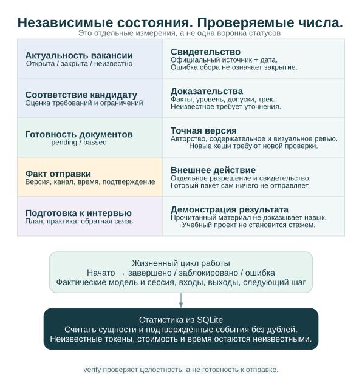

# Архитектура и данные

[English](../ARCHITECTURE.md) · [Русский](ARCHITECTURE.md) · [Документация](../../README.ru.md#документация)

Единая карта модулей, кода, жизненного цикла заявок и контейнеров — в [обзоре системы](SYSTEM_OVERVIEW.md).

## Граница хранилищ

Вместо глобального `--home` можно задать `AI_JOB_HUNTER_HOME`; явный параметр имеет приоритет.

Публичный проект содержит Python-код, документацию, шаблоны правил и синтетические
тесты. Приватное пространство подключается явным абсолютным `--home` и располагается
вне дерева исходников. Его нельзя размещать в корне файловой системы, домашнем
каталоге целиком или каталоге-предке публичного проекта.

```text
Публичный код                     Приватное пространство
src/job_search_agent/             workspace.json, settings.json, facts.json
docs/, tests/                    journal.sqlite
pyproject.toml                   snapshots/, imports/, legacy/
                                 packages/, reviews/, learning/, report/
```

Для реального кандидата приватное дополнение может жить в отдельном исследовательском
репозитории. Публичный проект не импортирует его модули и не знает его абсолютного
пути. Настройки источников, персональный словарь, реальные приоритеты и документы
не входят в дистрибутив.

## SQLite и оригиналы

`records` хранит JSON-сущности с составным ключом `(kind, id)`: компании, вакансии,
наблюдения, оценки, пакеты, события, обучение, состояние источников и миграции.
`artifacts` содержит относительный путь, SHA-256 и размер файла. `meta` оставляет
место для метаданных схемы. SQLite работает в WAL-режиме; согласованная копия базы
делается через SQLite backup API, а не копированием одного файла открытой базы.

Оригиналы и версии артефактов сохраняются неизменяемо. Попытка записать другое
содержимое по занятому пути вызывает конфликт. Снимок содержит исходные байты;
наблюдение связывает его с источником и нормализованной карточкой. Это позволяет
повторно разобрать данные без сети. Нормализованная карточка показывает актуальное
состояние, а наблюдения и события сохраняют происхождение.

Дедупликация использует ID провайдера в контексте компании, канонические URL и
сохранённые алиасы. Одно название должности недостаточно. Неоднозначность требует
ручного сопоставления. Повторное получение не должно удалять исследовательскую
разметку, версии документов и решения.

Принципы сохранения наблюдений, офлайн-повтора, учёта ошибок, ограниченных повторов
и последнего успешного результата вдохновлены практикой reddit-compass. Runtime-
зависимости от другого проекта нет; его история и данные не копируются.

## Версии, оценки и ревью

Оценка включает хеш входных вакансии, компании, фактов и политики. Изменение входов
создаёт новую оценку. Пакет связан с вакансией или `master`, треком и списком
версий; версия содержит фактическое авторство, пути, хеши, число страниц и ревью.
Контекст фиксирует использованные факты и вакансию, поэтому последующие изменения
базы не переписывают старый документ.

`facts import PATH` сохраняет прежний и новый наборы в `facts-history/` и
материализует локальные доказательства в `evidence/`. Использованный в пакете
снимок фактов сохраняется вместе с ним. Импорт предпочтительнее прямого изменения
рабочего `facts.json`: автоматический контроль ручных правок JSON не подразумевается.

Проверка привязана к точной версии и полному набору хешей. Техническая целостность,
содержательное ревью, визуальное ревью, соответствие вакансии и отправка — разные
состояния. `pending` честно отражает незавершённую проверку. Модельное имя — запись
о реальном исполнителе, а не настройка, превращающая механический черновик в
авторский текст.

## Отчёты и расширение

HTML и любые Markdown/CSV-выгрузки — формируемые представления SQLite. Их можно
воссоздать; исправления в них не меняют журнал. Локальный HTML показывает компании,
вакансии, документы, проверки, планы, события и состояние источников. Не публикуйте
его через публичный хостинг: он содержит приватные рабочие данные.

Дополнительный [веб-сервер](DASHBOARD.md) отдаёт локальные HTML/CSS/JavaScript и читает тот же журнал через соединения SQLite только для чтения. Запросы браузера не инициализируют пространство, не меняют схему и не записывают сущности. Действия в интерфейсе следуют явному контракту записи: интерфейс сохраняет проверенные заявки в своём каталоге состояния, а записи меняет только `ajh inbox apply` на машине, где хранится журнал, — с проверкой версии против потерянных обновлений и событием `record_updated` с полями до и после. Работа, требующая авторства или исследования, становится задачей для существующей агентской сессии и считается выполненной только после завершённой активности. Поэтому размещённая копия не превращается в самостоятельно редактируемый журнал. Исходные поля сохраняются; вычисленная география дополняет отображение и не подменяет доказательства. Зарегистрированные документы доступны только внутри выбранного приватного пространства.

В Docker-образ входят публичный код и файлы интерфейса. Отдельное проверенное приватное пространство подключается только для чтения. Compose открывает HTTP-порт на loopback хоста; удалённый доступ проходит через SSH-туннель. Копия на сервере — реплика для просмотра, локальное пространство остаётся источником истины. Обновление реплики выполняется явно при размещении, двусторонней синхронизации нет.

`report --open` записывает `report/index.html` внутри подключённого приватного
пространства и открывает локальный файл в браузере; JSON-представления сущностей
находятся рядом. Сервер и отдельная frontend-сборка не требуются. Публичный код
обзора — [report.py](../../src/job_search_agent/report.py), команды —
[cli.py](../../src/job_search_agent/cli.py), рендерер одноколоночного Markdown/PDF
и проверки пакета — [workflow.py](../../src/job_search_agent/workflow.py).

CLI не использует модельный API: агент получает пакет задания и вручную выполняет
авторство или ревью. Это делает видимым различие механической операции и суждения
модели. Новые адаптеры подчиняются [SOURCES](SOURCES.md), изменения схемы и переносы
— [OPERATIONS](OPERATIONS.md), любые публичные артефакты — [PRIVACY](PRIVACY.md).

## Навыки в существующей агентской среде


Канонические навыки находятся в `.agents/skills/`; обычные Markdown-адаптеры `.claude/skills/` ссылаются на те же контракты. Обнаружение выполняет Codex/Claude. Глобальной установки, встроенного LLM API, демона или отправщика нет. Координатор выбирает нужные этапы; каждый специалист применим самостоятельно.

Activity фиксирует запрос, фактическую модель/сессию, хеши входов, выходные файлы, типизированные записи и следующий шаг. Копии находятся в `activities/`, `activity-artifacts/`, связи с CLI-событиями — в SQLite. Название модели не доказывает её реальное участие. Локальное хранение не означает, что hosted-модель не увидит личных данных: передача внешнему сервису требует соответствующего разрешения.



Здоровье источника, доступность вакансии, соответствие, готовность документа, продемонстрированное обучение и отправка отвечают на разные вопросы. `current_assessments` выбирает актуальную оценку, история остаётся в `assessments`. `submissions` и `employer_responses` учитывают подтверждённые действия/ответы с доказательствами. Старые заявленные статусы пакетов показываются отдельно от таких записей.

Полные поля и связи — в [модели данных](DATA_MODEL.md), работа ролей — в [контрактах](AGENT_WORKFLOWS.md). Имена дистрибутива `job-search-agent`, модуля `job_search_agent` и CLI `ajh` сохранены для совместимости.
