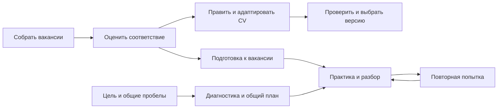

# Career Copilot: продуктовый анализ и направления развития

[English](../PRODUCT_RESEARCH_2026-09-15.md) · [Русский](PRODUCT_RESEARCH_2026-09-15.md) · [О проекте](../../README.ru.md)

**Дата исследования:** 15 сентября 2026 года.  
**Статус:** исследование и уточнённый продуктовый фокус. Реализовано 15 сентября 2026 года: F00 — достоверные состояния, очередь заявок и задач (F04, первый шаг), сбор с кампаниями, условиями и добавлением по ссылке (F02, F09 для существующих источников), понятные карточки вакансий (F14), объяснимый мэтчинг (F15), модуль «Резюме» (F01, F05, F10) и модуль «Подготовка» с памятками к вакансиям, общими пробелами и текстовой практикой (F06, F16). CRM (F07) описан в [спецификации модуля CRM](CRM_MODULE.md) и не реализован; голосовая и видеопрактика, новые адаптеры источников, F03, F08, F11–F13 остаются открытыми.  
**Объект:** публичный код и документация Career Copilot и 14 внешних продуктов и open-source проектов. Исходная выборка из десяти аналогов дополнена Treparo, Koru, Exponent / Aced и Interview Query для изучения сбора информации и подготовки к интервью.

## 1. Главный вывод

Career Copilot стоит развивать как **личное рабочее пространство для осмысленного поиска работы**, в котором человек понимает:

1. Какие возможности сейчас заслуживают внимания и почему.
2. Какими реальными фактами подтверждается соответствие роли.
3. Какую версию документов использовать и что ещё мешает её готовности.
4. Что сделать сегодня, чтобы приблизить следующий разговор с работодателем.
5. Что показали реальные отклики и интервью и как скорректировать поиск.

Основа для этого уже есть: история фактов, оценка требований, версии документов, независимое ревью, подготовка и журнал. Основной продуктовый разрыв — **доступность этих возможностей в ежедневной работе**. Значительная часть действий требует CLI, файлов и агентской сессии; браузер преимущественно показывает результаты.

**Приоритет после уточнения задачи:** сбор вакансий и понятные карточки с разделением рынков → объяснимый мэтчинг → правка и адаптация CV. Следующая поставка — [отдельный модуль подготовки](#preparation-module) к вакансии и по общим пробелам. [CRM](#optional-crm) описан отдельно, выключен по умолчанию и отложен. Достоверные состояния и действия из UI поддерживают этот сценарий; первый импорт CV нужен для самостоятельного старта.

**Предполагаемый первый сегмент:** опытные специалисты и руководители в product и technical leadership, которым важны точность позиционирования, конфиденциальность и качество отдельных возможностей. Это гипотеза на основе устройства проекта; исследование не подтверждает спрос этого сегмента.

## 2. Метод и границы выводов

- Проверены README, руководства по workflow, данным, источникам, dashboard и подготовке, а также соответствующие участки CLI, статистики и интерфейса.
- Локальная база сравнения: `ead5398` и доступное рабочее дерево на момент исследования. В интерфейсе были незакоммиченные изменения; наблюдаемое состояние нельзя автоматически считать опубликованным релизом.
- Внешняя база: официальные страницы продуктов, help-центры и репозитории авторов. Дата доступа ко всем внешним источникам — 15.09.2026.
- Конкуренты не проходили испытание в платных аккаунтах. «Заявлено» означает наличие описания у поставщика, а не независимую проверку качества.
- «Не найдено» означает отсутствие подтверждения в изученных материалах. Это не доказательство отсутствия функции во всём продукте.
- Пользовательские интервью, проверка готовности платить и измерение эффективности не проводились. Приоритеты ниже уточнены по запросу пользователя; оценки трудоёмкости, предполагаемый эффект и критерии пилота остаются гипотезами.
- Использованы только публичные продуктовые материалы. Кандидатские сведения и частный журнал для этого анализа не требуются.

## 3. Что уже есть у Career Copilot

Обозначения: **реализовано** — обнаружено в коде и/или описано как доступная функция; **агентский процесс** — результат требует работы агента или человека; **пробел** — готового пользовательского сценария не найдено.

| Область | Текущее состояние | Продуктовое значение и ограничение |
| --- | --- | --- |
| Карьерный профиль | Реализованы версионируемые факты и два master-трека; импорт структурированных данных | Сильная основа для согласованного позиционирования. Готового мастера «загрузить CV → проверить извлечённые факты» в UI не найдено |
| Поиск | Шесть адаптеров: Greenhouse, Lever, Ashby, HH, корпоративный JSON-LD и LinkedIn Salaries | Есть сбор, оригинальные снимки, ошибки и актуальность. Большинство источников требует настройки компаний/boards; это не универсальный поиск по рынку |
| Подходящесть | Матрица требований и доказательств, ограничения роли, языка и допуска; консервативные правила | Можно объяснять решение. Семантический разбор и содержательная оценка требуют агента; сортировка по личным предпочтениям не оформлена в самостоятельный сценарий |
| Компании | Карточки и отдельный процесс исследования работодателя | Есть бизнес-контекст. Личного сравнения привлекательности компаний с весами критериев не найдено |
| CV и письма | Версии source/PDF/text, coverage, авторство, привязка письма к версии CV, ревью | Хорошая прослеживаемость. Подготовка сложнее привычного визуального редактора; встроенный PDF-рендерер ограничен простым одноколоночным Markdown |
| Обзор поиска | RU/EN dashboard, фильтры, ссылки на состояния, подробные карточки, документы и история | Браузерный продукт уже существует. Предлагать «добавить dashboard» с нуля неправильно |
| Воронка и напоминания | Уже есть стадии, время в стадии, напоминания и следующие действия | Нужны развитие и уточнение семантики, а не новая воронка как таковая |
| Проверка вакансий | Есть проверка доступности из интерфейса и отображение возраста данных | Это уже интерактивное действие. Оно не превращает весь dashboard в редактор журнала |
| Интервью | Агентский процесс: план, STAR-истории, практика, обратная связь и подтверждённый прогресс; просмотр планов и PDF | «Добавить подготовку к интервью» слишком общее предложение. Не хватает удобного запуска и прохождения практики прямо из контекста вакансии |
| Результаты | Записи отправок и ответов, привязка к версиям, детерминированная статистика | Основа аналитики есть. Готового анализа сопоставимых когорт и управляемого цикла улучшения стратегии не найдено |
| Эксплуатация | Локальные данные, backup/restore, отдельный приватный workspace, Docker и закрытый доступ | Полезно для контроля данных. Настройка требует технических навыков; размещённая копия не даёт двустороннюю синхронизацию |

Основания: [README](../../README.md), [workflow](../WORKFLOW.md), [источники](../SOURCES.md), [модель данных](../DATA_MODEL.md), [dashboard](../DASHBOARD.md), [подготовка](../PREPARATION.md), [CLI](../../src/job_search_agent/cli.py), [статистика](../../src/job_search_agent/stats.py).

### 3.1. Продуктовый долг: точность воронки

При статическом чтении `vacancyStage()` в [app.js](../../src/job_search_agent/web_assets/app.js) обнаружены основания для отдельной проверки:

- `interview_practices` и `interview_feedback` участвуют в выборе стадии `interview`. Тренировка может выглядеть как фактическое продвижение у работодателя.
- Старое `application_status: submitted` тоже влияет на стадию, хотя [stats.py](../../src/job_search_agent/stats.py) отдельно отсекает отправки без подтверждения и доказательства.
- Для даты отправки UI рассматривает `at/date/submitted_at`, а статистика проверяет `sent_at`. Возраст стадии требует проверки на актуальном формате записей.

Это наблюдения по реализации, а не воспроизведённые ошибки конкретного частного журнала. До запуска аналитики конверсий нужно сделать стадии и даты согласованными с подтверждёнными событиями. Тренировка, назначенное интервью, состоявшееся интервью, оффер и завершение поиска должны различаться.

## 4. Сравнение с аналогами

Выборка покрывает разные способы решать задачу: автоматизация откликов, управление поиском, работа с CV, подготовка и самостоятельное размещение. Первая таблица содержит десять исходных аналогов; [расширенное сравнение](#interview-research) посвящено сбору информации и подготовке к интервью. Таблицы описывают выбранные возможности по материалам поставщиков, а не исчерпывающую проверку каждой функции.

| Продукт | Что подтверждают его материалы | Вывод для Career Copilot |
| --- | --- | --- |
| **Sofi** | Автоматизация поиска и откликов; подробнее ниже. [Лендинг](https://sofi-assistant.com/landing/) | Учиться простоте входа и видимому результату дня; отдельно проверить спрос на автоматическую отправку |
| **Teal** | Конструктор и адаптация резюме, сохранение вакансий расширением, трекер. [Продукт](https://www.tealhq.com/). В карточке есть рекомендации по стадии, заметки и прикрепление CV. [Help](https://help.tealhq.com/en/articles/9525013-leveraging-your-job-tracker-tools) | Сделать карточку вакансии местом работы с документами и следующими шагами |
| **Huntr** | Трекер, адаптация CV и писем, автозаполнение, сохранение вакансий и контакты. [Продукт](https://huntr.co/) | Простые повседневные операции; связь «человек ↔ компания ↔ возможность» вынести в опциональный CRM |
| **Simplify Copilot** | Расширение заполняет анкеты, помогает с ответами и адаптацией CV, сохраняет отправленные через него заявки. [Copilot](https://simplify.jobs/copilot) | Сократить повторный ввод на этапе отправки; сначала проверить ценность готового набора ответов |
| **Jobscan** | Сопоставление CV с вакансией, недостающие ключевые слова и проверки формата. Match Rate описан как показатель самого инструмента. [Scanner](https://www.jobscan.co/resume-scanner) | Показывать читаемость документа и покрытие требований раздельно; не выдавать собственный балл за вероятность найма |
| **LoopCV** | Повторяемый поиск, автоотклики, ручная проверка совпадений, исключение компаний и аналитика вариантов CV. [Продукт](https://www.loopcv.pro/) | Перенять понятие поисковой кампании с настройками, результатами и возможностью остановки |
| **Careerflow** | Практика интервью по целевой роли, обратная связь и история прогресса. [Mock interview](https://www.careerflow.ai/ai-mock-interview) | Сделать уже существующую методику подготовки удобной регулярной практикой |
| **JobSync** | Self-hosted трекер, импорт CV, AI-ассистент, контакты, вопросы, плановый поиск по ATS и MCP-интеграция. [Репозиторий](https://github.com/Gsync/jobsync) | Близкий open-source аналог: локальность и подключение агентов сами по себе уже не дают достаточного отличия |
| **Reactive Resume** | Self-hosting, визуальное редактирование с предпросмотром, экспорт PDF/JSON/DOCX, AI-интеграции. [Репозиторий](https://github.com/reactive-resume/reactive-resume) | Ориентир по редактору и переносимости; изучить экспорт/интеграцию до разработки большого собственного конструктора |
| **OpenResume** | Работа в браузере, импорт PDF, live preview и разбор резюме. [Репозиторий](https://github.com/xitanggg/open-resume) | Ориентир для простого первого запуска и показа того, что удалось извлечь из документа |

**Следствие сравнения:** генерация текста, трекер, локальное хранение и AI-чат по отдельности слабо отличают продукт в этой выборке. Перспективное отличие Career Copilot — связность: **факт → требование → решение → версия CV → подготовка → подтверждённый исход**. Наличие такой связи в архитектуре ещё нужно превратить в ощущаемую пользователем пользу.

<a id="interview-research"></a>

### 4.1. Сбор информации и подготовка к интервью у аналогов

Этот блок фиксирует конкретные функции и результаты внешних продуктов. Предложения для Career Copilot находятся в разделе 7. Дата проверки источников — 15.09.2026; собственные сессии в продуктах не проводились.

**Уровни подтверждения:**

- **Опубликованный пример / каталог:** открыта страница с результатом или содержимым базы. Это подтверждает наличие примера, но не точность каждого утверждения и не качество всех результатов.
- **Документированная функция:** help-центр описывает действия пользователя и результат. Это подтверждает описанный сценарий, но не независимое испытание.
- **Заявление поставщика:** функция описана на продуктовой странице; её исполнение не проверено.

### 4.2. Сравнение пользовательских сценариев

Подробности, источники и ограничения приведены ниже. Уровень подтверждения относится к конкретным материалам, а не ко всему продукту.

| Продукт | Входные данные | Сбор информации | Подготовка | Результат и подтверждение |
| --- | --- | --- | --- | --- |
| Treparo | Опыт и вакансия | Компания и отрасль | Тезисы, вопросы, планы ответов | Бриф и памятка; опубликованные примеры |
| Koru | Журнал или CV, компания, вакансия | Обновляемая публичная сводка | Подбор историй под роль | Редактируемые STAR-истории; заявления поставщика |
| Exponent / Aced | Компания и роль | Руководства и рассказы участников | Вопросы, курсы, тренировки | Каталог подготовки; открытые страницы и описание продукта |
| Interview Query | Цель подготовки и ответы на задания | База вопросов и процессов найма | Диагностика и рекомендации | Задачи и учебные материалы; заявление поставщика |
| Careerflow | CV и вакансия либо свои вопросы | Использует предоставленный контекст | Записанная тренировочная сессия | Видео, текст и обратная связь; инструкция |
| Teal | Сохранённая вакансия или сценарий | Описание роли; исследование по чек-листу | Режимы тренировки и обучения | Разбор и история встреч; инструкция |

### 4.3. Treparo: исследование превращается в пакет материалов

Из опыта кандидата и вакансии сервис заявляет подготовку семи отдельных материалов:

- Исследование компании: бизнес, конкуренты, культура и новости.
- Отраслевой контекст и ожидания от роли.
- Персональный бриф к интервью.
- Ситуационные вопросы.
- Планы ответов с опорой на опыт.
- Краткая памятка перед встречей.
- План первых 30/60/90 дней.

На странице также описана тренировка с записью и адаптивными уточнениями. [Продукт Treparo](https://treparo.com/)

**Что можно увидеть:** [пример исследования компании](https://treparo.com/examples/sarah-chen-tide/company-research) содержит тематические разделы и вопросы работодателю; [пример брифа](https://treparo.com/examples/sarah-chen-tide/interview-brief) — сильные стороны, пробелы и тезисы с указанием опыта. Страницы доступны без регистрации, содержат ссылки на PDF. Проверена структура примеров; факты об их персонажах и работодателях здесь не воспроизводятся и отдельно не верифицировались.

### 4.4. Koru: публичный контекст и карьерный журнал

Поставщик описывает сбор публичных сведений из нескольких источников, сводку бизнес-модели, культуры, рисков и стратегии. Исследования сохраняются и могут обновляться, затем используются в подготовке и материалах отклика. [Исследование компаний](https://koru.careers/en/features/company-research)

Записи о работе преобразуются в STAR-истории — ситуация, задача, действие, результат. Можно начать с CV, добавлять вакансию, искать подходящие истории и редактировать результат. Отдельно заявлены краткие брифы о компании и вопросы работодателю. [Подготовка к интервью](https://koru.careers/en/features/interview-prep)

**Подтверждение:** продуктовые страницы. Образец результата и работа функций в аккаунте не проверены.

### 4.5. Exponent / Aced: сведения о реальных процессах интервью

В открытом [каталоге руководств](https://www.tryexponent.com/guides) есть выбор компании и роли. Раздел [рассказов участников](https://www.tryexponent.com/experiences) показывает должность, компанию, дату интервью, число раундов и вопросы. Отдельные записи помечены самим сервисом как verified; методика этой проверки не исследована. Полный доступ к части материалов ограничен.

К этому добавляются курсы, банк вопросов, видеоответы экспертов и тренировочные интервью, включая направления Product Management и Engineering Management. На сайте используется название Aced и упоминание перехода с бренда Exponent. [Описание продукта](https://www.tryexponent.com/)

**Подтверждение:** открытые каталоги и описание продукта. Рассказы отражают опыт отдельных участников и не гарантируют формат будущего интервью.

### 4.6. Interview Query: диагностика направляет обучение

На продуктовой странице описаны вопросы по компаниям и темам, рассказы участников, руководства по процессам найма, задания с решениями и браузерный редактор кода. Заявлен подбор практики и учебных материалов по целям пользователя и результатам диагностических заданий. Основная специализация — data science и аналитика. [Interview Query](https://www.interviewquery.com/)

**Подтверждение:** описание продукта; персональная диагностика не проходилась. Оно не устанавливает, что система автоматически собирает произвольные внешние статьи под каждую вакансию.

### 4.7. Careerflow: персонализированная записанная практика

Инструкция описывает загрузку CV и вакансии, выбор технического, поведенческого или смешанного интервью и роли собеседника. Можно использовать свои вопросы. После записи доступны видео, расшифровка, оценки по критериям, разбор вопросов, примеры ответов и следующие шаги. [Инструкция Careerflow](https://help.careerflow.ai/en/articles/12631590-using-the-ai-mock-interview-tool)

**Подтверждение:** пошаговый help-центр. Он подтверждает работу с переданным контекстом; автоматическое исследование компании этой инструкцией не установлено.

### 4.8. Teal: практика связана с вакансией и историей встреч

Из сохранённой вакансии запускается практика с вопросами по её описанию. В режиме **Mock** обратная связь выдаётся в конце, в **Coach** — во время ответа. Есть уточняющие вопросы и расшифровка; в трекере ведутся раунды, участники и заметки. [Инструкция Teal](https://help.tealhq.com/en/articles/14435728-how-to-prepare-for-interviews-using-teal)

**Подтверждение:** help-центр. Исследование компании описано как задача пользователя по чек-листу; автоматический сбор досье этим источником не подтверждён.

### 4.9. Sofi: граница подтверждённых возможностей

Отдельные модули исследования компаний и тренировочного интервью на изученном [лендинге Sofi](https://sofi-assistant.com/landing/) не подтверждены. Это ограничение исследования, а не доказательство их отсутствия.

### 4.10. Что установлено и что остаётся неизвестным

Сравнение выше документирует несколько самостоятельных функций: исследовательские материалы, базы опыта интервью, подбор историй из карьерного журнала, рекомендации обучения после диагностики и практику с разбором. Их наличие у аналогов не доказывает эффективность для каждого пользователя.

**Уточнение первоначального вывода:** связь опыта, исследования и подготовки уже описана у Koru и показана в примерах Treparo. Поэтому уникальность самой этой идеи не установлена; отличия Career Copilot следует проверять на уровне конкретного пользовательского результата. [Koru](https://koru.careers/en/features/interview-prep), [пример Treparo](https://treparo.com/examples/sarah-chen-tide/interview-brief)

Не проверены полнота и свежесть исходных данных, точность генерируемых вопросов и оценок, качество русского языка, результаты в платных аккаунтах и доступность интеграций. Публичный образец не подтверждает ссылку на первоисточник для каждого утверждения. Совет в блоге собрать сведения о компании также не устанавливает наличие автоматического сбора в продукте.

## 5. Sofi: что взять и как адаптировать

### Что удалось установить

На лендинге заявлены импорт HH-профиля, подбор по предпочтениям, персональные письма, автоматическая отправка и полуавтоматический режим. FAQ перечисляет HH, Habr Career, карьерные сайты, Telegram и прямой контакт с рекрутером. Качество подбора, полнота каналов и обещание отсутствия блокировок независимо не проверялись. [Sofi](https://sofi-assistant.com/landing/)

### Продуктовая интерпретация

Сильный приём Sofi — объяснение ценности через завершённый пользовательский результат. Для Career Copilot аналогичная подача могла бы звучать так:

> «Разбери лучшие возможности, подготовь точные документы и знай следующий шаг по каждой вакансии».

Это предлагаемое позиционирование. Экономию времени и рост числа интервью ещё предстоит измерить.

| Идея для переноса | Адаптация в Career Copilot |
| --- | --- |
| Короткий путь к первому результату | CV + одна вакансия → черновой разбор с источниками и вопросами к фактам |
| Понятные предпочтения | Целевая роль, рынок, доход, формат работы, исключённые компании и недельный бюджет времени |
| Регулярное продвижение | Несколько приоритетных возможностей и конкретные действия на сегодня |
| Возможность влиять на подбор | «Подходит», «не мой уровень», «не устраивает формат», «вернуться позже» с редактируемыми причинами |
| Снижение рутины | Пакет CV/письмо/ответы и удобная фиксация реальной отправки |

**Решение по автоматизации:** полную автоотправку отложить. Она меняет действующую границу продукта, который читает источники и готовит материалы, и требует отдельной проверки каналов, ошибок отправки и пользовательского контроля. Ближайший полезный шаг — подготовленная очередь качественных пакетов с передачей пользователю для отправки.

**Возможное сосуществование:** если пользователь уже применяет сервис отправки, Career Copilot мог бы готовить материалы и принимать импорт результатов. Это идея для проверки; наличие публичного API или совместимого экспорта Sofi не установлено, интеграция не обещается.

## 6. Выбор продуктовой стратегии

| Направление | Потенциальная ценность | Цена развития | Рекомендация |
| --- | --- | --- | --- |
| Личный инструмент для опытного кандидата | Качественные решения, документы и подготовка; контроль истории | Нужно упростить существующую систему и измерить пользу | **Первый фокус**: соответствует двум текущим трекам и готовому ядру |
| Массовый сервис автоматических откликов | Большое сокращение повторяемых операций | Покрытие множества форм, эксплуатация каналов, поддержка и отправка от имени человека | Отдельная стратегическая ветка после проверки спроса |
| Рабочее место карьерного консультанта | Несколько клиентов, совместная работа и контроль качества | Изоляция клиентов, роли доступа, процессы согласования и поддержка | Позже: сначала проверить на консультантском пилоте без общей базы клиентов |

Для первого сегмента полезно различать **жёсткие ограничения** и **предпочтения**. Неподходящий допуск к работе не должен компенсироваться привлекательной зарплатой. Неизвестные условия должны порождать вопрос. Два master-трека сохраняются; кампании, рынки и домены — настройки поиска внутри них.

## 7. Продуктовые модули и приоритеты

**Уточнённый фокус:** сбор вакансий → объяснимое решение «подходим или нет» → адаптация резюме. Подготовка развивается отдельным модулем с двумя входами: к вакансии и по общим пробелам. CRM описан как опциональный модуль, выключенный по умолчанию. Это проектирование будущего поведения; новые экраны, настройки и операции этим отчётом не реализованы.

Приоритеты: **P0** — основной сценарий ближайшей версии; **P1** — следующая поставка после основного сценария; **P2** — опциональное расширение. Размеры относительные: **S** — локальная правка; **M** — новый сценарий на текущем ядре; **L** — несколько подсистем или интеграция. Это не оценки в днях. Приоритеты отражают выбранный фокус; полезность и трудоёмкость ещё нужно проверить.

### 7.1. Границы модулей

| Модуль | Задача пользователя | Самостоятельный вход | Связи |
| --- | --- | --- | --- |
| Вакансии и мэтчинг | Найти возможности и понять соответствие | Настроить поиск, добавить ссылку или текст | Передаёт требования в резюме и подготовку |
| Резюме | Исправить master-CV или адаптировать версию | Открыть резюме без вакансии либо из её карточки | Использует общие подтверждённые факты и выбранный трек |
| Подготовка | Подготовиться к встрече или закрыть общие пробелы | Выбрать вакансию либо направление и тему | Использует требования, опыт, диагностику и результаты практики |
| CRM, опционально | Помнить людей и договорённости | Включить модуль в настройках | Дополняет компанию/вакансию; остальные модули от него не зависят |

Основная навигация: **Вакансии · Резюме · Подготовка**. Настройки источников доступны из вакансий. Раздел CRM появляется после включения. Два master-трека — `product` и `technical-leadership` — сохраняются; рынки, домены и темы подготовки не создают дополнительные master-CV.

| ID | Возможность и результат | Что уже есть → что добавить | Приоритет / размер | Зависимость |
| --- | --- | --- | --- | --- |
| F00 | Достоверные состояния | Стадии и статистика → согласовать события, даты и отделение практики от реального интервью | P0, поддерживающая задача / M | Проверка семантики текущих записей |
| F01 | Понятный импорт CV | Импорт фактов → извлечение, проверка и выбор master-трека | P0 для первого запуска / M | F04 для сохранения из UI |
| F02 | Добавление вакансии | Адаптеры и записи → ссылка/текст, оригинал, полнота и дубли | P0 / M | Допустимый доступ; F04 для сохранения |
| F03 | Следующее полезное действие | Overview → короткая объяснимая очередь | P1 / M | F00, F04; результаты основного сценария |
| F04 | Действия из интерфейса | Просмотр → сохранение правок и передача задачи существующему агенту | P0, поэтапно / L | Явный контракт записи и исполнения |
| F05 | Правка и адаптация резюме | Версии и ревью → сравнение, причины правок, предпросмотр, выбор версии | P0 / M | Факты, F04; контракты авторства и ревью |
| F06 | Подготовка к вакансии | Исследование и планы → единое рабочее место, вопросы, практика, разбор | P1 / M | Требования и доступный опыт; F04, без обязательной готовности F05 |
| F07 | CRM: люди и договорённости | Компании/вакансии → отдельный включаемый модуль | P2, выключен по умолчанию / M | F04; самостоятельное решение о включении |
| F08 | Аналитика результатов | Счётчики → сопоставимые когорты и разбор причин | P2 / M | F00; достаточные подтверждённые данные |
| F09 | Сбор по рынкам | Шесть адаптеров → кампании, покрытие, свежесть, управляемое обновление | P0 для существующих источников; P1 для новых / M→L | F02, F04; новые каналы по выявленным пробелам |
| F10 | Читаемость и покрытие CV | Извлечённый текст → понятные разделы и отсутствующие доказательства | P0, минимум внутри F05 / M | F05 |
| F11 | Ответы для анкет | Материалы → банк подтверждённых ответов, затем автозаполнение | P2 / M→L | F05; проверка поддерживаемых сайтов |
| F12 | Сравнение условий | Досье и оплата → личные критерии и вопросы работодателю | P2 / M | Происхождение условий; CRM не требуется |
| F13 | Импорт переписки и календаря | События → выборочный импорт, затем подключения | P2 / L | F00, F04; отдельное решение по интеграциям |
| F14 | Понятная карточка вакансии | Название, описание, статус → условия, объяснение соответствия и следующий шаг | P0 / M | F02, F09; результат F15 при наличии |
| F15 | Объяснимый мэтчинг | Матрица требований → решение, доказательства, неизвестное и причины | P0 / M | Полнота вакансии, факты и ограничения поиска |
| F16 | Подготовка по общим пробелам | Общие планы по треку → диагностика, объединённые темы, упражнения и повторная проверка | P1 / M | Направление и доступный опыт; конкретная вакансия и CRM не нужны |

### 7.2. Вакансии: сбор, рынки и понятные карточки — F02, F09, F14

**Пользовательский результат:** получить свежий список возможностей и быстро понять, какие открыть, какие уточнить и какие исключить.

**Настройки поиска.** Переключатель списка: «Все / РФ / Международные / Рынок не определён». У каждой кампании — трек, названия ролей, уровень, страны работы, формат, язык, занятость, зарплатные предпочтения и исключения. Деление по рынкам определяется условиями позиции и настройкой кампании; страна головного офиса сама по себе его не определяет. Одна вакансия может соответствовать нескольким кампаниям и оставаться одной записью.

Отдельно отображать допустимую географию работы: «можно из выбранной страны / нельзя / нужно уточнить», с основанием. Пометка Remote не доказывает доступность работы из РФ или любой другой страны. «Международные» не означает автоматически подходящие пользователю вакансии.

**План расширения источников:**

| Область | Существующая основа | Ближайшая доработка |
| --- | --- | --- |
| РФ | HH по настроенным работодателям, корпоративный JSON-LD | Покрытие нужных работодателей; оценить отдельный широкий поиск HH; выбранные публикации Habr Career и Telegram сначала добавлять разрешённым ручным способом |
| Международные | Greenhouse, Lever, Ashby, корпоративный JSON-LD, LinkedIn Salaries | Настройки компаний/boards и регионов, получение полного описания из допустимого источника, устранение дублей |
| Оба рынка | Ссылка, текст и оригинальные снимки | Единые поля, история изменений, понятная полнота данных и результат обновления |

Это предложения по покрытию, а не заявление о готовых новых адаптерах. Текущий HH-адаптер собирает вакансии заданного работодателя; корпоративный адаптер читает статический JSON-LD. LinkedIn Salaries даёт агрегированные карточки, которым может не хватать полного описания и требований. Подробности существующей реализации: [источники](../SOURCES.md).

После запуска сбора показывать: новые записи, изменения, возможные дубли, ошибки/непроверенные источники и время последнего успешного получения. Закрытие вакансии требует отдельного основания; ошибка источника или отсутствие в неполной выдаче не доказывает закрытие. Сохранять публикацию, обнаружение и проверку как разные даты.

**Карточка в списке.** Использовать визуальную иерархию из предоставленного примера: крупные название и условия, компания, короткие метки, даты и ссылка. Предлагаемый макет использует только условные поля:

```text
Название роли                                  Исходная зарплатная вилка
Компания · место работы                        Валюта · период · до/после налогов

[Направление] [Уровень] [Формат] [Занятость]
Где разрешено работать: … · Язык: …

Соответствие: … — главная причина
Совпадения: … · Нужно уточнить: …
Следующий шаг: …

Опубликовано: … · Проверено: … · Источник: …
[Подробнее] [Адаптировать резюме] [Подготовка] [Оригинал ↗]
```

- Крупно показывать исходную вилку и период. Если оплаты нет — «не указана»; единичную сумму показывать только когда она дана источником. Расчёт в другой валюте — дополнительная явно приблизительная величина с происхождением; почасовая ставка требует допущения о часах.
- У агрегатора месячная USD-оценка — пересчёт поставщика, не подтверждённое предложение работодателя. Сохранять исходную валюту/формулировку. Декоративная шкала зарплаты не нужна без понятной базы сравнения.
- Ограничить метки условиями выбора; детали требований раскрывать внутри карточки. Неизвестные условия обозначать явно.
- Доступность вакансии, соответствие, готовность CV и этап отклика показывать раздельно. До оценки — «не оценено».
- На мобильном зарплата располагается под названием; действия и ограничения остаются доступны без горизонтальной прокрутки.
- В раскрытой карточке: **Вакансия · Соответствие · Компания · Резюме · Подготовка**. «Контакты» появляется только при включённом CRM. Переход в подготовку открывает тот же объект в отдельном модуле.

**Критерий проверки:** пользователь за целевые 10 секунд на карточку понимает роль, условия, неизвестное и следующий шаг. Это ориентир пилота, а не измеренная скорость. Неполная карточка доступна для просмотра, но не выдаёт полный мэтчинг без достаточных требований.

### 7.3. Мэтчинг: «подходим или нет» с объяснением — F15

**Вход:** версия вакансии, выбранный трек, подтверждённые факты кандидата и ограничения поиска. Формулировки текущего CV могут помочь найти сведения, но переписанный текст сам по себе не создаёт квалификацию.

| Решение в интерфейсе | Когда показывать | Следующее действие |
| --- | --- | --- |
| Не оценено | Разбор ещё не выполнен | Получить описание и запустить оценку |
| Недостаточно данных | Нет полного описания или достаточных сведений об опыте | Собрать недостающее; показывать только предварительные наблюдения |
| Подходит по проверенным требованиям | Проверенные обязательные условия выполнены, доказательства достаточны | Проверить личную привлекательность, перейти к CV |
| Есть вопросы | Неясно обязательное условие или доказательство | Показать конкретный вопрос и кому/где его уточнить |
| Не подходит по обязательному условию | Есть подтверждённое существенное несоответствие | Показать основание; при изменении входных данных пересмотреть |

Матрица под решением: **требование → обязательность → факт/источник → совпадение, пробел или неизвестное → действие**. Неподходящий формат по личным предпочтениям показывается отдельно от квалификации. Общий процент не должен скрывать обязательное ограничение или выглядеть вероятностью оффера.

Различать три результата: опыт есть и описан слабо — задача на CV; навык нужно развивать — задача в подготовку; структурное ограничение — уточнение условия или исключение вакансии. Отсутствие слова в резюме не равно отсутствию опыта. Курс не заменяет требуемый коммерческий стаж, лицензию или разрешение на работу.

Изменение вакансии, фактов или ограничений помечает соответствующую оценку как требующую обновления. Ручное «не интересно» сохраняет личное решение с причиной; оно не переписывает доказательства. Настройки кампании меняются явно.

**Критерий проверки:** каждое решение раскрывается до требований и оснований; неизвестное не превращается в отказ или совпадение. На синтетических случаях проверить как пропущенные ограничения, так и ошибочное исключение подходящей роли.

### 7.4. Резюме: исправить базу и адаптировать под вакансию — F01, F05, F10

Модуль работает в двух режимах: **master-CV по треку** и **версия под вакансию**. Сохраняются ровно два master-CV; вакансии получают производные версии. Адаптация не должна незаметно переписывать master.

1. Импортировать документ или открыть существующую версию. Показать извлечённые разделы, даты, факты и места, требующие проверки.
2. Для вакансии — сопоставить требования с уже подтверждённым опытом и выбрать нужные акценты.
3. Предложить правки: **было → стало → почему → на какой факт опирается**. Отдельно указать, где требуется уточнение кандидата.
4. Дать принять, отклонить или отредактировать правку. Содержательное редактирование создаёт новую версию и сохраняет связь с исходной.
5. Показать предпросмотр PDF, извлечённый текст и покрытие требований. Раздельно объяснить проблемы чтения документа и нехватку доказательств.
6. Отобразить замечания, оставшиеся проверки и точную версию, доступную для использования.

Состояния: черновик, ждёт фактов, написано, ожидает содержательного ревью, ожидает визуального ревью, готово. Решение пользователя принять правку не заменяет обязательные проверки; ревью относится к точным файлам и версии. Соблюдаются действующие контракты авторства и независимой проверки.

Официальные названия ролей, даты, личный вклад и результаты сохраняются точно. Новые ключевые слова допустимы только при подтверждённом опыте. Сопроводительное письмо создаётся по запросу и связывается с выбранной версией CV.

**Критерий проверки:** можно исправить master или пройти от вакансии к проверенной версии, понять каждую существенную правку и выбрать нужный файл без поиска по каталогам. Улучшение формулировок не меняет оценку реального опыта без новых доказательств.

<a id="preparation-module"></a>

### 7.5. Отдельный модуль «Подготовка» — F06, F16

**Задача:** превратить требования, общие пробелы и результаты ответов в выполнимую практику. Раздел доступен самостоятельно; готовый CV, отправленный отклик, назначенное интервью и включённый CRM не являются обязательными условиями входа.

Это развитие существующих планов и агентских процессов, включая общий план по треку. Новый продуктовый слой добавляет понятную навигацию, диагностику и прохождение цикла практики. [Текущая подготовка](../PREPARATION.md).

**Режим A — к конкретной вакансии.**

Вход: вакансия, выбранный трек, доступный опыт; при наличии — использованная версия CV, дата интервью, формат и бюджет времени.

Результат — связанный пакет:

- **О компании:** продукт, клиенты, бизнес-модель, рынок, конкуренты, свежие события; источники и даты, отдельно анализ и неизвестное.
- **О роли и интервью:** ключевые задачи, подтверждённые этапы и формат, собеседники при наличии. Рассказы участников и предположения не выдаются за обещанный работодателем процесс.
- **Вопросы:** поведенческие, профильные и уточняющие; у каждого — зачем он нужен, какое требование или пробел проверяет, откуда взят. Отличать опубликованный вопрос от сгенерированного упражнения.
- **Опыт:** подходящие реальные истории, самопрезентация, тезисы ответа, пробелы в доказательствах.
- **План:** что изучить, что решить и что проговорить на доступное время; отдельно отложенные темы.
- **Памятка:** короткий бриф и вопросы работодателю перед встречей. План 30/60/90 дней — по необходимости роли, не обязательный результат каждой подготовки.

Опорные примеры: пакет Treparo, привязка практики к вакансии у Teal и разбор записи у Careerflow описаны в [сравнении аналогов](#interview-research).

**Режим B — общие пробелы.**

Вход: направление, цель, доступные часы, опыт и диагностическая попытка. Можно начать без вакансий. По желанию использовать требования нескольких релевантных вакансий; их число и источники видны. При отсутствии такой выборки план обозначается как базовая подготовка по направлению.

1. Собрать карту тем: знания, применение, представление опыта и ответы на интервью.
2. Провести короткую диагностику: объяснение, кейс, задача или ответ. Самооценка задаёт гипотезу, проверка показывает текущий уровень.
3. Объединить повторяющиеся пробелы; дубли вакансий не увеличивают их вес. Приоритет определяется целью, важностью темы, результатами диагностики и доступным временем. Частота в ограниченной выборке не объявляется частотой на всём рынке.
4. Для темы предложить проверенный материал, упражнение, ожидаемый результат и критерий оценки. Для ссылки указать тему, язык, уровень и дату проверки; агент проверяет источники.
5. После выполнения дать конкретный разбор и повторное задание. Переносить подтверждённый прогресс в другие планы, сохраняя контекст и пределы проверки.

**Общая карточка пробела:** тема → почему важна → где обнаружена → попытки → следующее упражнение → критерий → результат проверки. Структурные ограничения показываются отдельно от учебного плана. Прочтение статьи или отметка «готово» не закрывают пробел без результата; учебный проект остаётся учебным опытом.

**Типы подготовки и вопрос про LeetCode:**

| Тип | Содержание |
| --- | --- |
| Поведенческое / leadership | Реальные истории о решениях, конфликтах, ошибках, влиянии и развитии команды; короткая и развёрнутая версии |
| Product / бизнес-кейс | Продуктовые решения, приоритизация, метрики, экономика и обсуждение допущений |
| System design / архитектура | Ограничения, варианты решения, компромиссы, надёжность и эксплуатация |
| Coding / алгоритмы | Задания нужного типа и сложности при подтверждённой потребности интервью или явной учебной цели |
| Самопрезентация и мотивация | Связное объяснение опыта, переходов и интереса к роли |

Поведенческая подготовка входит в базовую поставку. Истории строятся по STAR — ситуация, задача, личные действия, результат — только на реальном опыте. Если истории нет, фиксируется пробел.

Для конкретной вакансии хранить: **coding требуется / не требуется / неизвестно**, основание, источник и дату. Название технической роли не подтверждает алгоритмический раунд. При неизвестности — уточнение формата; самостоятельная цель изучать алгоритмы допустима без такого подтверждения. LeetCode — возможный внешний материал, не отдельная обязательная подсистема.

**Цикл тренировки:** контекст и цель → вопрос → ответ → уточнение → разбор → повторная попытка. «Обучение» даёт подсказки по ходу, «Пробное интервью» — обратную связь после сессии. Первая итерация может быть текстовой; затем голос с записью и расшифровкой, после проверки спроса — видео.

В разборе показывать фрагмент ответа, критерий, что удалось доказать, что неясно и как улучшить следующую попытку. При наличии записи — привязку к её месту. Сравнивать попытки по одной рубрике, сохранять тему и сложность. Оценка не является вероятностью пройти интервью. Исправленная расшифровка требует обновления затронутого разбора.

После настоящего интервью можно записать вопросы, заметки и обратную связь внутри подготовки. Запись о собеседнике допустима без CRM; контактная база и история отношений относятся к опциональному модулю. Наблюдение и предполагаемая причина отказа хранятся раздельно.

**Критерии проверки:** оба входа работают самостоятельно; по вакансии видны источники и конкретный план, без вакансии — диагностика и следующее упражнение. Повторная попытка использует замечания. Подтверждённый учебный прогресс не создаёт реальное интервью, коммерческий опыт или автоматически одобренное утверждение в CV.

<a id="optional-crm"></a>

### 7.6. Отдельный опциональный модуль CRM — F07

**Статус:** отложен, P2. CRM — учёт контактов и отношений с людьми. Его ценность проверяется отдельно после основного сценария поиска, резюме и подготовки.

**Предлагаемый переключатель:** «Настройки → Модули → CRM: выключен / включён», по умолчанию **выключен** для рабочего пространства. Это проектное описание настройки; готового параметра конфигурации и переключателя сейчас не заявляется.

| Состояние | Ожидаемое поведение |
| --- | --- |
| Выключен, начальное состояние | Нет раздела CRM, блока контактов и CRM-напоминаний. Вакансии, мэтчинг, CV и оба режима подготовки работают полностью |
| Включён | Появляются контакты, связи с компаниями/вакансиями, история взаимодействий и договорённости |
| Повторно выключен | CRM-интерфейс и его напоминания отключаются, уже введённые данные сохраняются; повторное включение восстанавливает доступ |

**Минимальное содержание после включения:**

- Контакт: имя, роль, компания, указанный пользователем канал связи.
- Связи: рекрутер, нанимающий руководитель, собеседник, рекомендатель; несколько вакансий у одного человека.
- Взаимодействие: дата, что обсудили, договорённость, кто делает следующий шаг и к какому сроку.
- Виды: контакты компании, люди по вакансии, собственные обещания и ожидаемые ответы.
- Действия: добавить, исправить, связать с вакансией, записать разговор, поставить или завершить напоминание.

Самостоятельный CRM не является зависимостью подготовки: краткие сведения о встрече и заметки остаются в модуле подготовки. Связь с контактом добавляется только при включённом CRM. Для первой версии CRM достаточно ручного ввода; почта, календарь и автоматическая переписка не входят в минимальный объём.

**Условие возвращения к разработке:** повторяющаяся потеря договорённостей или неудобство ведения нескольких контактов по вакансиям подтверждаются в использовании. До этого CRM не входит в ближайший выпуск.

**Критерий проверки будущего модуля:** его можно включить и выключить без потери введённых данных и без нарушения основного сценария и подготовки.

### 7.7. Поддерживающие функции — F00, F03, F04, F08

Минимальные действия из UI нужны для сохранения вакансий, уточнения входных данных, работы с CV и передачи задачи агенту. Полную систему управления задачами не требуется делать условием первого полезного результата. Происхождение фактов, версии и история изменений сохраняются.

Достоверные состояния остаются требованием качества: просмотр вакансии, подготовка документа, фактическая отправка, тренировка и настоящее интервью различаются. Для первого выпуска достаточно понятного следующего действия по карточке. Объяснимая дневная очередь развивается после проверки основного сценария.

Когортная аналитика — позднее расширение на достаточном числе подтверждённых исходов. Сравнивать трек, уровень, рынок, канал, период и версию; разницу ответов нельзя автоматически приписывать правкам CV. Отсутствие CRM не блокирует базовую статистику поиска.

## 8. Как это укладывается в нынешнюю архитектуру

В проекте действуют ограничения: нет встроенного вызова модели, фонового планировщика и автоматической отправки; обычные изменения проходят через CLI и агентские процессы. Предложения выше не объявляют эти ограничения снятыми. [Архитектура](../ARCHITECTURE.md), [workflow](../WORKFLOW.md), [privacy](../PRIVACY.md).

1. **Первый шаг:** интерфейс формирует задачу с выбранной вакансией, версией и ожидаемым результатом; существующая агентская сессия выполняет её, журнал показывает завершение. Это уменьшает сбор контекста, но не обещает полностью автономную кнопку.
2. **Записи из UI:** F04 потребует явного расширения текущего контракта. Нужны проверяемые операции над полями, история, защита от потери параллельных изменений и отмена подходящих действий. Нельзя использовать замену всей записи как скрытое редактирование одного поля.
3. **Локальная и размещённая копии:** начать с одного источника истины. Серверный просмотр копии не следует превращать во второй независимо редактируемый журнал. Режим очереди команд или единый сервер записи нужно выбрать до реализации.
4. **Автоматизация обновлений:** начать с запуска пользователем. Расписание требует отдельного решения по runner, доступности машины и бюджету запросов; поле расписания в источнике ещё не означает работающий scheduler.
5. **Внешние действия:** экспорт пакета и фиксация отправки покрывают первый сценарий. Подключение почты, автозаполнение, отправка и публикация документов — отдельные расширения со своим контролем доступа.

6. **Независимые модули:** подготовка принимает контекст вакансии либо общую цель. Готовность CV и контакты не являются обязательными входами. Все модули используют общие факты; пересмотр квалификации после обучения — отдельное содержательное решение.
7. **Опциональный CRM:** будущий переключатель действует на рабочее пространство, интерфейс и CRM-напоминания. Выключение не удаляет данные и не ломает чтение вакансий, резюме, планов и заметок встреч. Сохранение имени собеседника в подготовке не требует создания CRM-контакта.

Целевой пользовательский цикл:



Материалы CV доступны подготовке, когда они есть; переход через готовый пакет не обязателен. Фактические отправки и встречи записываются как отдельные реальные события. CRM подключается сбоку и не входит в обязательный путь.

## 9. Порядок проверки и развития

Этапы задают зависимости, а не календарное обещание. Ближайший законченный выпуск объединяет сбор, карточки, мэтчинг и работу с CV. Подготовка следует отдельной поставкой; CRM в эти этапы не входит.

| Этап | Содержание | Условие готовности |
| --- | --- | --- |
| A. Сбор и выбор | F02, F09 на существующих источниках, F14, F15; минимальный F04 и проверка F00 | Можно обновить нужный рынок, добавить вакансию, увидеть полноту и получить объяснимое решение |
| B. Резюме | F05 и минимум F10; F01 при первом импорте | Можно исправить master или адаптировать CV, проверить изменения и выбрать точную готовую версию |
| C. Отдельная подготовка | F06 и F16: оба входа, бриф/диагностика, вопросы, текстовая практика и повтор | План и упражнение доступны как по вакансии, так и без неё; результат попытки меняет следующий шаг |
| D. Углубление по фактической потребности | Новые источники F09, запись голоса/расшифровка, очередь F03 | Видна недостающая доля подходящих вакансий или повторное использование практики; добавление устраняет наблюдаемую проблему |
| E. Опциональные расширения | CRM F07 отдельно; F08 и F11–F13 по своим основаниям | Основной сценарий проверен; у каждого расширения есть подтверждённая задача пользователя |

Если актуальное интервью уже назначено, существующий агентский процесс подготовки можно использовать до разработки нового интерфейса. Это не требует изменения общей последовательности продуктовых поставок.

### Проверки на первых сценариях использования

| Гипотеза | Проверка | Признак полезности |
| --- | --- | --- |
| Карточка помогает быстро выбрать вакансию | Просмотреть одинаковый набор в старом и предлагаемом виде | Понятны условия, причины и неизвестное; меньше открытий только ради базовых сведений |
| Сбор покрывает выбранный рынок | Сопоставить результаты с ручной выборкой нужных источников | Видны пропуски, дубли и неполнота; понятен следующий источник для добавления |
| Мэтчинг объясняет решение | Разобрать синтетические случаи с совпадением, неизвестным условием и запретом | Пользователь находит основание; неизвестное не превращается в произвольное «да/нет» |
| Правки CV проверяемы | Сравнить черновик и «было → стало → факт», включая неподтверждённое утверждение | Ошибка замечена, правильная версия найдена; активное время и ожидание ревью измерены раздельно |
| Подготовка работает в двух режимах | Пройти задачу с вакансией и отдельную диагностику без вакансии | В обоих случаях есть попытка, полезный разбор и конкретное повторное задание |
| CRM действительно опционален | Пройти основной сценарий и подготовку при выключенном модуле | Нет обязательных контактов, скрытых зависимостей или CRM-напоминаний |

Это план проверки, а не результаты проведённого пилота. Сначала измерить исходный процесс и проверить полезность на регулярных задачах; расширять выборку после устранения очевидных проблем.

## 10. Метрики полезности

**Ближайший результат:** время от сохранённой вакансии до проверяемого решения и, для выбранной роли, корректной версии CV. Измерять активную работу, ожидание агента/ревью, ошибки мэтчинга и документов раздельно. Быстрый ошибочный результат не считается улучшением.

**Дальнейшая метрика результата:** подтверждённые приглашения на интервью по подходящим ролям на активную неделю поиска. «Подходящая роль» определяется сохранёнными ограничениями кампании; недели без приглашений тоже учитываются. Рядом обязательно показывать число отправок, время пользователя и размер выборки. Метрика не доказывает причинный эффект продукта.

| Уровень | Что измерять |
| --- | --- |
| Первый результат | Доля новых пользователей, получивших полезный разбор; медиана и p90 времени; сколько фактов пришлось исправить |
| Удобство | Активные минуты на сохранение вакансии, готовый пакет и фиксацию результата; ожидание агента отдельно |
| Сбор | Покрытие выбранных источников и рынков, свежесть, дубли, доля полных описаний, причины неполноты |
| Подбор | Доля вакансий, достойных следующего шага; причины отклонения; неизвестные обязательные условия; ошибки принятия и исключения на проверенной выборке |
| Документы | Существенные исправления после ревью; неподтверждённые утверждения; случаи выбора неверной версии |
| Реальные исходы | Для когорты отправок: ответ/приглашение за 14 и 30 дней, время до ответа, отсутствие результата наблюдения |
| Подготовка к вакансии | Готовность брифа, источников и вопросов; повторная практика по одной рубрике; тренировки отдельно от интервью работодателя |
| Общие пробелы | Диагностика, выполненные упражнения и подтверждённое улучшение; изученные материалы отдельно от продемонстрированного навыка |
| Продолжение использования | Недельное использование среди продолжающих поиск; найденная работа — успешное завершение, а не обычный отток |
| Надёжность и стоимость | Актуальность источников, дубли, ошибки записи, стоимость модельной работы и доля неизвестных расходов |

Не использовать рост числа генераций, сохранённых вакансий или отправок как самостоятельное доказательство ценности. Экономию времени считать относительно наблюдаемого исходного процесса; результат кандидата зависит и от рынка, роли и самого кандидата.

## 11. Коммерческая модель: что можно проверить

Этот блок сохраняется как исследовательский контекст и не входит в ближайшие продуктовые приоритеты.

Тарифные ориентиры на дату исследования: Teal+ — $13 за 7 дней, $29 за 30 дней или $79 за 90 дней; Huntr Pro — $40 при ежемесячной оплате. Это разные периоды и комплектации. [Teal pricing](https://www.tealhq.com/pricing), [Huntr pricing](https://huntr.co/pricing).

Sofi показывает 4 410 ₽ за месяц и трёхдневную пробу, но одновременно сообщает об ошибке загрузки актуальных тарифов; цену следует считать неподтверждённым ориентиром. [Sofi](https://sofi-assistant.com/landing/).

**Гипотеза для Career Copilot:** сохранить полезное открытое ядро, а платную ценность проверять в настройке, ограниченном по сроку сопровождении поиска и удобном управляемом размещении. Перед этим отдельно проверить, готовы ли пользователи предоставлять данные размещённому сервису. Подписка на месяц поиска или пакет сопровождения могут оказаться понятнее бессрочной подписки; это вопрос пилота.

Не назначать цену простым копированием конкурента. Сначала измерить расходы на авторство, отдельное ревью, обработку файлов, поддержку и исправление неудачных результатов. Собственная агентская подписка пользователя не означает нулевую стоимость его времени. Локальное хранение также не означает, что обработка выбранной моделью всегда локальна.

## 12. Что отложить

- CRM как отдельный выключенный по умолчанию модуль, до подтверждения потребности в контактах и договорённостях.
- Полностью автономные массовые отклики и переписку с рекрутерами.
- Универсальное покрытие всех job boards до измерения реальной недостающей доли вакансий.
- Большую библиотеку визуальных шаблонов до удобного выбора корректной версии и проверки читаемости.
- Собственный универсальный AI-чат без привязки к конкретной вакансии, документу или действию.
- Голосовой режим до проверки базового цикла практики; видео и сложную обработку записей — до подтверждения отдельной пользы.
- Собственную платформу алгоритмических задач до подтверждённой потребности; сначала достаточно заданий и проверенных внешних материалов.
- Сложное A/B-тестирование CV при малой и несопоставимой выборке.
- Мультипользовательский SaaS и кабинет консультанта до подтверждения основного сценария.
- Расширение за пределы двух master-треков без отдельного решения о целевой аудитории.

## 13. Зафиксированный фокус и открытые решения

**Зафиксировано для следующей детализации:**

1. Основной сценарий — **сбор вакансий → понятный мэтчинг → правка и адаптация резюме**.
2. Понятные карточки и разделение РФ/международного рынка входят в основной сценарий.
3. **Подготовка — отдельный модуль**: к конкретной вакансии и по общим пробелам, с диагностикой, вопросами, упражнениями и разбором попыток.
4. **CRM — отдельный опциональный модуль, выключенный по умолчанию**; ближайший выпуск не зависит от его разработки.
5. Сохраняются два master-трека, подтверждённые факты, версии и существующие контракты проверки.

**Открыто перед реализацией:** минимальный набор обязательных полей карточки, конкретное покрытие источников для первых кампаний, контракт записи и передачи задач из UI, рубрики первой диагностики и выбор первого голосового сценария. Эти детали уточняются при проектировании соответствующей поставки и не меняют выбранный фокус.

**Итоговая рекомендация:** сначала довести путь от найденной вакансии до объяснимого решения и проверенного CV; затем дать самостоятельный цикл подготовки **«диагностика/требования → план → попытка → разбор → повтор»**. CRM подключать только при возникновении отдельной потребности в работе с контактами.
