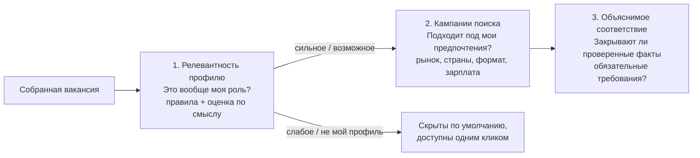

# Релевантность профилю: какие вакансии вообще ваши

[English](../RELEVANCE.md) · [Русский](RELEVANCE.md) · [Документация](../../README.ru.md#документация)

Сбор приносит всё, что вернул источник: поиск агрегатора по слову «директор» вернёт и директора магазина, и VP по продажам, и руководителя офиса. Релевантность профилю отделяет вакансии, которые относятся к поиску кандидата, от остальных, показывает на **термометре** 0–100, насколько каждая подходит, и объясняет почему. Работает в два слоя:

1. **Правила** — быстрый отбор каждой вакансии без вызова моделей: функция и уровень в названии, домены кандидата в названии и тексте, сколько фактов резюме их подкрепляют, сохранённые запросы.
2. **Оценка по смыслу** — флагманская агентская сессия читает вакансию на фоне профиля кандидата и записывает вердикт, балл и причины. Актуальная оценка агента главнее правил.

Реализация — [relevance.py](../../src/job_search_agent/relevance.py), настройка — приватный `settings.json → relevance`.

## Три разных вопроса



| Слой | Вопрос | Данные | Меняет записи? |
| --- | --- | --- | --- |
| Релевантность профилю (эта страница) | Это вообще роль кандидата и насколько близкая? | Название, сохранённый текст, компания, локация, факты и интересы кандидата, сохранённые запросы; при наличии — оценка агента | Правила: нет, считаются на лету. Оценка: запись `relevance_reviews` |
| [Кампании поиска](CONFIGURATION.md#кампании-поиска) | Подходит ли под предпочтения? | Условия: рынок, страны, формат, язык, зарплата | Нет |
| [Объяснимое соответствие](DATA_MODEL.md#объяснимое-соответствие-evidence-rules-v2) | Закрывают ли проверенные факты обязательные требования? | Размеченные требования и проверенные доказательства | Пишет оценку |

Релевантность никогда не отклоняет вакансию, не меняет факты и не заменяет оценку соответствия. Вакансия со ступенью `weak` или `off_profile` остаётся в журнале и видна во вкладке **Все**.

## Термометр

Балл правил складывается из четырёх частей:

| Часть | Баллы | Как начисляется |
| --- | --- | --- |
| Функция | 30 | Название называет функцию трека кандидата (продукт: `product`, `cpo`, `продукт`…; техническое лидерство: `engineering`, `technology`, `cto`, `platform`, `AI`, `разработ`, `технолог`, `ИИ`…). 24 — если вместо слова трека сработал сохранённый запрос с `include`; 18 — если слова трека нет, но домен кандидата стоит в руководящем названии («Head of Payments») |
| Уровень | 25 | 25 — слова `top` (director, head, VP, chief, CPO/CTO/CAIO, директор и русские названия, где руководитель возглавляет всю функцию: «руководитель разработки / департамента / управления / центра / блока / практики»); 22 — уровень сверяется по шкале работодателя; 20 — слова `lead` при цели `lead`; 12 — уровень не указан; 10 — lead при правиле «в РФ только директор»; 5 — ниже цели |
| Домены | 25 | Домены кандидата (из тегов фактов и `policy.interests`: AI, платежи и финтех, платформы, API и инструменты разработчиков, коммерциализация, руководство разработкой, промышленные технологии): 12 за первый в названии и по 3 за каждый следующий в названии, по 4 за домен, найденный только в тексте |
| Подкрепление резюме | 20 | Сколько фактов стоит за совпавшими доменами: проверенный факт — 1, со слов кандидата — 0,5; противоречивые факты и цели не считаются |

| Ступень | Балл | Жёсткие правила |
| --- | --- | --- |
| `strong` — сильное совпадение | 70–100 | — |
| `possible` — возможное | 50–69 | — |
| `weak` — слабое | 0–49 | Уровень ниже цели или под правилом «в РФ только директор», либо полный текст без доменов кандидата ограничивают балл значением 49 |
| `off_profile` — не мой профиль | 0–20 | Исключённая функция в названии (продажи, маркетинг, дизайн, подбор, офис, бухгалтерия, магазин…), исключение политики в тексте (`policy.exclude`) или отсутствие функции ограничивают балл значением 20 |

Подробности уровня: слово `below` (senior, manager, specialist, руководитель проектов, owner) или слово исполнителя (engineer, developer, staff, scientist — целым словом, поэтому «Director of Engineering» не инженер) означает уровень ниже цели. Для работодателей из `policy.bigtech_company_ids` названия уровня lead и senior/staff/principal сверяются по шкале работодателя (`company_specific`), а не понижаются; правило «в РФ только директор» эту сверку не отменяет. **Уровень ниже директора по рынкам.** `relevance.market_levels` задаёт целевой уровень для рынка, например `{"intl": "near"}`. Цель `near` принимает директорский уровень и один уровень ниже — Engineering Manager, Senior Engineering Manager, Staff, Principal, Group или Lead Product Manager, Product Lead (`levels.near`). Слова `near` читаются раньше слов `below` только там, где цель рынка — `near` (или `any`): «Engineering Manager» за рубежом проходит, а то же название на другом рынке, Senior Product Manager или российская роль под `policy.russia_director_only` остаются ниже цели.

**Роли руководителей программ в топовых компаниях.** Топовые компании — это `policy.bigtech_company_ids` и `relevance.top_companies`. Их названия сверяются по шкале работодателя (`company_specific`), а вне России названия руководителей программ и проектов — Technical Program Manager, Program/Programme Manager, Project Manager, Program/Project Lead, TPM (`relevance.program_roles`) — считаются функцией технического лидерства (причина `program_role_top_company`). Топовая компания узнаётся по стабильному ID или, если агрегатор сохранил карточку под другим ID, по названию и псевдонимам работодателя целым словом («amazon» совпадает с «Amazon»). У других работодателей название программы функцией не считается. Ориентир вроде «Meta E5» — решение смысловой оценки и `policy.company_levels`, а не слово в названии.

Банковский «продукт» — «продукты банка», «кредитные продукты», «lending products» — вырезается из названия перед проверкой функции (`ignore_in_title`), поэтому роль по ценообразованию или кредитованию не считается продуктовым менеджментом.

Отсутствие описания — не отсутствие домена: у карточки без текста остаётся причина «описания нет — домены проверены только по названию».

## Оценка по смыслу

Правила читают слова, агент — смысл. Флагманская агентская сессия (`claude-opus-5` или флагман Codex) читает вакансию на фоне профиля кандидата и записывает результат активности `relevance_review`:

```json
{
  "type": "relevance_review",
  "data": {
    "reviews": [
      {
        "vacancy_id": "…",
        "verdict": "strong",
        "score": 82,
        "track": "technical-leadership",
        "summary": "Руководство разработкой AI/ML у крупного интегратора — трек технического лидерства.",
        "reasons": [
          {"kind": "fit", "text": "Руководит инженерной функцией"},
          {"kind": "gap", "text": "Практика обучения моделей в резюме не подтверждена"}
        ],
        "fact_ids": ["…"]
      }
    ]
  }
}
```

Проверки: каждая вакансия существует и встречается один раз; `verdict` — ступень, а `score` лежит в её диапазоне (сильное 70–100, возможное 50–69, слабое 0–49, не мой профиль 0–20); `summary` до 400 символов; 1–6 причин вида `fit`, `gap` или `risk`; `fact_ids` называют существующие факты; исполнитель — флагманская модель с сессией. CLI сохраняет хэш того, что прочитал рецензент (название, работодатель, текст и требования), и хэш фактов кандидата.

**Актуальная** оценка определяет ступень и балл; результат правил остаётся виден («Правила: слабое · 49/100»). Если текст вакансии или факты кандидата изменились, оценка **устаревает**: до новой оценки снова показывается результат правил с предупреждением. Заказать оценку можно во вкладке **Соответствие** вакансии («Оценить по смыслу»): это ставит задачу `review_relevance` для `career-job-search`. Агентская сессия берёт её через `ajh tasks next`, читает `ajh relevance pending` и завершает активность типизированным результатом.

## Запросы по ключевым словам

Один синтаксис работает в строке поиска интерфейса, в `ajh relevance search` и в сохранённых запросах:

| Синтаксис | Значение | Пример |
| --- | --- | --- |
| `a + b` | Должна совпасть каждая группа | `инженер + ai` |
| `a \| b` или `a, b` | Любой вариант внутри группы | `(ai \| ml \| ии)` |
| `-a` (после пробела) | Исключить вакансии с этим словом | `product + payments - crypto` |
| `поле:(…)` | Искать группу только в одном поле | `компания:(сбер \| т-банк) + должность:(директор \| head)` |

| Поле | Русские варианты | Где ищет |
| --- | --- | --- |
| `title:` (`role:`) | `должность:`, `название:` | Название вакансии |
| `company:` | `компания:` | Название работодателя и его варианты из карточки компании |
| `location:` | `локация:`, `где:` | Указанная локация, страна и город, формат работы (remote, hybrid, office) и разрешённые страны |
| `text:` (`tech:`) | `текст:`, `стек:` | Описание и требования — технологии, стек |

Группа без поля ищется во всех четырёх. Слова до трёх букв ищутся целиком (`ai` не находит «air»), более длинные — с окончаниями (`инженер` находит «инженера»); слово с пробелами — фраза. Сравнение без учёта регистра, разделители убираются, поэтому «AI/ML» читается как «ai ml». Русские и английские названия мест — разные слова: пишите `где:(москва | moscow)`.

Пример: `компания:(сбер | т-банк) + должность:(директор | руководитель) + где:(москва | remote) + стек:(llm | ml)`.

В интерфейсе поиск с `+`, `|`, ` -` или полем — это запрос; несколько обычных слов должны встретиться все, в любом порядке и в любом месте карточки (`сбер ai директор`); одно слово — обычный поиск подстроки.

## Настройка

`settings.json → relevance` необязателен. Без него отбор использует встроенные слова, треки из `policy.tracks` и домены, выведенные из фактов и интересов.

```json
{
  "relevance": {
    "target_level": "lead",
    "queries": [
      {"name": "AI-продукт", "query": "title:(product | продукт | cpo) + (ai | ии | genai | llm | agent)", "include": true},
      {"name": "Инженерия + AI", "query": "title:(engineering | engineer | cto | инженер | разработ) + (ai | ии | ml | llm)"}
    ],
    "exclude_title": ["customer success"],
    "vocabulary": {"payments": ["open banking"]}
  }
}
```

| Поле | По умолчанию | Значение |
| --- | --- | --- |
| `target_level` | `lead` | `top` — нужны слова уровня директора; `near` — также один уровень ниже (EM, Staff, Principal, Group PM) и слова lead; `lead` — принимаются также lead/principal/руководитель; `any` — уровень не проверяется |
| `market_levels` | нет | Целевой уровень по рынку, например `{"intl": "near"}`; для `ru` правило «только директор» сильнее |
| `top_companies` | нет | ID или названия компаний в дополнение к `policy.bigtech_company_ids`: уровни по шкале работодателя и роли руководителей программ за рубежом |
| `program_roles` | встроенные | Дополнительные слова названий руководителей программ и проектов для топовых компаний вне России |
| `roles` | встроенные для каждого трека | Дополнительные слова названия для трека, например `{"product": ["pm lead"]}` |
| `levels` | встроенные | Дополнительные слова для `top`, `near`, `lead`, `below` и `individual` |
| `exclude_title` | встроенный список | Дополнительные исключённые функции, ищутся в названии |
| `ignore_in_title` | банковские продукты | Регулярные выражения, вырезаемые из названия перед проверкой функции |
| `domains` | выводятся | Явный список id доменов; заменяет вывод из фактов и интересов |
| `vocabulary` | встроенный | Дополнительные слова для id домена; новый id задаёт новый домен |
| `queries` | нет | `{name, query, include}`; `include: true` позволяет запросу заменить проверку функции и домена, но не уровня |
| `extend_defaults` | `true` | `false` заменяет встроенные слова вместо дополнения |

Синтетический пример для старта — [examples/relevance.json](../../examples/relevance.json). Некорректный раздел показывается в интерфейсе и в `ajh relevance profile`; отбор тогда пропускается, а не угадывается, и сбор продолжается. Заменить раздел — `ajh relevance set PATH` (с проверкой и событием `relevance_updated` со значениями до и после).

## Где используется

- **Интерфейс.** «Вакансии» и «Воронка» открываются на **Подходят** (сильные + возможные); переключатель показывает каждую ступень и **Все** со счётчиками, есть сортировка по релевантности. Сохранённые запросы — кнопки под строкой поиска. В карточке строка «Профиль»: ступень, термометр с отметкой «по правилам» или «по смыслу» и короткая причина. Вкладка **Соответствие** начинается с оценки агента, четырёх частей балла, всех причин и каждого сохранённого запроса с отметкой, совпал ли он. В обзоре «Свежие вакансии», счётчик проверки доступности и статистика вакансий учитывают только подходящие вакансии.
- **Сбор.** Каждая карточка оценивается при сборе; запись `collection_runs` считает новые вакансии по ступеням (`relevance`). Источник с `"skip_off_profile": true` не добавляет карточки `off_profile` в журнал (снимок их сохраняет, а `source_health.screened_out` считает); пока правила настраиваются, оставляйте этот флаг выключенным.
- **Агенты.** `career-job-search` сначала смотрит подходящие вакансии, оценивает ожидающие по смыслу и в первую очередь размечает требования для подходящих.

## Команды

| Команда | Результат |
| --- | --- |
| `ajh relevance list [--relevant] [--tier T] [--limit N]` | Вакансии со ступенью, баллом, способом оценки, доменами и причиной в одну строку, лучшие первыми |
| `ajh relevance explain VACANCY_ID` | Все причины, части балла, домены, результаты запросов и оценка агента для одной вакансии |
| `ajh relevance search "ЗАПРОС" [--limit N]` | Вакансии, подходящие под запрос, с совпавшими словами |
| `ajh relevance pending [--limit N] [--all]` | Вакансии без актуальной оценки по смыслу, самые перспективные первыми, с текстом для рецензента; `--all` включает неподходящие |
| `ajh relevance profile` | Итоговые роли, уровни, исключения, домены с подкреплением резюме и запросы |
| `ajh relevance set PATH` | Заменить `settings.json → relevance` из JSON-объекта |

## Настройка по результатам и ограничения

Настраивайте по фактам: запустите `ajh relevance list --tier weak` и `--tier off_profile`, найдите вакансии, которые вы бы прочитали, и добавьте слово роли, термин домена или включающий запрос; в `strong` ищите шум и добавляйте исключение или фразу `ignore_in_title`. Где слов не хватает, закажите оценку по смыслу. Правила лексические — у вакансии, описанной только картинкой или на несохранённой странице, нет текста для проверки, — а оценка агента — суждение, а не проверенный факт: считайте `possible` сигналом «прочитать вакансию», а решение об отклике принимайте по оценке соответствия.
