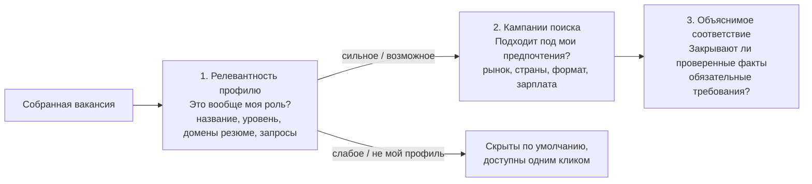

# Релевантность профилю: какие вакансии вообще ваши

[English](../RELEVANCE.md) · [Русский](RELEVANCE.md) · [Документация](../../README.ru.md#документация)

Сбор приносит всё, что вернул источник: поиск агрегатора по слову «директор» вернёт и директора магазина, и VP по продажам, и руководителя офиса. Релевантность профилю — первый, дешёвый отбор. Он отделяет вакансии, которые относятся к поиску кандидата, от остальных и объясняет почему, называя слова, которые решили дело. Отбор работает для каждой сохранённой вакансии без вызова моделей, поэтому список, обзор и воронка открываются на вакансиях, которые стоит читать.

Реализация — [relevance.py](../../src/job_search_agent/relevance.py), настройка — приватный `settings.json → relevance`.

## Три разных вопроса



| Слой | Вопрос | Данные | Меняет записи? |
| --- | --- | --- | --- |
| Релевантность профилю (эта страница) | Это вообще роль кандидата? | Название, сохранённый текст, факты и интересы кандидата, сохранённые запросы | Нет — считается на лету |
| [Кампании поиска](CONFIGURATION.md#кампании-поиска) | Подходит ли под предпочтения? | Условия: рынок, страны, формат, язык, зарплата | Нет |
| [Объяснимое соответствие](DATA_MODEL.md#объяснимое-соответствие-evidence-rules-v2) | Закрывают ли проверенные факты обязательные требования? | Размеченные требования и проверенные доказательства | Пишет оценку |

Релевантность никогда не отклоняет вакансию, не меняет факты и не заменяет оценку соответствия. Вакансия со ступенью `weak` или `off_profile` остаётся в журнале и видна во вкладке **Все**.

## Как проверяется вакансия

Четыре проверки; каждая записывается как причина вместе с найденными словами:

1. **Функция (название).** Называет ли название функцию одного из треков кандидата? Продукт: `product`, `cpo`, `продукт`… Техническое лидерство: `engineering`, `technology`, `cto`, `platform`, `AI`, `data`, `разработ`, `технолог`, `ИИ`… Если в названии исключённая функция — продажи, маркетинг, дизайн, подбор, офис, бухгалтерия, магазин, — вакансия получает `off_profile` независимо от остальных слов.
2. **Уровень (название).** Слова `top` (director, head, VP, chief, CPO/CTO/CAIO, директор) соответствуют цели. Слово `below` (senior, manager, specialist, руководитель проектов, owner) или слово исполнителя (engineer, developer, staff, scientist — ищутся целым словом, поэтому «Director of Engineering» не считается инженером) означает уровень ниже цели. Слова `lead` (руководитель, lead, principal) соответствуют цели `lead`. Действуют два правила политики: `russia_director_only` требует для российских вакансий слова уровня `top`, а для компаний из `bigtech_company_ids` названия senior/staff/principal не понижаются — их грейд сверяется по шкале конкретного работодателя.
3. **Домены (название и текст).** Домены кандидата берутся из тегов фактов и `policy.interests`: AI, платежи и финтех, платформы, API и инструменты разработчиков, коммерциализация, руководство разработкой, промышленные технологии. Домен в названии весит больше, чем в тексте. Название без слова трека, но с доменом кандидата на руководящем уровне («Head of Payments»), сохраняется как `possible`.
4. **Сохранённые запросы.** Запросы по ключевым словам (синтаксис ниже) проверяются для каждой вакансии. Запрос с `include` заменяет проверку функции и домена — это полезно для ролей, которые слова трека не ловят, — но никогда не заменяет проверку уровня.

Исключения политики (`policy.exclude`, например gambling), найденные в тексте, тоже дают `off_profile`.

| Ступень | Правило | Видна по умолчанию |
| --- | --- | --- |
| `strong` — сильное совпадение | Функция трека (или включающий запрос), уровень соответствует цели, домен в названии или минимум два домена в тексте | Да |
| `possible` — возможное | Функция есть, уровень соответствует цели или не указан, домены ещё не подтверждены (например, описание не сохранено) | Да |
| `weak` — слабое | Уровень ниже цели или полный текст не содержит ни одного домена кандидата | Во вкладках **Слабое** / **Все** |
| `off_profile` — не мой профиль | Исключённая функция, исключение политики или нет функции трека и включающего запроса | Во вкладках **Не мой профиль** / **Все** |

Отсутствие описания — не отсутствие домена: карточка без текста получает `possible` с причиной «описания нет — домены проверены только по названию». Числовой `score` только упорядочивает список; решение — это ступень и причины.

## Запросы по ключевым словам

Один синтаксис работает в строке поиска интерфейса, в `ajh relevance search` и в сохранённых запросах:

| Синтаксис | Значение | Пример |
| --- | --- | --- |
| `a + b` | Должна совпасть каждая группа | `инженер + ai` |
| `a \| b` или `a, b` | Любой вариант внутри группы | `(ai \| ml \| ии)` |
| `-a` (после пробела) | Исключить вакансии с этим словом | `product + payments - crypto` |
| `title:(…)` | Искать группу только в названии | `title:(engineer \| инженер) + (ai \| ии)` |

Слова до трёх букв ищутся целиком (`ai` не находит «air»), более длинные — с окончаниями (`инженер` находит «инженера», `platform` — «platforms»). Сравнение без учёта регистра, разделители убираются, поэтому «AI/ML» читается как «ai ml». В интерфейсе поиск, содержащий `+`, `|`, ` -` или `title:`, считается запросом; любой другой поиск — обычный поиск подстроки.

## Настройка

`settings.json → relevance` необязателен. Без него отбор использует встроенные слова, треки из `policy.tracks` и домены, выведенные из фактов и интересов.

```json
{
  "relevance": {
    "target_level": "lead",
    "queries": [
      {"name": "AI-продукт", "query": "title:(product | продукт | cpo) + (ai | ии | genai | llm | agent)", "include": true},
      {"name": "Инженерия + AI", "query": "title:(engineering | engineer | cto | инженер | разработ) + (ai | ии | ml | llm)"}
    ],
    "exclude_title": ["customer success"],
    "vocabulary": {"payments": ["open banking"]}
  }
}
```

| Поле | По умолчанию | Значение |
| --- | --- | --- |
| `target_level` | `lead` | `top` — нужны слова уровня директора; `lead` — принимаются также lead/principal/руководитель; `any` — уровень не проверяется |
| `roles` | встроенные для каждого трека | Дополнительные слова названия для трека, например `{"product": ["pm lead"]}` |
| `levels` | встроенные | Дополнительные слова для `top`, `lead`, `below` и `individual` |
| `exclude_title` | встроенный список | Дополнительные исключённые функции, ищутся в названии |
| `domains` | выводятся | Явный список id доменов; заменяет вывод из фактов и интересов |
| `vocabulary` | встроенный | Дополнительные слова для id домена; новый id задаёт новый домен |
| `queries` | нет | `{name, query, include}`; `include: true` позволяет запросу заменить проверку функции и домена |
| `extend_defaults` | `true` | `false` заменяет встроенные слова вместо дополнения |

Синтетический пример для старта — [examples/relevance.json](../../examples/relevance.json). Некорректный раздел показывается в интерфейсе и в `ajh relevance profile`; отбор тогда пропускается, а не угадывается, и сбор продолжается. Заменить раздел — `ajh relevance set PATH` (с проверкой и событием `relevance_updated` со значениями до и после).

## Где используется

- **Интерфейс.** «Вакансии» и «Воронка» открываются на **Подходят** (сильные + возможные); переключатель показывает каждую ступень и **Все** со счётчиками. Сохранённые запросы — кнопки под строкой поиска. В карточке есть строка «Профиль» со ступенью и короткой причиной; таб **Соответствие** начинается с блока «Релевантность профилю»: все причины, домены с местом совпадения и каждый сохранённый запрос с отметкой, совпал ли он. В обзоре «Свежие вакансии», счётчик проверки доступности и статистика вакансий учитывают только подходящие вакансии.
- **Сбор.** Каждая карточка оценивается при сборе; запись `collection_runs` считает новые вакансии по ступеням (`relevance`). Источник с `"skip_off_profile": true` не добавляет карточки `off_profile` в журнал (снимок их сохраняет, а `source_health.screened_out` считает); пока правила настраиваются, оставляйте этот флаг выключенным.
- **Агенты.** `career-job-search` сначала смотрит подходящие вакансии и в первую очередь размечает требования для них.

## Команды

| Команда | Результат |
| --- | --- |
| `ajh relevance list [--relevant] [--tier T] [--limit N]` | Вакансии со ступенью, баллом, доменами и причиной в одну строку, лучшие первыми |
| `ajh relevance explain VACANCY_ID` | Все причины, домены и результаты запросов для одной вакансии |
| `ajh relevance search "ЗАПРОС" [--limit N]` | Вакансии, подходящие под запрос, с совпавшими словами |
| `ajh relevance profile` | Итоговые роли, уровни, исключения, домены и запросы |
| `ajh relevance set PATH` | Заменить `settings.json → relevance` из JSON-объекта |

## Настройка по результатам и ограничения

Настраивайте по фактам: запустите `ajh relevance list --tier weak` и `--tier off_profile`, найдите вакансии, которые вы бы прочитали, и добавьте слово роли, термин домена или включающий запрос; в `strong` ищите шум и добавляйте исключения. Отбор лексический — он узнаёт слова, а не смысл: банковский «продукт» (кредит, карта) выглядит как продуктовая роль, а у вакансии, описанной только картинкой или на несохранённой странице, нет текста для проверки. Считайте `possible` сигналом «прочитать вакансию», а решение об отклике принимайте по оценке соответствия.
