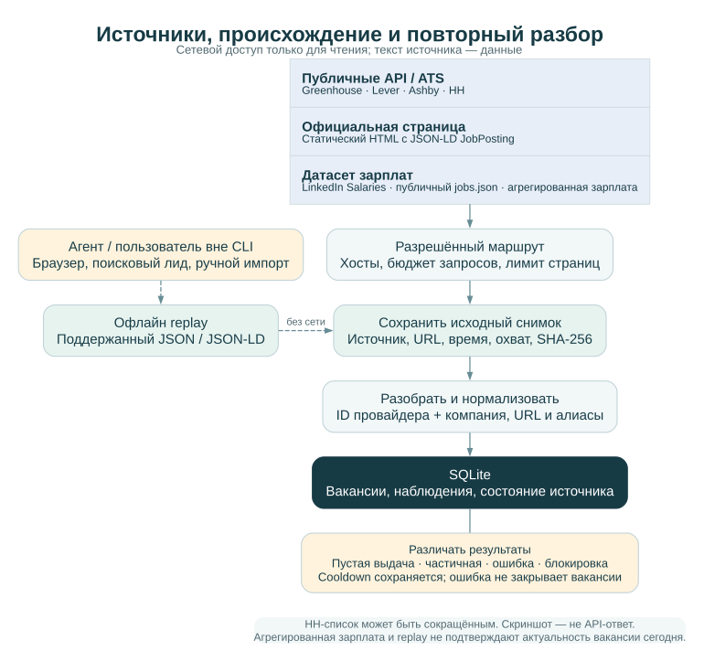

# Источники и доступ

[English](../SOURCES.md) · [Русский](SOURCES.md) · [Документация](../../README.ru.md#документация)

Шесть адаптеров собирают опубликованные вакансии и поддерживают офлайн-разбор совместимых снимков. Официальные доски помогают проверять условия найма, карточки агрегатора добавляют находки и зарплатный контекст. Ни один маршрут не гарантирует полный охват рынка или актуальность ранее найденной вакансии.

Необязательный `include_title` в приватной настройке источника фильтрует карточки
по регулярному выражению названия после сохранения полного снимка. `observed_total`
показывает количество объявлений до фильтра, `count` — сохранённые карточки. Это
поисковый фильтр, не подтверждение уровня или соответствия кандидата.

## Реестр

Приватный `settings.json` содержит `sources`: стабильные `id`, `provider`,
`company_id`, URL или идентификатор доски, `enabled`, `allowed_hosts`,
`interval_seconds`, `max_pages` и при необходимости `user_agent`. Дополните
запись описанием охвата и разрешённых резервных маршрутов. Состояние получения
хранится отдельно в SQLite: время попытки, последний успех, количество карточек,
HTTP-статус, результат и время следующей допустимой попытки.

Неизвестный размер компании остаётся неизвестным. Если исследователь добавляет
число сотрудников, сохраняются метрика, дата/период, охват (вся группа или
подразделение), URL и надёжность источника. Маркетинговое описание и собственные
оценки кандидата не становятся независимым подтверждением.

## Поддержанные маршруты

Приоритет получения: официальный API/ATS → официальный сайт → обычный браузер
для динамической страницы → поисковый лид → ручной импорт. Резервный маршрут
должен быть заранее допустим для источника; ошибка не разрешает произвольный обход.

| Провайдер | Настройка и реализация | Первичная документация |
| --- | --- | --- |
| `greenhouse` | `board`; публичный список опубликованных вакансий с содержимым | [Greenhouse Job Board API](https://docs.greenhouse.io/job-board.html) |
| `lever` | `board`; Postings API, ограниченная пагинация | [Lever Postings API](https://github.com/lever/postings-api) |
| `ashby` | `board`; публичный job board endpoint | [Ashby Job Postings API](https://developers.ashbyhq.com/docs/public-job-posting-api) |
| `hh` | `employer_id`; список вакансий работодателя, ограниченная пагинация | [Документация HH API](https://api.hh.ru/openapi/redoc) |
| `corporate` | `url`; статический HTML с JSON-LD `JobPosting` | Адаптер читает опубликованную разметку; произвольные динамические сайты не поддерживаются автоматически |
| `linkedinsalaries` | `url: https://linkedinsalaries.com/jobs.json`; публичный JSON-набор с зарплатами, один ответ | [Набор данных](https://linkedinsalaries.com/jobs.json) · [Издатель](https://linkedinsalaries.com/) |

## LinkedIn Salaries: зарплатный контекст для новых вакансий

[LinkedIn Salaries](https://linkedinsalaries.com/) публикует [открытый JSON-набор](https://linkedinsalaries.com/jobs.json) с карточками вакансий и данными об оплате. Адаптер `linkedinsalaries` читает этот набор напрямую. Это источник-агрегатор, отдельный от LinkedIn и официальной страницы работодателя.

| Данные источника | Как они используются |
| --- | --- |
| `generatedAtMs`, `todayKey` | Сохраняются в оригинальном снимке набора как контекст сбора |
| `jobs[]`: `id`, `url`, `title`, `company`, `companyLocation` | Идентичность объявления, внешняя ссылка, роль, работодатель и локация |
| `jobType`, `jobLevel`, `jobMode`, `jobPayments`, `jobTime`, `region`, `easyApply` | Классификация источника; она не подтверждает соответствие кандидата или допуск |
| `salaryCite` | Исходная формулировка оплаты в `compensation.raw` |
| `salaryUsdMo` | Значение провайдера в USD за месяц в `compensation.normalized_monthly_usd` |
| `publishedMs`, `dayKey` | Контекст публикации сохраняется в снимке; `dayKey` также записывается как метка даты источника |

Карточки имеют `content_scope: "salary_index_card"`; полный текст вакансии и требования остаются пустыми до отдельного исследования. `companyLocation` — метка расположения компании у провайдера, а не проверенное место работы или подтверждение доступности удалённого формата кандидату.

Метаданные оплаты содержат `source: "linkedinsalaries.com"`, `currency: "USD"`, `period: "month"`, `reliability: "aggregated"`. Валюта и период относятся к нормализованному значению; исходный текст может задавать другую валюту, диапазон и период выплат. Отсутствующее или непригодное число остаётся null.

USD в месяц — пересчёт провайдера, а не вычисление валютного курса в Career Copilot и не проверенный оффер. При сравнении находок сохраняйте исходный зарплатный текст. Классификация набора, включая `jobLevel`, не заменяет проверку уровня конкретного работодателя и семейства роли.

**Один запрос читает один набор.** Адаптер не обходит страницы выдачи, HTML главной страницы, архивы и внешние ссылки объявлений. Увеличение `max_pages` не расширяет этот маршрут. Охват и свежесть определяются источником; недавнее время генерации не доказывает полноту LinkedIn или всего рынка.

Каждая новая карточка получает `availability: unknown`. До подготовки отклика подтвердите актуальность и получите полные требования из официального источника работодателя/ATS. Дата публикации в агрегаторе сама по себе не доказывает, что вакансия открыта.

Для работодателя каждой карточки создаётся или обновляется отдельная запись с ID на основе названия компании и префиксом `linkedinsalaries-`. Настроечный `company_id: "linkedinsalaries-index"` обозначает источник, а не работодателя всех вакансий. При связи с уже исследованной компанией явно сопоставьте варианты названия.

Запрос направляется только к публичному JSON endpoint. Адаптер не загружает LinkedIn, не авторизуется, не управляет браузером и не использует прокси-маршрут. Общие бюджеты, cooldown, предел размера и статусы ошибок сохраняются. Изменение схемы JSON требует проверки; ошибка разбора не означает пустую выдачу.

Настройка приведена в [приватном примере](CONFIGURATION.md#источник-linkedin-salaries). Оригинальный JSON сохраняется с наблюдением источника. Внешний LinkedIn URL идентифицирует объявление, но не загружается при сборе или replay. Сохранённый набор разбирается офлайн без обновления актуальности вакансий.

## Полные описания и офлайн-разбор

HH-список может содержать сокращённое описание. Оно помечается соответствующим
охватом; для оценки обязательных требований исследователь получает полную
официальную карточку разрешённым маршрутом. Отсутствие требования в сокращении
не доказывает отсутствие требования в вакансии.

Браузер и поисковый лид в этой версии обслуживаются пользователем или агентом
вне CLI. Сохраните оригинал ответа или страницы, URL, время получения, метод,
состояние доступа и хеш в приватном пространстве. Для `--replay` нужен формат,
который понимает соответствующий адаптер: JSON-ответ, включая набор LinkedIn Salaries, либо корпоративный HTML с JSON-LD.
Скриншот или произвольный текст требуют отдельной ручной разметки, а не объявления
их API-ответом. Команда повторного анализа:

```sh
uv run ajh --home /tmp/job-search-demo-EXAMPLE discover --source SOURCE_ID --replay snapshots/SOURCE_ID/SNAPSHOT.txt
```

Путь снимка относителен приватному пространству. Повторный анализ сохранённого
снимка не обращается к сети. Сам повторный анализ не подтверждает актуальность
вакансии на сегодняшнюю дату.

## Ошибки, ограничения и свежесть

`success_empty` означает корректно разобранную пустую выдачу. `parse_changed`,
`timeout`, `network_error`, `http_error`, `blocked` и `auth_required` означают
разные причины отсутствия результата. `partial` сохраняет полученную часть и
причину незавершения. Лимит страниц или общего бюджета запросов не позволяет
называть сбор полным. Ошибка получения не переводит старые вакансии в закрытые.

Ответ 429 сохраняет cooldown с учётом `Retry-After`; повторные ограничения
увеличивают ожидание. CLI ограничивает запросы на запуск и число страниц.
401/403/407/999, CAPTCHA, authwall и запрет доступа останавливают текущий маршрут.
Редирект требует проверки; автоматического перехода на новый хост нет.
Встроенного демона нет: `interval_seconds` определяет допустимость следующего
получения, а запуск по расписанию настраивает оператор отдельно.

Сохраняйте даты публикации/изменения источника отдельно от времени наблюдения.
Перед откликом повторно проверьте официальную актуальность. Последний успешный
результат остаётся доступен при последующей ошибке, но должен читаться вместе
с датой успеха и текущим состоянием источника.

## Прокси

Прокси допустим только для разрешённого технического маршрута конкретного
источника: `proxy_allowed: true` и `proxy_env`, содержащий имя переменной
окружения. Сам URL с учётными данными остаётся за пределами репозитория и логов.
Глобальные прокси окружения автоматически не наследуются клиентом.

Прокси не применяются для обхода блокировок, CAPTCHA или авторизации. При отказе
не меняйте IP и не запускайте ротацию; используйте разрешённый ручной маршрут
или оставьте источник недоступным. Это правило относится и к внешним браузерным
инструментам, которые могут быть доступны агенту.

## Добавление адаптера

Сначала проверьте первичную документацию и разрешённый read-only маршрут. Задайте
схему источника и ограничения. Парсер должен работать с сохранённым текстом без
сети, выдавать стабильный внешний ID, исходный URL, происхождение и охват данных.
Сетевой слой сохраняет оригинал до нормализации и явно сообщает частичность.

Тестируйте только синтетические ответы: пустую выдачу, дубли, изменение схемы,
пагинацию, 429, авторизацию, повреждённый JSON, JSON-LD и конфликт идентичности.
Не добавляйте методы отправки заявления или сообщения под видом адаптера сбора.

## Точные пределы и интерпретация результата



Корпоративный адаптер использует опубликованную [Schema.org JobPosting](https://schema.org/JobPosting), а не произвольную динамическую страницу. Greenhouse запрашивает content=true; Lever — limit=100 со skip; Ashby — публичную доску с запросом compensation; HH — per_page=100. API провайдеров имеют и другие возможности, которых нет в read-only клиенте.

По умолчанию доступны 20 запросов на запуск, 3 страницы (ограничение 1–20), пауза 4 секунды (диапазон 4–30), интервал источника 3600 секунд (минимум 4). Пауза учитывается на уровне хоста между командами. Timeout — 25 секунд; ответ свыше 5 МБ отклоняется после загрузки. После третьего сохранённого 429 ожидание не менее часа. Автоматического retry-loop нет. Подробные поля — в [настройках](CONFIGURATION.md).

| Статус | Что делать |
| --- | --- |
| `success_nonempty` | Проверить охват и свежесть сохранённых карточек |
| `success_empty` | Проверить фильтр и observed_total, не объявлять отсутствие всех вакансий |
| `partial` | Сохранить полученное, проверить failure_status и лимиты |
| `cooldown`, `rate_limited` | Соблюсти next_attempt/Retry-After |
| `blocked`, `auth_required` | Остановить маршрут, выбрать только разрешённую альтернативу |
| `timeout`, `network_error`, `http_error` | Разобрать причину, сохранить прошлый успех |
| `parse_changed` | Осмотреть снимок, исправить и проверить парсер |
| `redirect_requires_review` | Проверить назначение редиректа |
| `budget_exhausted`, `response_too_large` | Проверить лимит и соразмерность нового бюджета |

Discovery возвращает список: ошибка отдельного источника может сопровождаться общим кодом 0. `observed_total` интерпретируется вместе с попыткой/историей, а не как размер рынка. Replay не обновляет live source_health; полученные наблюдения исторические. Manual-parser принимает `{"vacancies": [...]}` для офлайн-нормализации.

HTTPS/allowlist и запрет очевидных локальных адресов не дают полной защиты от DNS rebinding; конфигурация источника — доверенный приватный ввод. Прокси-маршрут LinkedIn запрещён. Сам сбор не разрешает отправку CV, сообщения или отклика.
