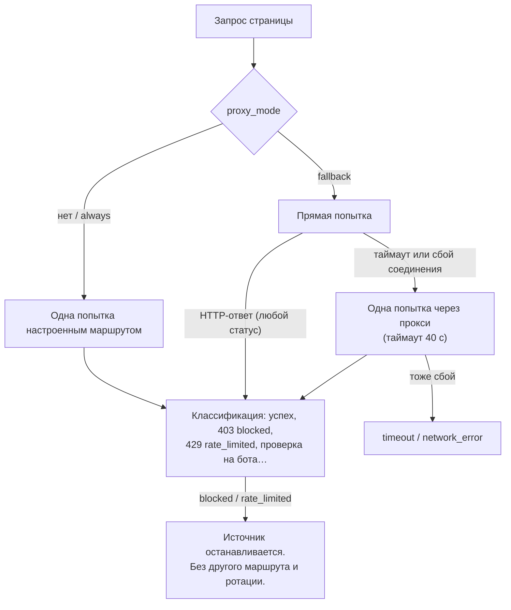

# Архитектура источников: конвейер сбора, сетевые маршруты и новые адаптеры

[English](../SOURCE_ARCHITECTURE.md) · [Русский](SOURCE_ARCHITECTURE.md) · [Документация](../../README.ru.md#документация)

Страница описывает источники вакансий как единую систему: семейства источников, что происходит во время сбора, как запрос доходит до провайдера (напрямую, через прокси или через резервный канал), контракт адаптера и шаги подключения нового провайдера. Справочник провайдеров, состояния ошибок и политика доступа — в [Источниках](SOURCES.md); значения полей по умолчанию — в [Настройке](CONFIGURATION.md#поля-источника).

## Устройство в одном абзаце

Источник — это строка приватной настройки, а не код. В коде один цикл сбора (`discover` в [sources.py](../../src/job_search_agent/sources.py)), и он отвечает за всё рискованное и изменяющее состояние: бюджеты, cooldown, allowlist хостов, сетевой маршрут, классификацию ответа, снимки, выбор компании и итог прогона. Адаптер провайдера отвечает только за две чистые функции — *какой URL запросить* и *как превратить сохранённые байты в карточки* — и регистрируется в [source_adapters.py](../../src/job_search_agent/source_adapters.py). Адаптеры не ходят в сеть, не пишут в журнал и не видят учётных данных. Поэтому новый провайдер — небольшое изменение, полностью проверяемое офлайн, и все провайдеры автоматически получают одни и те же правила безопасности.

## Слои

```mermaid
flowchart LR
  subgraph Private["Приватное рабочее пространство"]
    S["settings.json<br/>sources[]"]
    E["Окружение<br/>переменная прокси"]
  end
  subgraph Loop["discover (sources.py)"]
    G["Проверки<br/>enabled · cooldown · бюджет<br/>allowlist · разрешение прокси"]
    R["Маршрут<br/>напрямую · прокси · резерв"]
    C["Классификация<br/>200 · 403 · 429 · проверка на бота<br/>timeout · размер"]
    P["Снимок<br/>исходные байты"]
  end
  subgraph Adapters["Адаптеры (чистые функции)"]
    A["Реестр ADAPTERS<br/>endpoint + parse"]
    N["card · conditions<br/>salary · geography"]
  end
  subgraph Journal["Журнал (core.py)"]
    F["Фильтр include_title<br/>отбор по профилю"]
    K["Выбор компании<br/>по id, названию, alias"]
    O["observe_vacancy_detailed<br/>новая · изменилась · без изменений"]
    H["source_health"]
    U["collection_runs"]
  end
  S --> G --> R --> C --> P --> A --> N --> F --> K --> O
  E -. "только если разрешено" .-> R
  C --> H
  O --> U
  H --> D["Интерфейс: карточки источников,<br/>последний сбор, ошибки, маршрут"]
  U --> D
```



| Слой | Отвечает за | Никогда не делает |
| --- | --- | --- |
| Настройка (`settings.json → sources[]`) | Провайдеры, доски, запросы, фильтры, интервалы и разрешение прокси | Не хранит учётные данные — только *имя* переменной окружения |
| Цикл сбора (`sources.discover`) | Бюджет, cooldown, allowlist, маршрут, классификация HTTP, снимки, состояние, итог прогона | Не разбирает JSON провайдера |
| Адаптер (`source_adapters.ADAPTERS`, базовые парсеры в `sources.parse_jobs`) | URL страницы, разбор сохранённых байтов в нормализованные карточки | Не работает с сетью, журналом, учётными данными и повторами |
| Нормализация (`card`, `conditions`, `salary`, `geography`, [vacancy_fields.py](../../src/job_search_agent/vacancy_fields.py)) | Стабильные id, канонические URL, зарплата с валютой и периодом, формат, занятость, допустимая география, уровень и даты с указанием происхождения | Не угадывает — неизвестное остаётся `unknown` |
| Журнал (`Store.observe_vacancy_detailed` в [core.py](../../src/job_search_agent/core.py)) | Дедупликация, ранг полноты текста, наблюдения, обнаружение изменений | Не удаляет прежние наблюдения и исследования |
| Интерфейс ([dashboard](DASHBOARD.md)) | Карточки источников с маршрутом и проблемами, последний сбор, дубли | Не запускает сетевые запросы из браузера |

## Семейства источников

| Семейство | Провайдеры | Откуда работодатель | Полнота текста | Для чего |
| --- | --- | --- | --- | --- |
| ATS-доска работодателя | `greenhouse`, `lever`, `ashby`, `smartrecruiters`, `workable`, `recruitee` | Из настроенного `company_id` | Полное описание (SmartRecruiters и Workable — только карточка) | Проверка текущих вакансий целевой компании |
| Список работодателя на job-доске | `hh` с `employer_id` | Из настроенного `company_id` | Часто выдержка | Российские работодатели без своей ATS |
| Корпоративный сайт | `corporate` | Из настроенного `company_id` | JSON-LD `JobPosting` | Карьерные страницы со структурированными данными |
| Агрегатор / job-доска | `remotive`, `remoteok`, `jobicy`, `arbeitnow`, `getonbrd`, `hh` с `query` | Из каждой карточки (`company_name`) | Полное или частичное описание | Поиск вакансий у многих работодателей |
| Открытые данные | `trudvsem` | Из каждой карточки (id по ИНН) | Полное описание, контакты не копируются | Региональный и государственный рынок РФ |
| Набор данных | `linkedinsalaries` | Из каждой карточки | Карточка без описания | Зарплатный контекст |
| Ручное добавление | `ajh vacancy add --url/--text-file`, форма в интерфейсе | По названию или alias, иначе заготовка компании | Текст страницы или вставленный текст | Одна вакансия, найденная в другом месте |

Адаптер помечается `aggregate=True`, когда работодатель берётся из каждой карточки. Для агрегаторов цикл не создаёт компанию из записи источника: он находит или создаёт компанию по названию работодателя. Поэтому один работодатель, найденный на ATS-доске и на двух job-досках, остаётся одной компанией.

## Один прогон сбора по шагам

1. **Выбор источников.** Включённые записи или одна, указанная в `--source`. Бюджет прогона — `max_requests_per_run` (по умолчанию 20).
2. **Cooldown.** Источник, у которого `next_attempt` ещё не наступил, возвращает `cooldown` и ничего не отправляет.
3. **URL и проверки.** `endpoint(source, page)` даёт адаптер. Хост должен совпадать с хостом endpoint или быть в `allowed_hosts`; учётные данные в URL и локальные адреса отклоняются. Здесь же проверяются настройки прокси: `proxy_env` требует `proxy_allowed: true`, `proxy_mode` — только `always` или `fallback`, хосты LinkedIn прокси не получают. Любая ошибка даёт источнику `config_error` с причиной; остальные источники продолжают работу.
4. **Паузы.** Отметка времени по хосту в журнале выдерживает 4–30 секунд между запросами к одному хосту, в том числе между разными командами.
5. **Запрос выбранным маршрутом** (следующий раздел). Редиректы не выполняются, прокси из окружения игнорируются.
6. **Классификация ответа.** Больше 5 МБ → `response_too_large`. 429 → `rate_limited` с Retry-After и растущим cooldown. 401/407 → `auth_required`. 403/999 или страница проверки → `blocked`. Прочие не-200 → `http_error` или `redirect_requires_review`. Таймаут → `timeout`; другой сбой соединения → `network_error`.
7. **Сохранение исходных байтов** как снимка до разбора — страницу можно разобрать заново офлайн через `--replay`.
8. **Разбор** адаптером. Несовпадение схемы вызывает исключение и становится `parse_changed`; оно никогда не считается пустой выдачей.
9. **Фильтр** `include_title` — поисковый фильтр, а не оценка соответствия; затем каждая карточка проходит [отбор по профилю](RELEVANCE.md), и источник с `skip_off_profile` не добавляет карточки `off_profile`. `observed_total` считает карточки до фильтра, `count` — добавленные.
10. **Выбор компании.** Для досок — настроенная компания; для агрегаторов — существующая компания с тем же названием или alias, иначе новая с неизвестными размером и описанием.
11. **Наблюдение.** `observe_vacancy_detailed` сводит дубли по id провайдера и каноническому URL, сохраняет самый полный текст (`full > page_text > excerpt > card`) и сообщает `new`, `changed` (с полями) или `unchanged`.
12. **Пагинация** продолжается, пока приходит полная страница и не исчерпан лимит страниц; остановка на лимите даёт `partial`.
13. **Запись состояния** (`source_health`: статус, причина сбоя, HTTP-статус, количество, маршрут, число отсеянных карточек, последний успех, следующая попытка) и в конце одна запись `collection_runs`: новые (с их ступенями релевантности), изменившиеся, возможные дубли между источниками и ошибки.

## Сетевые маршруты и прокси

Каждый запрос идёт ровно одним из трёх маршрутов, выбранных для источника:

| `proxy_env` задан и переменная есть | `proxy_mode` | Маршрут | Значение `health.route` |
| --- | --- | --- | --- |
| Нет | — | Прямой запрос | `direct` |
| Да | `always` (по умолчанию) | Все запросы через прокси | `proxy` |
| Да | `fallback` | Сначала напрямую; прокси только после сбоя соединения или таймаута | `direct` или `proxy_fallback` |



**Для чего резервный канал.** Некоторые сети вообще не достают до провайдера — например, когда машина, которая собирает вакансии, выходит в интернет через VPN, а сеть провайдера такие соединения сбрасывает. Это сбой связи, а не отказ. Резервный канал повторяет тот же запрос один раз через разрешённый прокси и записывает, что так и было.

**Для чего он никогда не используется.** HTTP-ответ — решение провайдера. 403, 429, требование авторизации или страница проверки записываются как `blocked`, `rate_limited` или `auth_required` и не повторяются через прокси, другой адрес или другой инструмент. Нет ротации прокси, решения CAPTCHA и обхода входа. Хосты LinkedIn отклоняются для любого прокси-маршрута. Эти правила реализованы в коде и покрыты тестами, а не только описаны.

**Учётные данные.** В настройке хранится только имя переменной (`proxy_env`). URL прокси берётся из окружения на время запроса и никогда не пишется в состояние, снимки, события или логи. Клиент игнорирует `HTTP(S)_PROXY` из окружения, поэтому прокси используется только там, где источник это явно разрешает.

**Настройка у владельца (приватно).** Команда сбора читает переменную из окружения, поэтому её может подготовить небольшой приватный скрипт-обёртка. Если прокси-провайдер принимает только адрес из белого списка, обёртка может пробросить локальный порт к прокси через SSH на этот сервер и указать в переменной `127.0.0.1`. Такие обёртки и секреты живут в приватном рабочем пространстве; в публичном репозитории нет адресов прокси, аккаунтов и хостов.

```json
{
  "id": "jobicy-product",
  "provider": "jobicy",
  "company_id": "jobicy-index",
  "query": "product",
  "proxy_env": "CAREER_COPILOT_SOURCE_PROXY",
  "proxy_allowed": true,
  "proxy_mode": "fallback"
}
```

## Контракт адаптера

```python
@dataclass(frozen=True)
class Adapter:
    parse: Callable[[object, dict], list[dict]]  # декодированный JSON, запись источника -> карточки
    endpoint: Callable[[dict, int], str]  # запись источника, номер страницы -> HTTPS URL
    page_size: int | None = None  # размер полной страницы; None = один запрос
    aggregate: bool = False  # работодатель берётся из каждой карточки
    min_interval_seconds: int = 3600  # минимальный интервал, который просит провайдер
```

- `parse` получает уже декодированный JSON и запись источника. При неожиданной схеме бросает `TypeError`/`ValueError`/`KeyError` (цикл запишет `parse_changed`) и пропускает только элементы, которые точно не вакансии (например, юридическое уведомление).
- Каждая карточка строится через `card(...)`. Функция требует стабильный внешний id, название, URL `https://` и, для агрегаторов, непустое имя работодателя. Она формирует id вакансии (`provider-external` для агрегаторов, `provider-company-external` для досок), канонические URL, `availability: "unknown"`, `content_scope` и `conditions`.
- Условия строятся через `conditions(text, location, source_label, salary_value=..., work_mode=..., employment=..., allowed=..., published=..., level=...)`. `salary(...)` — только если провайдер указал валюту, `geography(...)` — только для явно разрешённых стран. У каждого значения есть происхождение (например, `jobicy.annualSalaryMin`). То, чего провайдер не указал, остаётся `unknown`.
- Текст очищается через `plain(...)`. Дефекты кодировки конкретного провайдера исправляются в его адаптере (двойное кодирование UTF-8 у Remote OK проходит через `repair_mojibake`).
- Не копируйте персональные контакты, которые не нужны для исследования (у «Работы России» контактные поля отбрасываются).
- Добавьте уведомление в `NOTICES`, если условия провайдера требуют указания источника или ограничений.

## Как подключить новый источник

**Только настройка.** Если адаптер для провайдера уже есть (ещё одна доска Greenhouse, ещё один работодатель HH, ещё один запрос Jobicy), добавьте запись в приватный `settings.json` и выполните `ajh discover --source ID`. Код менять не нужно.

**Новый провайдер.**

1. **Проверьте маршрут.** Прочитайте первичную документацию и условия провайдера. Маршрут должен быть публичным, только для чтения и допускать автоматический доступ. Если нужен платный ключ, вход или автоматизация браузера — остановитесь и зафиксируйте «не подключено».
2. **Сохраните реальный ответ приватно** и сделайте из него синтетическую фикстуру с вымышленными работодателями, id и текстом. Реальные ответы в репозиторий не попадают.
3. **Напишите адаптер** в [source_adapters.py](../../src/job_search_agent/source_adapters.py): функцию `parse` на основе `card` и `conditions` и запись в реестре.

   ```python
   def examplejobs(data: object, source: dict) -> list[dict]:
       result = []
       for item in _list(data, "jobs"):
           text = plain(item.get("description"))
           result.append(
               card(
                   "examplejobs",
                   source,
                   external=item.get("id"),
                   title=item.get("title"),
                   url=item.get("url"),
                   text=text,
                   location=item.get("location"),
                   company_name=str(item.get("company") or ""),
                   conditions_value=conditions(
                       text,
                       str(item.get("location") or ""),
                       "examplejobs",
                       salary_value=salary(
                           item.get("salary_min"),
                           item.get("salary_max"),
                           item.get("currency"),
                           "year",
                           "examplejobs.salary",
                       ),
                       published=item.get("published_at"),
                   ),
               )
           )
       return result


   ADAPTERS["examplejobs"] = Adapter(
       examplejobs,
       lambda s, page: f"https://api.example.com/jobs?{_query(s, q=s.get('query'), page=page + 1)}",
       page_size=100,
       aggregate=True,
   )
   ```

4. **Проверьте офлайн** в [test_source_adapters.py](../../tests/test_source_adapters.py): добавьте синтетический ответ в `PAYLOADS` (параметризованные тесты сразу проверят нормализацию и отказ при чужой схеме) и частные случаи — пагинацию, зарплату без валюты, явную географию, отсутствие работодателя, дефекты кодировки.
5. **Один раз проверьте вживую, приватно.** `ajh --home PRIVATE discover --source ID`, затем посмотрите `health.status`, `http_status`, `route`, `count` и `observed_total`. Блокировку или недоступность фиксируйте честно, а не обходите.
6. **Опишите на двух языках.** Строка в таблице провайдеров [Источников](SOURCES.md#поддержанные-маршруты) и [английской версии](../SOURCES.md#provider-reference), новые поля в [Настройке](CONFIGURATION.md#поля-источника) (RU+EN), отключённый пример в [examples/source-config.json](../../examples/source-config.json), подпись провайдера в переводах `app.js` и запись в [журнале изменений](../../CHANGELOG.md).
7. **Запустите проверки** из `app/`: `uv run ruff check .`, `uv run ruff format --check .`, `uv run pytest`, `uv run python scripts/check_docs.py` и проверки приватности из раздела [Приватность](PRIVACY.md).

## Охват на 15 сентября 2026 года

Доступность зависит от сети, из которой идёт сбор, а не только от адаптера:

| Провайдер | С машины владельца (выход через VPN) | Через резервный канал | Из сети сервера |
| --- | --- | --- | --- |
| «Работа России», Workable, Recruitee | Отвечают напрямую | Не нужен | Отвечают |
| Jobicy, Remote OK, Get on Board | Периодические таймауты | Отвечают (`proxy_fallback`) | Отвечают |
| Remotive, Arbeitnow, SmartRecruiters | 403 проверка на бота → `blocked` | Не используется (отказ) | Отвечают |
| HH API | 403 → `blocked` | Не используется (отказ) | 403 |
| LoopCV и другие платные API | Не подключены | — | — |

Запуск сбора из сети, которую провайдер принимает, — обычный разрешённый выбор. Это решение о развёртывании, и оно не принимается автоматически в ответ на блокировку.
