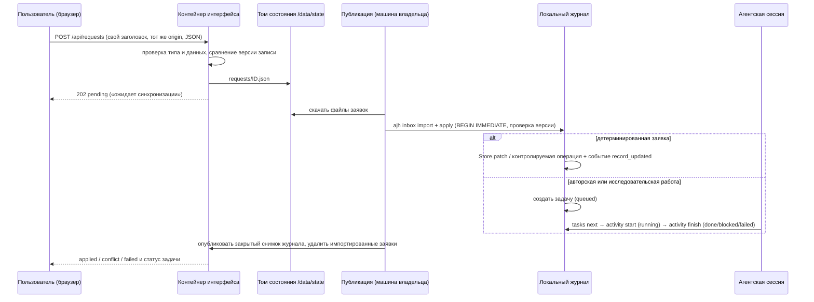
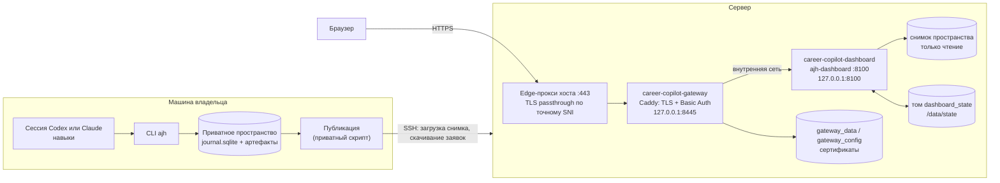

# Обзор системы: модули, код, запуск и контейнеры

[English](../SYSTEM_OVERVIEW.md) · [Русский](SYSTEM_OVERVIEW.md) · [Документация](../../README.ru.md#документация)

Одна страница о том, как устроен Career Copilot: продуктовые модули, где каждый находится в коде, как действия в интерфейсе попадают в журнал и как веб-интерфейс работает в контейнерах. Подробные контракты — в руководствах по ссылкам.

## Продуктовые модули

Основной путь — **собрать → понять карточку → решить, подходим ли → исправить или адаптировать резюме → подготовиться**. Каждым модулем можно пользоваться и отдельно.

| Модуль | Что получает пользователь | Интерфейс | CLI | Код | Записи |
| --- | --- | --- | --- | --- | --- |
| Сбор и источники | Новые и изменившиеся вакансии, дубли, ошибки источников, вакансии по ссылке или тексту | Источники: сбор, форма добавления, карточки источников | `discover`, `collection runs`, `vacancy add` | `sources.py`, `intake.py`, `vacancy_fields.py`, `core.py` (`observe_vacancy_detailed`) | `vacancies`, `observations`, `source_health`, `collection_runs` |
| Релевантность профилю | Какие вакансии подходят профилю и почему: функция, уровень, домены резюме, запросы; ступени сильное/возможное/слабое/не мой профиль | Переключатель профиля, сохранённые запросы, строка в карточке, таб «Соответствие» | `relevance list/explain/search/profile/set` | `relevance.py` | вычисляемое `display.relevance`; `collection_runs.relevance` |
| Кампании поиска | Что ищет пользователь, сравнение по каждому критерию | Источники: кампании; вкладка «Соответствие» | `campaigns list/set/match` | `campaigns.py` | `settings.json → campaigns` |
| Карточки вакансий | Исходная вилка, формат, занятость, язык, где можно работать, даты, статус | Список вакансий, переключатель рынка, вкладка «Вакансия» | `maintenance reextract-conditions` | `vacancy_fields.py`, `descriptions.py`, `availability.py`, `dashboard.py` | `vacancies.conditions` |
| Доступность | Открыта / закрыта / неизвестно с причиной и признаком | Кнопки проверки, напоминания | `availability check/import` | `availability.py` | `vacancies.availability_check` |
| Объяснимое соответствие | Результат, первая блокирующая причина, матрица требований с маршрутами, ограничения, устаревание | Вкладка «Соответствие» | `evaluate [--stale]`, `vacancy requirements` | `matching.py`, `workflow.py` (`evaluate`) | `assessments`, `current_assessments` |
| Резюме | Два master, версии под вакансии, предложения правок и решения, состояния, предпросмотр PDF, импорт | Раздел «Резюме», вкладка «Резюме» | `prepare`, `review`, `cv status/import/decide/apply-edits` | `cv.py`, `workflow.py` (`prepare`, `record_review`) | `packages`, `cv_edits`, `cv_edit_decisions`, `cv_imports` |
| Подготовка | Памятки к вакансиям, планы по общим пробелам, текстовая практика с разбором | Раздел и вкладка «Подготовка» | `prep plan/status`, `learn` | `preparation.py`, `workflow.py` (`learning_plan`) | `preparation_briefs`, `track_plans`, `practice_*`, `learning` |
| PDF-документы | Markdown-планы для чтения и печати, сборники A4, проверка и извлечение страниц | Скачивание планов и просмотр документов | `pdf render/bind/inspect/extract` | `pdf_documents.py`, `dashboard_pdf.py`, `workflow.py` | Приватные PDF-артефакты и манифесты; без изменения ревью или прогресса |
| Заявки и задачи | Действия интерфейса с проверкой версий; работа, переданная агентам | Панель «Заявки и задачи», статусы во вкладках | `inbox import/list/apply/reject`, `tasks list/next` | `inbox.py`, `activity.py`, `core.py` (`Store.patch`) | `inbox_requests`, `tasks`, `events` |
| Работа агентов | Прослеживаемая модельная работа с исполнителем, входами и типизированными результатами | Раздел «Активности» | `activity start/show/finish` | `activity.py` | `activities`, `activity_events`, типизированные результаты |
| Воронка и статистика | Этап каждой вакансии, напоминания, подтверждённые счётчики | Воронка, обзор | `stats`, `report` | `stats.py`, `report.py`, `web_assets/app.js` | `submissions`, `employer_responses` |
| Обслуживание журнала | Удаление дублей, понятные имена файлов, переводы, резервные копии | — | `maintenance`, `translations`, `backup`, `restore`, `verify` | `maintenance.py`, `naming.py`, `translations.py`, `backup.py` | `superseded_records`, `text_translations` |
| Приватность | Проверки перед публикацией: дерево, индекс, история, артефакты | — | `privacy check` | `privacy.py` | — |
| CRM | Только спецификация, не реализован | — | — | — | см. [модуль CRM](CRM_MODULE.md) |

## Карта кода

```text
src/job_search_agent/
  cli.py            команды ajh; один Store и файловая блокировка на команду
  core.py           Store (записи, артефакты, версии, patch с проверкой версии), наблюдения, init
  activity.py       start/finish активностей агентов, проверка результатов, привязка задач
  inbox.py          проверка заявок, import/apply с проверкой версий, задачи
  sources.py        цикл сбора, базовые адаптеры, поиск HH, итоги сбора, дубли
  source_adapters.py ATS-доски, доски удалённой работы, региональные доски, открытые данные РФ
                    (реестр Adapter: endpoint + parse; см. SOURCE_ARCHITECTURE.md)
  intake.py         добавление одной вакансии по публичной ссылке или тексту
  vacancy_fields.py зарплата, формат, занятость, язык, география и даты с источником
  relevance.py      отбор по профилю: функция, уровень, домены резюме, запросы, ступени
  campaigns.py      кампании поиска и сравнение предпочтений по критериям
  matching.py       evidence-rules-v2: строки требований, ограничения, результат, дайджесты входов
  workflow.py       evaluate, планы обучения, адаптер вёрстки пакетов, prepare, review
  pdf_documents.py  общий Markdown/PDF-рендерер, проверка, сборники A4, извлечение страниц
  cv.py             состояния версий, предложения правок и решения, сборка черновика, импорт CV
  preparation.py    памятки к вакансиям, планы по трекам, вопросы, попытки и разборы практики
  availability.py   проверки объявлений с ограничением публичных адресов и перенаправлений
  descriptions.py   дословные выдержки из сохранённых объявлений и исследований
  translations.py   сохранённые русские и английские версии текстов журнала
  maintenance.py    dedupe, rename-artifacts, reextract-conditions
  naming.py, backup.py, privacy.py, stats.py, report.py
  dashboard.py      HTTP-сервер: чтение снимка, заявки и проверки, предпросмотр PDF
  dashboard_pdf.py  адаптер журнала/переводов для общего PDF-рендерера; скрытие локальных путей
  web_assets/       index.html, app.js (без сборки и innerHTML), styles.css
tests/              только синтетические данные; файл на область модулей
.agents/skills/     восемь канонических навыков; .claude/skills/ — тонкие адаптеры
deploy/, Dockerfile, compose.yaml, compose.public.yaml
```

Контракты вёрстки, сборки и хранения описаны в [PDF-документах](PDF.md). Общий рендерер выполняет детерминированную локальную обработку; авторство и визуальное ревью принадлежат существующим агентским сессиям. Сложное проектирование и содержательные решения выполняет флагман (`gpt-6-astra` в Codex/OpenAI, `claude-opus-5` в Claude); простое извлечение может выполнять `gpt-5.6-luna` в OpenAI. CLI сам не выбирает и не вызывает модели.

## Жизненный цикл заявки и задачи

Веб-интерфейс никогда не редактирует журнал. Любая запись проходит через заявку, которую применяет машина владельца.



Если запись изменилась между нажатием и `apply`, заявка получает `conflict` — ничего не перезаписывается. Задача не показывается выполненной без завершённой активности.

## Схема запуска



Без шлюза интерфейс открывается через SSH-туннель к `127.0.0.1:8100`. Локально тот же сервер запускается без Docker: `ajh-dashboard --home PATH --state-dir PATH`.

## Контейнеры

| | `career-copilot-dashboard` | `career-copilot-gateway` (необязательный) |
| --- | --- | --- |
| Где описан | [compose.yaml](../../compose.yaml), [Dockerfile](../../Dockerfile) | [compose.public.yaml](../../compose.public.yaml), [Caddyfile](../../deploy/public-gateway/Caddyfile) |
| Образ | `python:3.12-slim-bookworm` + шрифты DejaVu; зависимости из `uv.lock --frozen` | `caddy:2.11.4-alpine` |
| Процесс | `ajh-dashboard --home /data/workspace --host 0.0.0.0 --port 8100 --state-dir /data/state`, UID/GID 10001 | Caddy без admin API, HTTPS на 8445, проверка здоровья на 8081 |
| Опубликованный порт | `127.0.0.1:8100` (только loopback) | `127.0.0.1:8445` (только loopback) |
| Монтирование | снимок пространства только для чтения в `/data/workspace`; именованный том `dashboard_state` в `/data/state` | Caddyfile только для чтения; тома `gateway_data`, `gateway_config` |
| Что пишет | только `availability-checks.json` и `requests/*.json` в `/data/state` | сертификаты в своих томах |
| Защита | файловая система только для чтения, `/tmp` в tmpfs, все capabilities сброшены, `no-new-privileges`, 512 МБ, 1 CPU, 100 процессов, ротация логов | файловая система только для чтения, только `NET_BIND_SERVICE`, `no-new-privileges`, 128 МБ, 0,5 CPU, 100 процессов |
| Здоровье | `GET /healthz` | `GET :8081/healthz` |
| Защита на уровне HTTP | только разрешённые `Host`, CSP, `X-Frame-Options: DENY` для страниц и `SAMEORIGIN` только для предпросмотра PDF, запросы не логируются | Basic Auth на всех путях, кроме `/healthz` и `/robots.txt`, HSTS, `Authorization` не передаётся дальше, журнала доступа нет |

Исходящие запросы из контейнера интерфейса — только проверки доступности сохранённых ссылок на вакансии. Заявки ничего не загружают на сервере: ссылка из `vacancy_add` читается на машине владельца во время `apply`.

## Где выполняется сбор

Сбор вакансий (`ajh discover`) выполняется на машине владельца с локальным журналом, а не в контейнерах; размещённый интерфейс показывает опубликованный снимок и может поставить задачу `collect`. Каждый источник использует один из трёх сетевых маршрутов: напрямую, всегда через разрешённый прокси или напрямую с однократным повтором через прокси после сбоя соединения (`proxy_mode: fallback`). Отказы — 403, 429, страница проверки — останавливают источник и никогда не повторяются другим маршрутом. Маршрут записывается в `source_health.route` и виден в карточке источника. Конвейер, контракт адаптера и шаги подключения провайдера описаны в [архитектуре источников](SOURCE_ARCHITECTURE.md).

## Релиз, публикация данных и откат

1. **Код.** Каталог релиза на коммит (`releases/<commit>`) и символическая ссылка `current`; `docker compose up -d --build --wait` пересобирает интерфейс. При ошибке ссылка возвращается на прежний релиз. Caddyfile шлюза монтируется при старте контейнера, поэтому его изменение требует `caddy validate` и `up -d --no-deps --force-recreate gateway`.
2. **Данные.** Публикация импортирует в локальный журнал проверки доступности и заявки с сервера, применяет заявки, собирает закрытый снимок SQLite с проверкой хешей артефактов, загружает его, подменяет обслуживаемое пространство с сохранением прежней копии, пересоздаёт только интерфейс и удаляет импортированные файлы заявок.
3. **Откат.** Верните `current` на прежний релиз, а для данных — прежнюю копию пространства. Именованные тома не удаляются.

Подробности: [веб-интерфейс и размещение](DASHBOARD.md#копирование-обновление-и-восстановление), [эксплуатация](OPERATIONS.md), [архитектура](ARCHITECTURE.md).

## Контроль качества

Каждый push запускает [проверки](../../.github/workflows/checks.yml): ruff (линтер и форматирование), pytest на синтетических данных, проверку двуязычной документации и навыков, офлайн-пример с проверенным восстановлением и сканирование индекса и всей истории на приватные данные с закреплённой и проверенной по контрольной сумме версией Gitleaks. Перед передачей те же команды выполняются локально вместе с проверкой по приватному словарю из [инструкции по приватности](PRIVACY.md).
